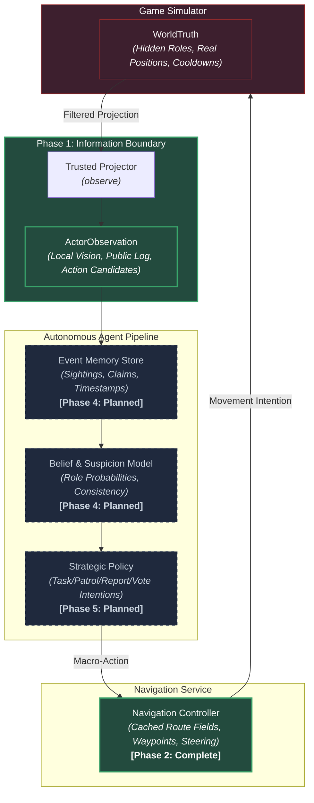

# Social Deduction AI

> Autonomous crewmate reasoning, belief modeling, and strategic reinforcement learning under legitimate partial observability.

[](https://www.python.org/)
[](https://pytorch.org/)
[](https://gymnasium.farama.org/)
[](test_information_contract.py)
[](docs/information_contract.md)

## Watch the five-player simulator

```powershell
python run_phase3.py
```

One command opens the improved Skeld map and starts a full scripted match:
four crew, one impostor, physical travel, timed private tasks, occluded sightings,
bodies, reports, structured claims, public votes and a final winner. Space pauses,
Right steps, `+/-` changes speed, R replays and N starts the next seed. `1` reveals
privileged spectator roles; controllers never receive that view.

The owner-requested character/task artwork is available in an ignored local pack.
`python phase3_assets.py --install` installs the pinned selection explicitly;
without it, the demo uses original procedural characters. See the
[asset provenance and redistribution boundaries](docs/phase3_asset_provenance.md).

```powershell
python run_phase3_batch.py --matches 1000 --workers 8
```

This headless command independently replays every seed and writes CSV/JSON results.
Read the [rules, architecture, controls and limitations](docs/social_simulator.md)
and [acceptance evidence](docs/benchmarks/phase3/README.md). The learned crewmate,
event-memory/belief model and strategic RL remain later work.

## Preserved source-backed Skeld navigation inspector

Launch the new map with `python among_us_map_simulation.py`. It combines native
collider geometry, task/vent metadata and the supplied reference artwork, with
63 task and utility destinations, swept collision and a deterministic navigation service.
The original files and checkpoints are preserved; `skeld_config_legacy.py` also
snapshots the old map. Existing training entry points still select the old map.


Read the [map blueprint, controls, compatibility and accuracy limits](docs/among_us_map_simulation.md).
This is not yet verified against a matching live-game build: collider geometry is
historical, and some console positions and physics values are estimates. This new
asset-backed path has separate [source notices](assets/skeld/NOTICE.md).

### Preserved legacy map


*Figure 1: The Skeld multi-room map environment. Logical world coordinate space (1600.0 × 895.45) with 14 rooms, 40 authentic task destinations, dual-layer collision geometry, and internal A\* route validation.*

---

## What is this?

**Social Deduction AI** is an artificial intelligence research project investigating autonomous agent reasoning in partially observable, multi-agent social-deduction environments (inspired by games like *Among Us*).

The research goal is to train an **autonomous crewmate** that:
- Receives strictly legitimate partial observations (local field-of-view, public announcements, and verbal statements).
- Accumulates timestamped evidence in an episodic memory store.
- Maintains and updates an explicit probabilistic belief/suspicion model over hidden player roles.
- Learns high-level strategic decision-making (task completion, patrol routes, grouping, reporting bodies, and voting) through reinforcement learning.

The current Phase 3 actors are small scripted baselines used to validate the
environment. They do not yet implement this learned reasoning pipeline.

---

## Research Question

> **Can a compact learned crewmate agent—operating solely under legitimate partial observations, persistent evidence memory, and explicit role uncertainty—learn effective cooperative strategies that significantly improve team win rates over heuristic and memory-ablated baselines against held-out teammate and impostor strategies?**

---

## Architecture

The system enforces a strict hierarchical separation between the simulated game world, legitimate sensory observations, epistemic memory, and low-level navigation:



*Architectural Guarantees*: Hidden simulator truth (`WorldTruth`) can **never** leak into actor observations (`ActorObservation`), memory containers (`Knowledge`), or legal action candidates.

---

## Project Roadmap & Status

| Phase | Focus Area | Core Deliverables | Status |
|:---:|:---|:---|:---:|
| **Phase 1** | **Information Contract** | Immutable value types, observation projector, evidence provenance, zero-leakage test harness. | **COMPLETE / FROZEN** |
| **Phase 1.5** | **Source-backed Map** | Separate native-coordinate Skeld sandbox, blueprint, reference artwork and collision checks; live-game parity unverified. | **FROZEN FOR NAVIGATION** |
| **Phase 2** | **Navigation Service** | Swept-clear routes, interaction arrival, cancellation/replanning, 3,906 directed pairs + 1,008 random spawns. | **COMPLETE** |
| **Phase 3** | **Scripted Game Simulator** | Full five-player matches, information-safe scripts, visual demo, 1,000 seeds + 1,000 exact replays. | **COMPLETE** |
| **Phase 4** | **Memory & Belief Model** | Spatio-temporal event memory, consistency tracking, impossibility detection, and role posterior estimation. | **PLANNED** |
| **Phase 5** | **Learned Crewmate Policy** | Strategic actor-critic policy (PPO) optimizing crew task completion, grouping, and voting accuracy. | **PLANNED** |
| **Phase 6** | **Multi-Agent Expansion** | Learned impostor strategies, competitive self-play, saboteurs, vent networks, and symbolic communication. | **FUTURE** |

---

## Current Validated Foundation

1. **Phase 1 Information Boundaries**:
   - `WorldTruth`, `ActorObservation`, `Knowledge`, and `RoleLabels` cleanly decoupled into immutable dataclasses.
   - Provenance typing (`DIRECT`, `PUBLIC`, `CLAIM`) with explicit delivery vs. claimed timestamp separation.
   - Identity randomization stream isolated from role assignment.
   - 42 exhaustive property and paired-world invariance tests.
2. **Preserved Legacy Skeld Spatial Infrastructure**:
   - Approximate $1600.0 \times 895.45$ logical world with 1.7866 aspect-ratio preservation.
   - 50 solid wall rectangles and 32 walkable floor segments.
   - 40 authentic task destinations with verified $\ge 20\text{ px}$ wall clearance (0 unreachable).
   - Single connected walkable component verified via 4px occupancy grid ($89,600$ cells).
   - 34 automated physical validation tests.
3. **Continuous Locomotion Baseline**:
   - Preserved Stage 1 PPO model (`models/stage1/best_model/best_model.zip`) achieving 100% success rate and 93.86% path efficiency across 100 evaluation episodes.
4. **Reliable Navigation Service**:
   - **4,914/4,914 physical executions passed**: 3,906 directed destination pairs and 1,008 stratified random spawns.
   - Zero collisions, blocked steps or replans in the static-map benchmark.
   - Task/room/location arrival, cancellation, replacement and explicit failure outcomes.
   - [Committed results](docs/benchmarks/phase2/README.md) and [service documentation](docs/navigation_service.md).
5. **Five-Player Scripted Simulator**:
   - **1,000/1,000 matches completed**, with **1,000/1,000 identical independent replays**.
   - Zero crashes, invalid states, timeouts, illegal scripted actions or navigation failures.
   - 870 task victories, 41 impostor ejections and 89 impostor parity wins.
   - [Committed acceptance evidence](docs/benchmarks/phase3/README.md).
6. **Test Suite Health**:
   - **291 tests passing**: all 197 original checks plus 93 Phase 3 checks and one legacy-viewer exit regression.

---

## Quick Start

### 1. Installation

```powershell
# Clone repository
git clone https://github.com/Hadisovic/social-deduction-ai.git
cd social-deduction-ai

# Create and activate virtual environment
python -m venv .venv
.venv\Scripts\activate

# Install dependencies
pip install -r requirements.txt
pip install -r requirements-dev.txt
```

### 2. Run Test Suite

```powershell
# Run the complete automated test suite
pytest -q
```

### 3. Watch a Full Scripted Match

```powershell
python run_phase3.py
python run_phase3.py --seed 15 --speed 4
python run_phase3_batch.py --matches 1000 --workers 8
```

Seed 7 demonstrates tasks and a skipped meeting; seed 15 demonstrates an observed
kill leading to ejection; seed 25 demonstrates an impostor parity victory.

### 4. Launch the Navigation Inspector

```powershell
python among_us_map_simulation.py
```

WASD/arrows move and cancel navigation; click sets a goal; Tab cycles destinations; Space starts the navigation service. The window title shows its status.
B shows the blueprint, C collision, T interactions, L labels, R rays, P preview crew.

### 5. Reproduce Navigation Acceptance

```powershell
python benchmark_navigation.py
```

Runs every directed pair of 63 destinations and 1,008 deterministic stratified
spawns through normal movement physics. Results include per-case CSV and a JSON
summary in `docs/benchmarks/phase2/`. See the [service API and methodology](docs/navigation_service.md).

### 6. Launch Preserved Legacy Inspector

```powershell
# Interactive visual inspector for The Skeld map
python inspect_skeld.py
```
- `W / A / S / D`: Move player
- `Left Click`: Set target navigation goal
- `Tab / N`: Cycle through 40 authentic task destinations
- `G`: Toggle real-time internal A\* path overlay
- `C`: Toggle collision and walkable floor overlays
- `R`: Toggle 16 radial obstacle raycasts
- `H`: Toggle diagnostic HUD (spatial region, nearest task, FPS)

---

## Documentation

Comprehensive project documentation is maintained in the [`docs/`](docs/) directory:

- [**docs/PROJECT_PROGRESS.md**](docs/PROJECT_PROGRESS.md): Canonical detailed project history, navigation curriculum benchmarks (Stages 1, 2, 2.5), architectural pivot analysis, settled decisions, and milestone commits.
- [**docs/information_contract.md**](docs/information_contract.md): Strict rules, data structures, and invariants governing player observation and action spaces.
- [**docs/project_architecture.md**](docs/project_architecture.md): Module hierarchy, data flow, observation filtering, and evaluation design.
- [**docs/skeld_research.md**](docs/skeld_research.md): Map coordinate derivation, aspect ratio mathematics, and physical clearance calibration.
- [**docs/skeld_accuracy.md**](docs/skeld_accuracy.md): Rigorous factual accuracy audit, 9 canonical routes validation table, and physical test report.
- [**docs/among_us_map_simulation.md**](docs/among_us_map_simulation.md): New map blueprint, source versions, fidelity limits, controls and sandbox API.
- [**docs/asset_sources.md**](docs/asset_sources.md): Legacy procedural-asset policy and separate source-backed map notices.
- [**docs/navigation_service.md**](docs/navigation_service.md): Phase 2 architecture, API, failure handling and benchmark reproduction.
- [**docs/social_simulator.md**](docs/social_simulator.md): Phase 3 architecture, rules, information integrity, scripts and launch commands.
- [**docs/phase3_asset_provenance.md**](docs/phase3_asset_provenance.md): Audit of all three requested sources and exact locally used artwork.
- [**HANDOFF.md**](HANDOFF.md): Engineering state, frozen boundaries, validation and continuation notes.

---

## Tech Stack

- **Core Simulation**: Python 3.12, Pygame-CE 2.5
- **RL Interfaces**: Gymnasium 1.1, Stable-Baselines3 2.7
- **Deep Learning**: PyTorch 2.6
- **Numeric & Testing**: NumPy, Pytest 9.1
