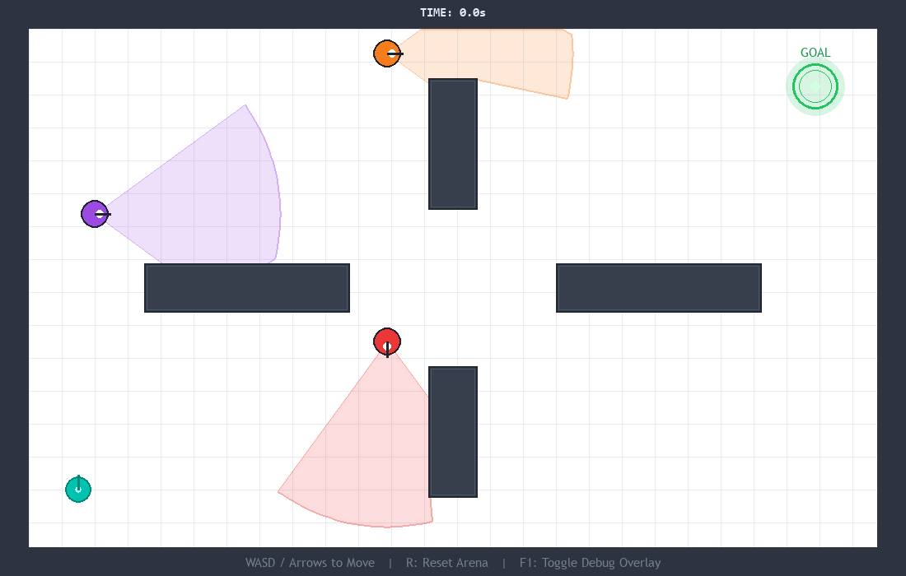
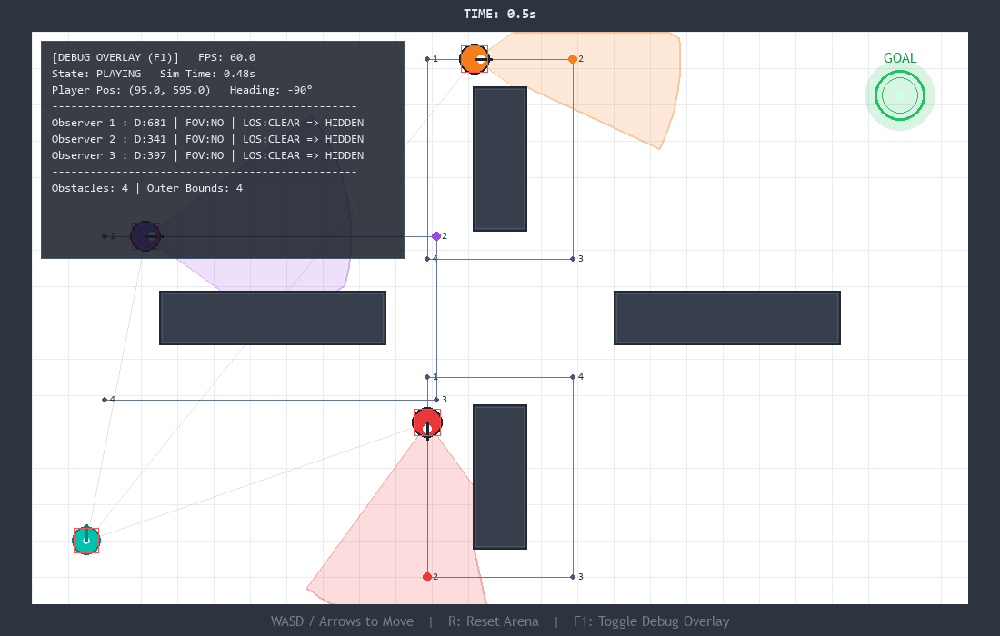
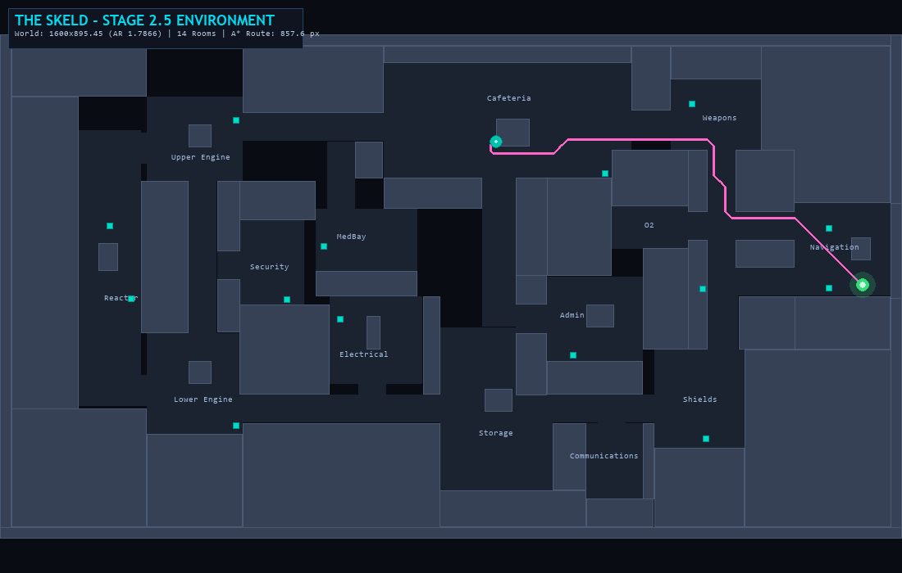
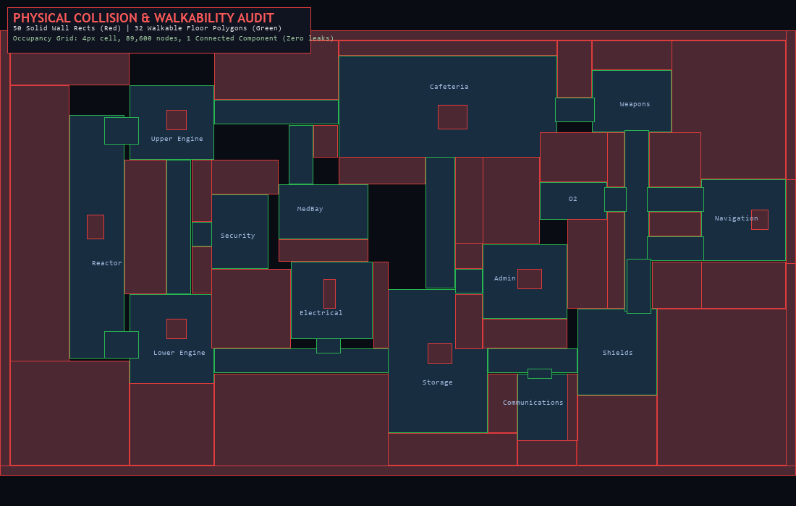
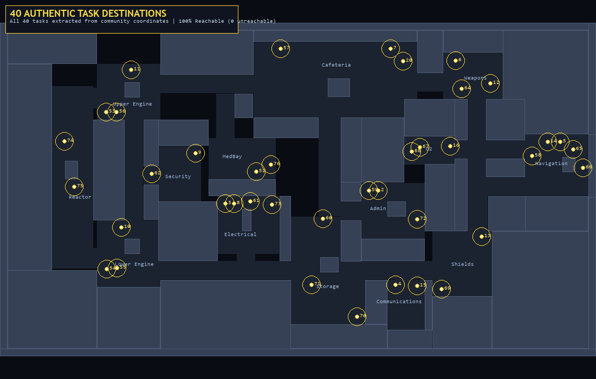
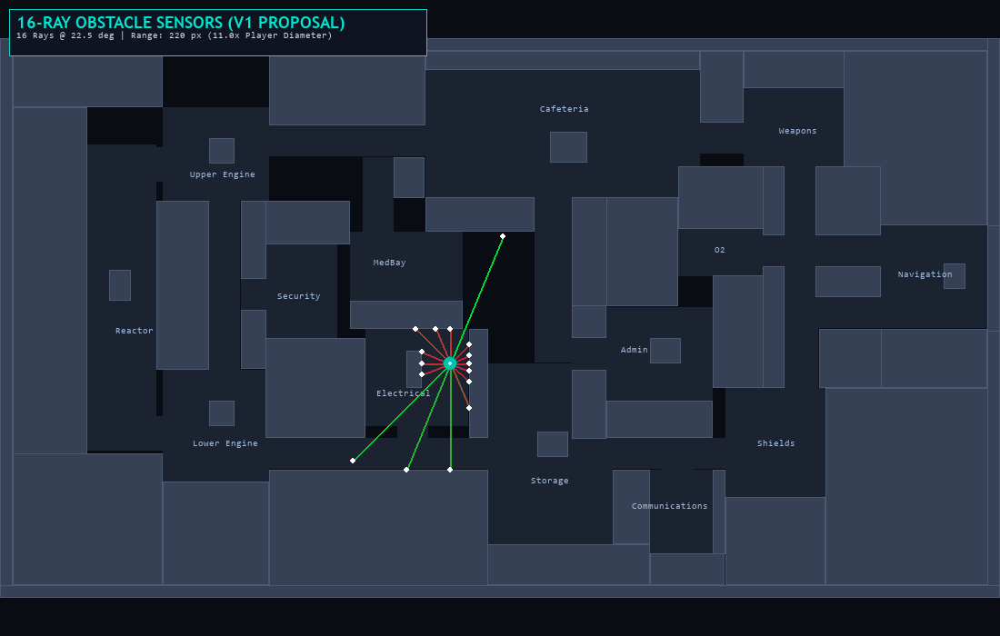

# Stealth RL Navigation

> A curriculum-trained Proximal Policy Optimization (PPO) agent discovering 2D continuous navigation, obstacle detour routing, stuck recovery, and dynamic stealth avoidance in a custom Gymnasium/Pygame sandbox.

---

## Overview

This project is a reinforcement-learning experiment exploring autonomous agent navigation through progressive curriculum stages. Rather than hardcoding A* pathfinding, waypoint graphs, collision-avoidance heuristics, or scripted recovery routines, the agent is provided raw sensory observations (spatial coordinates, radial obstacle rays, observer visual state) and structured reward feedback. All navigational intelligence—including steering around walls and breaking out of deadlocks—must be discovered end-to-end by the neural network.

The simulation runs in a continuous 2D environment rendered with Pygame-CE and wrapped with a standard Gymnasium interface for Stable-Baselines3.


*Stage 2 environment: Top-down 1100x700 arena with solid interior obstacles, randomized player spawn, and target goal.*


*Debug visualization: Observer dynamic patrol routes, polygonal vision cones occluded by obstacles, and radial distance rays.*

---

## Why This Project Exists

In many 2D games and robotics tasks, obstacle avoidance and stuck handling are implemented via classical geometry engines, navigation meshes, or emergency steering rules. While effective, these methods do not generalize well to dynamic perception tasks with patrol guards, moving vision cones, and emergent deadlocks.

The core premise of this project is to test whether continuous actor-critic reinforcement learning (PPO) can reliably learn:
1. **Goal-directed displacement** across an unconstrained continuous domain.
2. **Geometric detour routing** around non-convex obstacles without artificial path hints.
3. **Internal recovery strategies** when forward movement is blocked.
4. **Dynamic stealth avoidance** in later stages when patrolling guards intersect the route.

---

## Curriculum

The learning pipeline is structured into incremental stages, allowing the agent to master foundational locomotion before encountering complex obstacles and perceptual threats.

| Stage | Environment | Primary Objective | Current Status |
|:---:|:---|:---|:---|
| **Stage 1** | Open arena, randomized start & goal, no obstacles, no guards | Learn basic 2D goal navigation from raw displacement vectors | **COMPLETE / PASSED** *(100% success rate, 2.93s avg time, 93.86% path efficiency)* |
| **Stage 2** | Fixed central obstacles, randomized start & goal, no guards | Learn geometric obstacle detours, wall sliding, anti-looping, and deadlock recovery | **IMPLEMENTED / TRAINING NEXT** *(Guaranteed obstacle detour on every episode)* |
| **Stage 2.5** | The Skeld (Among Us) navigation map — 14 rooms, organic corridors, 40 task destinations | Long-horizon continuous navigation across complex ship topology | **ENVIRONMENT BUILT / NOT TRAINED** *(34/34 tests passing, 100% walkable connectivity)* |
| **Stage 3** | Fixed obstacles, randomized start/goal, **1 patrol guard** | Learn dynamic line-of-sight awareness and detection avoidance | **Planned** |
| **Stage 4** | Fixed obstacles, randomized start/goal, **3 patrol guards** | Multi-guard timing, cover utilization, and complete stealth navigation | **Planned** |
| **Stage 5** | Randomized obstacle layouts & guard patrol patterns | Policy generalization across unseen arena geometry | **Planned** |

> **Official Stage 1 Benchmark (43-Obs Architecture)**:
> Stage 1 has been fully retrained with the locked 43-input observation space. Across 100 stochastic evaluation episodes:
> - **Success Rate**: 100.00% (100 / 100)
> - **Average Successful Time**: 2.93 s (Fastest: 1.83 s, Slowest: 4.83 s)
> - **Average Path Efficiency**: 93.86% (Initial distance: 507.86 px)
> - **Episode Reward**: Mean 120.93 (Std Dev 6.43, Median 119.59)
> - **Preserved Brain**: `models/stage1/best_model/best_model.zip` initializes Stage 2 training.

---

## Environment & Physics

- **Arena**: 1100 &times; 700 px playable window with a 40 px outer wall margin (`1020 x 620` internal playfield).
- **Player**: Circular rigid body ($r = 15\text{ px}$), constant speed $v = 185.0\text{ px/s}$.
- **Collision Physics**: Continuous circle-to-axis-aligned-bounding-box (AABB) resolution with smooth wall sliding.
- **Simulation Frequency**: Fixed RL simulation timestep $\Delta t = \frac{1}{30}\text{ s}$ (30 Hz).
- **Gymnasium Interface**: Standard `step(action) -> (obs, reward, terminated, truncated, info)` interface.
- **Randomization**: Independent seeded random placement for player and goal on each reset, enforcing a minimum Euclidean separation of 350 px and safety clearances from obstacle boundaries.

---

## Observation Space (43 Dimensions)

The observation vector is a 1D `numpy.ndarray` of **43 `float32` values**:

| Index Range | Name | Dimensions | Normalized Range | Description |
|:---:|:---|:---:|:---:|:---|
| **0 – 1** | Player Position | 2 | `[0.0, 1.0]` | Absolute player coordinates: `[x / 1100, y / 700]` |
| **2 – 3** | Relative Goal Vector | 2 | `[-1.0, 1.0]` | Goal relative displacement: `[(gx - px) / 1100, (gy - py) / 700]` |
| **4 – 19** | Radial Obstacle Rays | 16 | `[0.0, 1.0]` | 16 distance sensors spaced every $22.5^\circ$ ($0^\circ, 22.5^\circ, \dots, 337.5^\circ$) detecting central obstacles and outer boundaries (max distance 300 px) |
| **20 – 26** | Observer 1 Slot | 7 | Real | `[active, rel_x, rel_y, cos(facing), sin(facing), vision_range / 1100, fov / pi]` *(Zeroed in Stages 1 & 2)* |
| **27 – 33** | Observer 2 Slot | 7 | Real | Observer 2 sensory slot *(Zeroed in Stages 1 & 2)* |
| **34 – 40** | Observer 3 Slot | 7 | Real | Observer 3 sensory slot *(Zeroed in Stages 1 & 2)* |
| **41** | Stuck Flag | 1 | `{0.0, 1.0}` | `1.0` if agent has experienced $\ge 15$ consecutive blocked steps (0.5s); `0.0` otherwise |
| **42** | Stagnation Progress | 1 | `[0.0, 1.0]` | Normalized measure of remaining in a 10 px radius: $\min(\text{stagnation\_steps} / 60, 1.0)$ |

---

## Action Space

Continuous 2D displacement vector:
$$\mathbf{a} \in \text{Box}(-1.0, 1.0, \text{shape}=(2,), \text{dtype}=\text{float32})$$
- Representing commanded $[a_x, a_y]$ movement.
- **Deadzone**: Actions with $\|\mathbf{a}\| < 0.05$ produce zero movement.
- **Normalization**: Vectors exceeding unit length are normalized: $\hat{\mathbf{a}} = \frac{\mathbf{a}}{\|\mathbf{a}\|}$.
- **Displacement**: $\Delta \mathbf{p} = \hat{\mathbf{a}} \cdot v_{\text{player}} \cdot \Delta t$.

---

## PPO Network Architecture

Implemented with Stable-Baselines3:
- **Policy Network (Actor)**: Fully connected MLP `[43 -> 64 -> 64 -> 2]` with Gaussian action distribution.
- **Value Network (Critic)**: Fully connected MLP `[43 -> 64 -> 64 -> 1]`.
- **Optimizer**: Adam ($\text{lr} = 3 \times 10^{-4}$).
- **Rollout Length**: $N = 2048$ steps.
- **Batch Size**: 64.
- **Epochs per Update**: 10.
- **Discount Factor ($\gamma$)**: 0.99.
- **GAE Parameter ($\lambda$)**: 0.95.
- **PPO Clip Range**: 0.2.
- **Normalization**: Raw continuous observation without VecNormalize or reward scaling to preserve absolute penalty relationships.

---

## Reward Design

### Stage 1: Basic Locomotion
- **Step Penalty**: `-0.01` per active simulation step.
- **Progress Shaping**: `+0.05` per pixel of new-best Euclidean progress toward goal (evaluated every 0.5s, minimum 5.0 px advancement, anti-farming protection).
- **Goal Reached**: `+100.0` (terminates episode).
- **Timeout**: 30.0s (truncates episode, no extra penalty).

### Stage 2: Obstacle Detours and Recovery
Stage 2 balances goal seeking with anti-stagnation and anti-looping penalties to discourage pressing into solid walls or pacing aimlessly.

| Event / Condition | Frequency / Scope | Reward / Penalty |
|:---|:---|:---:|
| **Simulation Step** | Every step | `-0.01` |
| **New-Best Progress** | Every 0.5s if advancement $\ge 5.0\text{ px}$ | `+0.03 * distance_px` |
| **Sideways / Detour Movement** | When distance doesn't decrease | `0.0` (no distance punishment) |
| **Wall Sliding** | Meaningful motion along wall ($\ge 20\%$ expected) | `0.0` extra penalty |
| **Short Blocked Steps** | Steps 1 through 14 while blocked | `-0.02` additional |
| **Prolonged Blocked Steps** | Steps 15+ while blocked | `-0.05` additional |
| **Stagnation Penalty** | Confined within 10 px for 2.0s (60 steps) | **`-25.0` ONE-TIME** |
| **Cell Revisit / Looping** | 3rd and later confirmed entry to 30 px cell | **`-2.0` ONCE** per confirmed re-entry |
| **Recovery Refund** | Break free: 10 unblocked steps + $\ge 40\text{ px}$ from anchor | **Refund 50%** of blocked penalties (capped at `+2.0`) |
| **Goal Success** | Contact with goal radius | **`+100.0`** (Terminates) |
| **Episode Timeout** | Reaching 20.0s (600 steps) | **`-50.0`** (Truncates) |

### Anti-Farming Mathematical Guarantee
Recovery refunds **only** 50% of the blocked-specific penalties (`-0.02` and `-0.05`) up to a maximum of `+2.0`. Because entering the stuck state requires at least 15 blocked steps (costing $-0.33$ blocked penalty plus $-0.15$ in time step penalties), the maximum possible refund on immediate escape is $+0.165$, leaving the net event at $\le -0.315$. Prolonged stuck events decay further into net negatives. Stagnation (`-25.0`), cell revisit penalties (`-2.0`), timeout (`-50.0`), and step penalties are **never** refunded. Deliberately getting stuck can never become profitable.

---

## Obstacle Sensing & Stuck Recovery System

### 16-Ray Radial Perception
The agent perceives solid geometry through 16 radial raycasts spaced at $22.5^\circ$ intervals covering the full $360^\circ$ circle. Rays detect both interior obstacle boundaries and outer arena walls, returning normalized distances $\in [0.0, 1.0]$. The network receives no artificial path hints, optimal route waypoints, or directional steering recommendations.

### Forced Obstacle Detour Layout Guarantee
To prevent the agent from sampling unconstrained open-field routes, Stage 2 enforces a strict geometric obstruction constraint on every episode reset:
- The finite line segment from the player spawn to the goal center must intersect at least one central obstacle.
- Obstacles are inflated by the player radius ($r = 15\text{ px}$) on all sides during the intersection test.
- Any candidate layout with an unobstructed direct line-of-sight is rejected during bounded rejection sampling.
- If sampling limits are reached, a verified deterministic fallback layout guarantees an obstructed path.
- Consequently, **100% of Stage 2 episodes** (in training, deterministic evaluation, stochastic evaluation, and live spectator modes) require navigating around solid interior barriers.

### Spatial Anti-Looping / Revisit System
To stop the agent from gaming the stagnation detector by pacing back and forth across small areas without making genuine progress:
1. **Spatial Grid Partitioning**: The arena is logically divided into $30\text{ px} \times 30\text{ px}$ cells (`STAGE2_REVISIT_CELL_SIZE = 30.0`).
2. **Confirmed Entry (Anti-Jitter)**: To prevent false visits from hovering along cell borders, entering a new candidate cell requires remaining in it for 3 consecutive simulation steps (`STAGE2_REVISIT_CONFIRM_STEPS = 3`) before the transition is committed.
3. **Visit Schedule**:
   - **Visit 1** (Spawn Cell): Counted on reset, cost: `0.0`.
   - **Visit 2**: Permitted without penalty (`0.0`) to allow legitimate exploration and normal backtracking.
   - **Visit 3 and Later**: Assesses a **`-2.0` penalty** once per confirmed re-entry (`STAGE2_REVISIT_PENALTY = -2.0`).
4. **Reward-Side Only**: Continuous occupancy inside a cell incurs no additional penalty. The revisit counter is strictly evaluated in reward space; the observation vector remains exactly 43 values.

### Deadlock and Stagnation Lifecycle
1. **Blocked Detection**: Triggered when commanded movement $\|\mathbf{a}\| \ge 0.05$ yields actual displacement $< 20\%$ of expected displacement ($< 1.233\text{ px}$ per step).
2. **Stuck State**: Declared after 15 consecutive blocked steps (0.5s). Sets `stuck_flag = 1.0` in observation index 41.
3. **Stagnation Event**: If the agent remains within a 10 px radius of an anchor point for 60 steps (2.0s), a one-time penalty of `-25.0` is assessed. The system cannot re-arm until the player escapes at least 40 px away from the stagnation anchor.
4. **Autonomous Recovery**: The environment **never** artificially turns, teleports, or steers the agent. When the neural network discovers its own escape path—remaining unblocked for 10 consecutive steps and traversing $\ge 40\text{ px}$ away from the stuck anchor—the recovery refund is awarded and the stuck flag clears.

### Path Efficiency Diagnostic Metric
Episode evaluation logs record path efficiency as the ratio of straight-line displacement from spawn to the actual distance traveled:
$$\text{Path Efficiency} = \min\left(1.0, \frac{\|\mathbf{p}_{\text{current}} - \mathbf{p}_{\text{start}}\|}{d_{\text{travelled}}}\right) \times 100\%$$
This formulation ensures mathematical validity ($\le 100.0\%$) and resolves boundary discrepancy between entity collision circles and center coordinates.

---

## Stage 2.5: The Skeld Navigation Environment

Stage 2.5 is a standalone research environment modeled on the **The Skeld** map from *Among Us* by Innersloth. It is designed as a future curriculum milestone for testing long-horizon map navigation, room-to-room routing, and eventual CNN visual navigation research.

### Map Overview

- **14 rooms** (Cafeteria, Weapons, O2, Navigation, Shields, Communications, Storage, Admin, Electrical, Lower Engine, Security, Reactor, Upper Engine, MedBay)
- **76 AABB collision rectangles** approximating the ship hull and interior walls
- **31 task interaction positions** across all rooms (for future RL task mechanics)
- **4 isolated vent networks** (documented for future social-deduction research)
- **Coordinate source**: Among Us Fandom Wiki interactive map markers (8565×4794 px → 1100×700 px)

### Observation Space (22 Dimensions)

| Index | Name | Range | Description |
|:---:|:---|:---:|:---|
| 0–1 | Player position | [0, 1] | Normalized x/y coordinates |
| 2–3 | Goal relative vector | [-1, 1] | Goal displacement normalized by window size |
| 4–19 | 16 wall raycasts | [0, 1] | 360° at 22.5° intervals, max 200 px |
| 20 | Stuck flag | {0, 1} | 1.0 after 15 consecutive blocked steps |
| 21 | Stagnation progress | [0, 1] | How long player has been stationary |

### Spawning
Every episode, the player and goal are independently placed in **different random rooms** using rejection sampling that guarantees:
- No overlap with any solid rect
- 20 px safety margin from all wall surfaces
- Minimum 200 px start-goal distance (where possible)

### Running the Inspector
```powershell
python inspect_skeld.py
```
- Arrow keys / WASD: Move player
- SPACE: New random episode
- R: Toggle raycasts, L: Labels, T: Tasks, V: Vents, H: HUD

### Training (Do NOT run until Stage 2 is complete)
```powershell
python train_skeld.py --timesteps 250000 --n-envs 4
```

### Running the Test Suite
```powershell
python test_skeld_environment.py
```
All **21/21 tests** pass, covering geometry integrity, spawn safety, physics correctness, and SB3 compatibility.

### Documentation
- `docs/skeld_research.md` — Coordinate mapping, topology research, task list
- `docs/skeld_accuracy.md` — Accuracy assessment vs. real game, known simplifications
- `docs/asset_sources.md` — Research sources and copyright/licensing notes

---

Both curriculum stages feature unified, single-command workflows that train headlessly at maximum speed while concurrently spawning an independent visual spectator window:

### Stage 1 Training + Live Spectator
```powershell
python train_stage1.py --watch
```
- Trains PPO on curriculum Stage 1 headlessly.
- Spawns `live_watch_training.py` in a separate process.
- Evaluates checkpoints deterministically every 10k steps and saves the best model.
- Automatically reloads the spectator when newer checkpoints appear.

### Stage 2 Training + Live Spectator
```powershell
python train_stage2.py --watch
```
- Validates that a compatible 43-input Stage 1 model exists at `models/stage1/best_model/best_model.zip`.
- Initializes Stage 2 policy and value networks directly from the Stage 1 brain.
- Spawns `live_watch_stage2.py` with real-time HUD diagnostics (Stuck flag, blocked streak, stagnation percentage, completion times).

---

## Model Evaluation

Independent evaluation scripts evaluate trained checkpoints using fixed layout seeds:

```powershell
# Stage 1 deterministic evaluation (100 episodes)
python evaluate_stage1.py --model models/stage1/best_model/best_model.zip --episodes 100 --deterministic

# Stage 2 evaluation (both deterministic and stochastic modes)
python evaluate_stage2.py --model models/stage2/best_model/best_model.zip --episodes 100
```

---

## Stage 2.5: The Skeld Navigation Environment

Stage 2.5 introduces a full-scale, topologically faithful navigation environment based on **The Skeld** map from *Among Us*, engineered specifically for long-horizon continuous navigation and visual representation research.

> **Status**: **ENVIRONMENT BUILT / NOT TRAINED**  
> **Mandatory Next Step**: **MANUAL MAP INSPECTION BEFORE ANY RL TRAINING** via `python inspect_skeld.py`. No training has been launched.


*Figure 1: The Skeld Stage 2.5 environment. Uniform 1600.0 × 895.45 logical world space rendered with letterboxing into an 1100 × 700 display window. Shows all 14 authentic rooms, 40 task destinations, vents, and real-time internal A\* route validation.*

### Architecture & Mathematical Coordinate Separation

To eliminate aspect-ratio distortion present in early prototypes, Stage 2.5 enforces strict separation between reference coordinates, logical simulation physics, and display presentation:

1. **Reference Space**: $8565.0 \times 4794.0\text{ px}$ (Aspect Ratio $\approx 1.78660826$).
2. **Logical World Space (Physics & RL)**: $1600.0 \times 895.44658\text{ px}$.
   - Uniform World Scale: $S_{\text{world}} = \frac{1600.0}{8565.0} \approx 0.18680677$.
   - **Aspect Ratio Preservation**: Mathematically identical to reference space within machine precision ($< 10^{-7}$ relative error).
   - All physics calculations, circle-AABB collisions, wall sliding, raycasting, and task interaction distances operate purely in world units.
3. **Display Space (Rendering Only)**: $1100 \times 700\text{ px}$.
   - Display Scale: $s_{\text{display}} = \frac{1100.0}{1600.0} = 0.6875$.
   - Letterboxing: Vertical offset $Y = 42.19\text{ px}$ centers the ship vertically without stretching.
   - Exact invertible mappings: `world_to_screen(wx, wy)` and `screen_to_world(sx, sy)`.

### Physical Collision Geometry & Walkable Hull

The map rejects the naive "free-space except where wall rects exist" assumption by utilizing a **dual-layer safety model**:


*Figure 2: Physical walkability audit. 50 solid wall rects (red) and 32 walkable floor segments (green). An internal 4px occupancy grid proves single connected component topology with zero exterior leaks.*

- **50 Solid Wall Rectangles**: Outer perimeter hull and interior room boundaries/consoles.
- **32 Walkable Floor Polygons**: Explicit navigable interior corridors and room floors.
- **Dual-Layer Movement Solver**: Axis-separated movement verifies both that candidate positions are clear of solid wall AABBs and remain strictly inside valid ship floor boundaries.
- **Exterior Vacuum Non-Walkability**: The space outside the hull is strictly non-walkable. The agent cannot leak or escape into the void.

### Calibrated Physics Ratios

- **Doorway / Player Clearance**: Narrowest doorway is 40.0 px wide. Player radius is 10.0 px (diameter 20.0 px). Ratio $\frac{\text{doorway}}{\text{diameter}} = 2.0$.
- **Player Speed**: 160.0 px/s (traverses ship width in ~10s at full throttle).
- **Goal Radius**: 12.0 px (fits cleanly within 35 px wall alcoves with $\ge 20\text{ px}$ clearance).
- **Task Interaction Radius**: 25.0 px ($2.5\times$ player radius).
- **Sensor Ray Range**: 16 rays at 22.5° intervals, max range 220.0 px ($11.0\times$ player diameter, $4.4\times$ average corridor width, $1.22\times$ average room dimension).

### 40 Authentic Task Destinations


*Figure 3: All 40 authentic task destinations extracted from community reference coordinates. Every task is verified 100% reachable with zero wall collisions.*

All 40 task destinations are represented as rich inspectable `TaskDestination` dataclasses containing verified IDs, display names, room assignments, world coordinates, and confidence metadata.
- **Reachability**: **40 / 40 reachable (0 unreachable)** verified by occupancy-grid pathfinding.
- **All-Pairs Task Connectivity**: All 1,560 directed task-to-task pairs have verified walkable paths.
- **Goal Modes**: Supports `task` (random spawn $\to$ authentic task), `task_to_task` (crewmate chore sequence), and `room_to_room`.

### Internal Validation Pathfinder & Route Verification

An internal 4px occupancy grid ($400 \times 224 = 89,600\text{ cells}$) with player radius clearance inflation validates physical walkability without leaking any pathfinding hints to the RL agent.

**Representative Route Validation (Actual Geometry A\*)**:
| Origin Room | Destination Room | Path Exists | Optimal Route Length | Clearance Status |
|---|---|---|---|---|
| **Cafeteria** | **Electrical** | **YES** | 1001.8 px | Clear (traverses Storage corridor) |
| **Cafeteria** | **Navigation** | **YES** | 977.6 px | Clear (traverses Weapons / East corridor) |
| **Navigation** | **Reactor** | **YES** | 1491.1 px | Clear (full trans-ship traversal via Cafeteria/Engines) |
| **MedBay** | **Shields** | **YES** | 1132.8 px | Clear (traverses Cafeteria & East Hall) |
| **Security** | **Admin** | **YES** | 985.1 px | Clear (traverses Lower Engine / Storage) |
| **Electrical** | **Weapons** | **YES** | 1151.5 px | Clear (traverses Storage & Cafeteria Hall) |
| **Lower Engine** | **O2** | **YES** | 1263.9 px | Clear (traverses Storage & Shields Hall) |
| **Storage** | **Reactor** | **YES** | 1045.1 px | Clear (traverses Lower Engine corridor) |
| **Weapons** | **Electrical** | **YES** | 1151.5 px | Clear (symmetric route verification) |

### Observation Architecture Status


*Figure 4: Proposed 16-ray radial distance sensors (V1 experiment proposal) calibrated to local corridor geometry (220 px range).*

> **IMPORTANT ARCHITECTURAL NOTICE**: The 22-dimensional observation vector (`[0:2]` player position, `[2:4]` goal vector, `[4:20]` 16 obstacle rays, `[20]` stuck flag, `[21]` stagnation progress) is designated strictly as **`PROPOSED_STRUCTURED_OBSERVATION_V1`**. It is an **experimental proposal and is NOT permanently locked**. The environment is decoupled from this specific vector layout. Future experiments may evaluate 24- or 32-ray configurations or visual CNN representations.

### Interactive Map Inspector

Launch the visual developer inspector to verify map topology, doorways, and pathfinding:
```powershell
python inspect_skeld.py
```
- `W / A / S / D` or Arrow Keys: Move player
- `Left Click`: Set custom goal destination in world coordinates
- `Tab / N`: Cycle through authentic task destinations
- `R`: Toggle 16 radial obstacle raycasts
- `C`: Toggle collision debug overlay (solid wall rects + walkable floor polygons)
- `T`: Toggle task destination markers and interaction radii
- `L`: Toggle room and region name labels
- `V`: Toggle vent markers
- `G`: Toggle real-time internal A\* validation route overlay
- `H`: Toggle comprehensive diagnostic HUD (true spatial region, nearest task, clearance, FPS)
- `SPACE`: Reset episode with random spawn
- `ESC / Q`: Quit inspector

---

## Automated Test Suites

The project includes an extensive test suite verifying mathematical correctness, physics stability, and curriculum safety:

| Test File | Verification Scope |
|:---|:---|
| `test_observation_43dim.py` | 43-element observation vector, 16 ray angles (22.5°), observer slot indexing, stuck & stagnation flags |
| `test_stage2_forced_detour_and_revisit.py` | Forced obstacle detour generation (200 resets), seed reproducibility, fallback layout validity, spatial revisit schedule (visits 1–3+), 3-step jitter protection, trajectory anti-loop penalty (-4.0), Stage 1 immunity, bounded path efficiency |
| `test_stage2_stuck_stagnation_recovery.py` | Blocked detection, stuck escalation, stagnation -25 trigger/rearm, recovery refund formula, anti-farming proof |
| `test_rl_env.py` | Gymnasium API compliance, action bounds, step penalty consistency, terminal reward logic (41 tests) |
| `test_stage1_randomization.py` | Spawn margin safety, clearance guarantees, layout determinism from seeds (17 tests) |
| `test_stage2_randomization.py` | Obstacle clearance, 350 px minimum start-goal distance, Stage 1 (0.05) vs Stage 2 (0.03) progress scale (24 tests) |
| `test_stage2_blocked_and_timeout.py` | 20s timeout truncation, -50 timeout penalty, wall sliding vs blocked distinction (16 tests) |
| `test_stage2_evaluation_and_ranking.py` | 4-tier checkpoint ranking (success rate -> completion time -> reward -> tiebreaker) |
| `test_stage2_transfer.py` | Exact weight transfer from Stage 1 into Stage 2 PPO without reinitialization |
| `test_stage2_watch.py` | Spectator initialization, checkpoint polling, boundary switching, clean exit |
| `test_stealth_env.py` | Pygame base physics, AABB collisions, observer vision cones, line-of-sight raycasts (15 tests) |
| `test_ppo_infrastructure.py` | PPO model initialization, policy shapes, training smoke, evaluation and checkpointing (14 tests) |
| `test_skeld_environment.py` | Full Skeld Stage 2.5 suite: aspect ratio, single connected component, 40 task reachability, representative routes, dual-layer collision, hull safety, Gymnasium/SB3 compatibility (34 tests) |

To run the automated suite:
```powershell
# Run all unit tests (97 tests total)
pytest -v

# Run individual standalone integration suites
python test_skeld_environment.py
python test_rl_env.py
python test_stage1_randomization.py
python test_stage2_randomization.py
python test_stage2_blocked_and_timeout.py
python test_stage2_forced_detour_and_revisit.py
python test_ppo_infrastructure.py
```

---

## Repository Structure

```
.
├── config.py                               # Stages 1-2: Environment, physics, raycast, and RL hyperparameters
├── environment.py                          # Stages 1-2: Core Pygame 2D stealth environment and renderer
├── rl_environment.py                       # Stages 1-2: Gymnasium-compatible wrapper and reward calculation
├── geometry.py                             # Shared: Vector math, raycasting, and obstacle distance queries
├── player.py                               # Shared: Player entity with circle-AABB wall sliding
├── observer.py                             # Stages 3-4: Patrolling guard entity with polygon vision cones
├── skeld_config.py                         # Stage 2.5: Skeld map constants, 1600x895.45 world geometry, 40 tasks
├── skeld_navigation.py                     # Stage 2.5: 4px occupancy grid, player clearance inflation, A* pathfinder
├── skeld_environment.py                    # Stage 2.5: Gymnasium navigation environment for The Skeld
├── inspect_skeld.py                        # Stage 2.5: Interactive visual map inspector (WASD, A* path, HUD)
├── train_skeld.py                          # Stage 2.5: PPO training script (EXPERIMENTAL / NOT YET APPROVED)
├── test_skeld_environment.py               # Stage 2.5: 34-test comprehensive validation suite
├── main.py                                 # Manual keyboard interactive mode (Stages 1-4)
├── train_stage1.py                         # Stage 1 PPO training script (--watch support)
├── train_stage2.py                         # Stage 2 PPO continuation script (--watch support)
├── evaluate_stage1.py                      # Headless Stage 1 checkpoint evaluation
├── evaluate_stage2.py                      # Headless Stage 2 checkpoint evaluation
├── live_watch_training.py                  # Standalone live spectator for Stage 1
├── live_watch_stage2.py                    # Standalone live spectator for Stage 2 with HUD
├── training_callbacks.py                   # Periodic deterministic evaluation and best-model saving
├── docs/
│   ├── skeld_research.md                   # Skeld coordinate research and room topology
│   ├── skeld_accuracy.md                   # Accuracy assessment and known simplifications
│   ├── asset_sources.md                    # Research sources and copyright/licensing notes
│   └── images/                             # Curated environment and sensor screenshots
├── models/                                 # Saved PPO checkpoints and best models (gitignored)
├── logs/                                   # Evaluation logs, monitor CSVs, TensorBoard (gitignored)
├── requirements.txt                        # Python package dependencies
└── README.md
```

---

## Setup & Installation

### Prerequisites
- Python 3.10 through 3.14 (tested on Windows 11 with Python 3.12 and 3.14).
- Git.

### Windows Setup
```powershell
# 1. Clone repository
git clone https://github.com/Hadisovic/stealth-rl-navigation.git
cd stealth-rl-navigation

# 2. Create and activate virtual environment
python -m venv .venv
.venv\Scripts\activate

# 3. Install dependencies
pip install -r requirements.txt
```

### Manual Interactive Mode
To test environment physics and observer vision cones manually using keyboard controls:
```powershell
python main.py
```
- `W / A / S / D` or Arrow Keys: Move player
- `F1`: Toggle sensor and raycast debug overlay
- `R`: Reset player and goal positions
- `ESC`: Exit

---

## Design Philosophy

The project intentionally adheres to strict principles of emergent reinforcement learning:
1. **No Artificial Navigation Hints**: The network receives no waypoints, pathfinding graphs, optimal paths, or directional steering hints (e.g., "steer left" or "steer right").
2. **No Scripted Recovery Assistance**: When blocked or stagnant, the environment never intervenes with scripted turns, reverse helpers, emergency steps, or teleportation. Recovery behavior must be discovered end-to-end.
3. **Emergence from First Principles**: All navigational intelligence emerges entirely from:
   - 43 continuous state observations
   - 16 radial distance raycasts
   - Structured reward feedback (progress incentive, blocked penalty, stagnation penalty, anti-loop revisit penalty)
4. **Bounded Recovery Economics**: Rewards for overcoming deadlocks are strictly fractional refunds of prior blocked penalties, ensuring that colliding with obstacles or hovering can never become profitable.

---

## Research Roadmap & Future Directions

### Visual vs. Sensor-Based Navigation (Future Work)
While current curriculum stages utilize compact 43-dimensional numerical feature vectors (positions, goal displacement, 16 radial raycasts), a planned future experiment will compare:
- **Sensor/Vector Navigation**: Low-latency, geometrically precise vector observations (current architecture).
- **CNN-Based Visual Navigation**: Deep convolutional networks learning navigation and stealth directly from rendered 2D pixel frames.

Anticipated research progression:
$$\text{Vector Navigation} \longrightarrow \text{Visual / CNN Navigation} \longrightarrow \text{Recurrent Memory (LSTM/GRU)} \longrightarrow \text{Multi-Agent Social Sandbox}$$

### Long-Term Vision
The long-term research direction explores visually driven multi-agent navigation and decision-making inspired by social-deduction environments.

