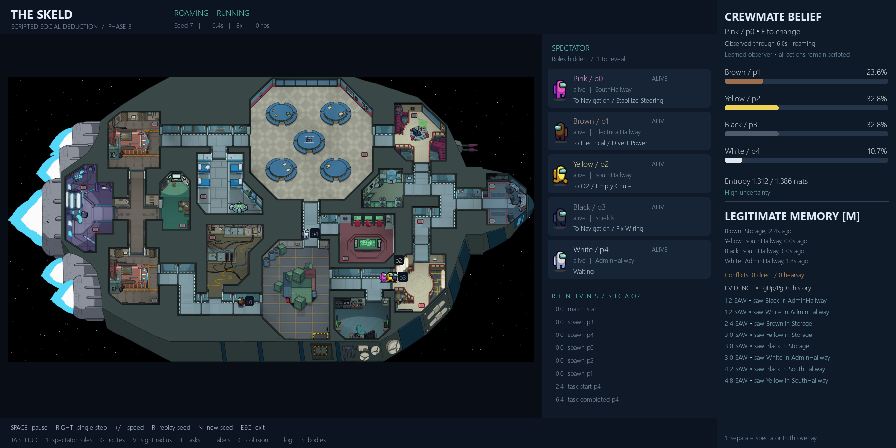
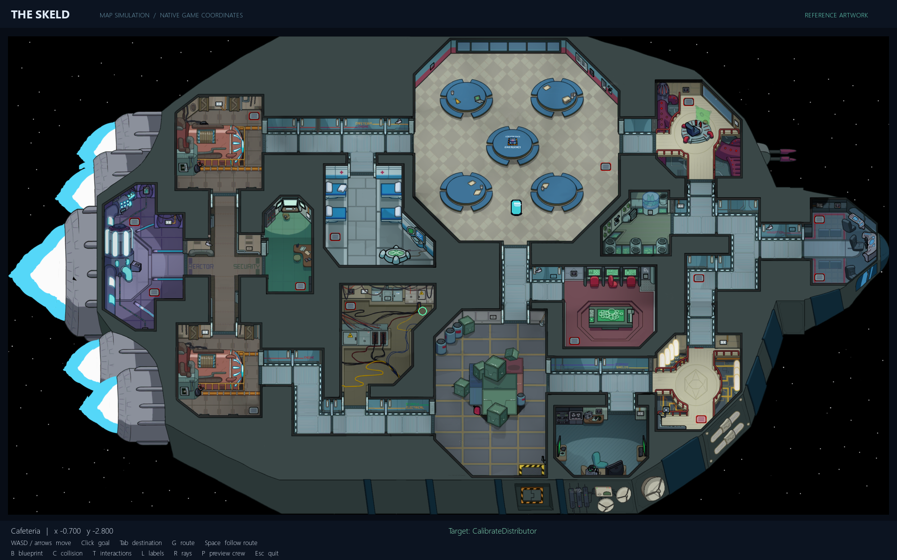
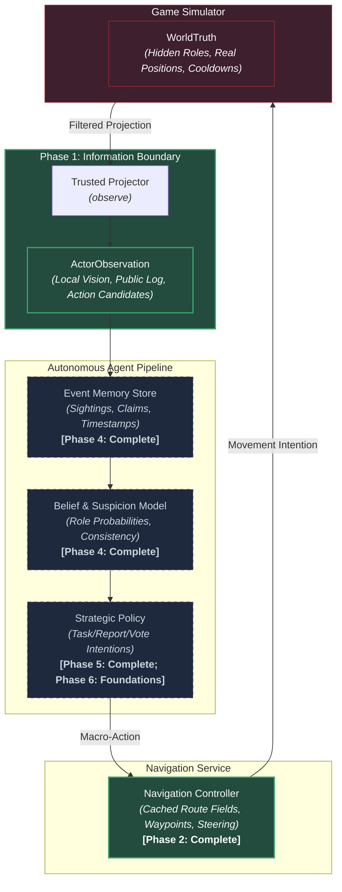

# Social Deduction AI

> Autonomous crewmate reasoning, belief modeling, and strategic reinforcement learning under legitimate partial observability.

[](https://www.python.org/)
[](https://pytorch.org/)
[](https://gymnasium.farama.org/)
[](docs/benchmarks/phase6/seed17-stage/runner-pytest.xml)
[](docs/information_contract.md)

Explore the [interactive project journey](https://hadisovic.github.io/social-deduction-ai/) for a visual, non-technical guide to the milestones and current research frontier.

## Phase 6 foundations — in progress

The approved [Phase 6.1 seed-17 pilot](docs/benchmarks/phase6/seed17-stage/README.md)
completed three 8,192-decision models and validation only. Full / history without
belief / current-only won 90.0% / 87.5% / 90.0% of 200 paired validation matches,
with 1.905 / 1.950 / 1.940 own tasks per match. The full model cast 167 votes
(159 correct); the ablations cast one and zero. All exceeded idle/random controls;
none established superiority over scripted play. Training took 91.58 minutes;
the whole stage took 2.746 hours. Remaining six models are estimated at 4.28
additional hours (planning range 3.42–6.42), awaiting approval. Final partitions
remain unopened; Phase 6.1 is not accepted and no release model is replaced.

Phase 6.0 adds opt-in role-specific vision: crew sees **4.5** simulator units,
impostors **6.75**, and native walls/opaque props block both. Historical rules
and Phase 4/5 releases remain frozen. Phase 6.1 experiment foundations reuse the
existing PPO network with controlled memory/belief ablations, 12/24-second task
holds, optional public route distances, fresh seed partitions and detailed logs.
These are infrastructure changes, not evidence of stronger strategic play.

```powershell
python run_phase6.py          # Frozen Phase 5 crew under new rules; scripted impostor
python -m phase6.audit
python -m phase6.train --config artifacts/phase6/configs/reference.json --steps 256 --output artifacts/phase6/smoke/reference-17
python -m phase6.evaluate --config artifacts/phase6/configs/reference.json --matches 2 --output artifacts/phase6/smoke/development
```

Choose fresh output directories. V toggles spectator vision in the preview.
The smoke trainer caps runs at 512 decisions, and its evaluator exposes only
development seeds. The separate [approved seed-17 stage](docs/phase6_1_staged_protocol.md)
runner trains exactly three 8,192-decision conditions and uses validation only.
Remaining initializations and final tests require further approval.
No learned impostor, alternating training or multi-agent self-play is implemented.
Read the [experiment plan and compute proposal](docs/phase6_experiment_plan.md),
[vision rules and compatibility](docs/phase6_vision_and_rules.md), and
[foundation verification](docs/benchmarks/phase6/foundation/README.md).

## Watch the evaluated Phase 5 strategic crewmate

Read the [illustrated teammate guide](docs/phase5_teammate_guide.md) for controls,
updates, graph explanations, results, timings and the proposed Phase 6 experiments.

```powershell
python run_phase5.py
```

One focal crewmate now chooses actions with a PPO neural policy. The Phase 4
belief network stays frozen; A* handles physical navigation. The supplied release
is the validation-selected seed-17 policy trained for 8,192 option decisions.
It won 88.4% of 500 familiar-family matches and 90.4% of 500 held-out patient-family
matches, completing 1.67/1.68 own tasks per match. It clearly outperformed idle
and random controls; superiority over scripted play was not established.
The policy sidebar shows legal action probabilities, value and the last choice.
Meeting banners identify the reporter or emergency caller. All ten local sprite
colors have walking frames; red material masks are decoded to a red suit.

The conservative circle-clearance repair passed 4,914 routes at each of 30 Hz and
5 Hz: 9,828 successful executions, no collisions or navigation failures. Source
map vertices and the physical radius remain unchanged. See
`docs/phase5_corridor_audit_fixed.json` and `docs/benchmarks/phase5/`.
The preserved first run completed 32,768
decisions but completed no own tasks in 299 training matches. A separate version
lets network-selected movement/task actions finish before resampling a goal.
Three full-memory seeds and a separately trained current-only comparison
were evaluated with validation-only checkpoint selection and independent final tests.
The [expanded experiment report and graphs](docs/benchmarks/phase5/expanded/README.md)
distinguish training, validation and final-test evidence across 9,000 final matches.
Phase 5's simulator study is complete. Phase 6 foundations are now implemented;
stronger crewmate experiments precede training learned opponents.

```powershell
# Watch the committed evaluated release with its recorded execution protocol.
python run_phase5.py --checkpoint artifacts/phase5/release/policy.pt
# Regenerate graphs from persisted measurements; this does not train or open tests.
python phase5_research_report.py
```

## Watch a crewmate form beliefs (Phase 4)

```powershell
python run_phase4.py
```

The focal avatar and Report / Use / Meeting availability cards appear along the
bottom of the map (spectator indicators). F changes the focal crewmate. The window
now fits its selected monitor and can be resized without stretching sprites;
`--display 0 --window-scale 1` requests the full 1800 x 900 canvas.
The [reviewed Phase 5 specification](docs/phase5_strategic_policy_specification.md#review-amendment--2026-10-03)
preserves the original proposal and appends required corrections, the rendering
fix and the original corridor-clearance prerequisite, now resolved above.

The real five-player match runs while a learned observer estimates which of the
four other players is the impostor. The right panel shows probabilities, entropy,
last sightings and source-tagged memory. F changes focal crew, M opens/closes memory,
PgUp/PgDn browse evidence, and `1` independently reveals spectator truth. Space
pauses, Right steps, `+/-` changes speed, R repeats and N changes seed.

**Phase 4 is complete:** 1,400 matches / 64,097 samples; a 2,849-parameter shared
set model; 327 passing tests. Against the held-out patient impostor family, the
calibrated model achieves **67.4% accuracy / 0.637 NLL**, versus **63.2% / 0.800**
for calibrated evidence rules. Early ambiguous states remain uncertain. Scripts
still choose all actions in the Phase 4 viewer; the separate Phase 5 viewer uses a learned focal policy.

```powershell
python train_phase4.py          # Generate/resume, train, calibrate, evaluate
python train_phase4.py --quick  # Separate smoke experiment
python evaluate_phase4.py      # Reevaluate both final sets and ablations
```

The compact release checkpoint is committed; training data is regenerable and
ignored. See [memory, boundary and reproduction](docs/belief_model.md) and
[measured results, uncertainty and limitations](docs/benchmarks/phase4/README.md).



## Watch the original five-player simulator

```powershell
python run_phase3.py
```

One command opens the improved Skeld map and starts a full scripted match:
four crew, one impostor, physical travel, timed private tasks, occluded sightings,
bodies, reports, structured claims, public votes and a final winner. Space pauses,
Right steps, `+/-` changes speed, R replays and N starts the next seed. `1` reveals
privileged spectator roles; controllers never receive that view.

The owner-requested character/task artwork is available in an ignored local pack.
`python phase3_assets.py --install` installs the pinned selection explicitly;
without it, the demo uses original procedural characters. See the
[asset provenance and redistribution boundaries](docs/phase3_asset_provenance.md).

```powershell
python run_phase3_batch.py --matches 1000 --workers 8
```

This headless command independently replays every seed and writes CSV/JSON results.
Read the [rules, architecture, controls and limitations](docs/social_simulator.md)
and [acceptance evidence](docs/benchmarks/phase3/README.md). Phase 4 adds a learned
belief observer; Phase 5 adds the separate learned focal-crewmate policy.

## Preserved source-backed Skeld navigation inspector

Launch the new map with `python among_us_map_simulation.py`. It combines native
collider geometry, task/vent metadata and the supplied reference artwork, with
63 task and utility destinations, swept collision and a deterministic navigation service.
The original files and checkpoints are preserved; `skeld_config_legacy.py` also
snapshots the old map. Existing training entry points still select the old map.



Read the [map blueprint, controls, compatibility and accuracy limits](docs/among_us_map_simulation.md).
This is not yet verified against a matching live-game build: collider geometry is
historical, and some console positions and physics values are estimates. This new
asset-backed path has separate [source notices](assets/skeld/NOTICE.md).

### Preserved legacy map


*Figure 1: The Skeld multi-room map environment. Logical world coordinate space (1600.0 × 895.45) with 14 rooms, 40 authentic task destinations, dual-layer collision geometry, and internal A\* route validation.*

---

## What is this?

**Social Deduction AI** is an artificial intelligence research project investigating autonomous agent reasoning in partially observable, multi-agent social-deduction environments (inspired by games like *Among Us*).

The research goal is to train an **autonomous crewmate** that:
- Receives strictly legitimate partial observations (local field-of-view, public announcements, and verbal statements).
- Accumulates timestamped evidence in an episodic memory store.
- Maintains and updates an explicit probabilistic belief/suspicion model over hidden player roles.
- Learns high-level strategic decision-making (task completion, patrol routes, grouping, reporting bodies, and voting) through reinforcement learning.

The Phase 3 actors remain scripted. Phase 4 now implements persistent legitimate
memory and learned role probabilities as an independent observer.

---

## Research Question

> **Can a compact learned crewmate agent—operating solely under legitimate partial observations, persistent evidence memory, and explicit role uncertainty—learn effective cooperative strategies that significantly improve team win rates over heuristic and memory-ablated baselines against held-out teammate and impostor strategies?**

---

## Architecture

The system enforces a strict hierarchical separation between the simulated game world, legitimate sensory observations, epistemic memory, and low-level navigation:



*Architectural Guarantees*: Hidden simulator truth (`WorldTruth`) can **never** leak into actor observations (`ActorObservation`), memory containers (`Knowledge`), or legal action candidates.

---

## Project Roadmap & Status

| Phase | Focus Area | Core Deliverables | Status |
|:---:|:---|:---|:---:|
| **Phase 1** | **Information Contract** | Immutable value types, observation projector, evidence provenance, zero-leakage test harness. | **COMPLETE / FROZEN** |
| **Phase 1.5** | **Source-backed Map** | Separate native-coordinate Skeld sandbox, blueprint, reference artwork and collision checks; live-game parity unverified. | **FROZEN FOR NAVIGATION** |
| **Phase 2** | **Navigation Service** | Swept-clear routes, interaction arrival, cancellation/replanning, 3,906 directed pairs + 1,008 random spawns. | **COMPLETE** |
| **Phase 3** | **Scripted Game Simulator** | Full five-player matches, information-safe scripts, visual demo, 1,000 seeds + 1,000 exact replays. | **COMPLETE** |
| **Phase 4** | **Memory & Belief Model** | Provenance-aware memory, conservative contradictions, calibrated shared candidate model, held-out evaluation. | **COMPLETE** |
| **Phase 5** | **Learned Crewmate Policy** | Evaluated PPO strategic actor-critic with frozen beliefs; useful contribution, no established superiority over scripts. | **COMPLETE** |
| **Phase 6** | **Multi-Agent Expansion** | Versioned vision and crewmate experiment foundations implemented; learned impostors, adaptation and self-play remain planned. | **IN PROGRESS** |

---

## Current Validated Foundation

1. **Phase 1 Information Boundaries**:
   - `WorldTruth`, `ActorObservation`, `Knowledge`, and `RoleLabels` cleanly decoupled into immutable dataclasses.
   - Provenance typing (`DIRECT`, `PUBLIC`, `CLAIM`) with explicit delivery vs. claimed timestamp separation.
   - Identity randomization stream isolated from role assignment.
   - 42 exhaustive property and paired-world invariance tests.
2. **Preserved Legacy Skeld Spatial Infrastructure**:
   - Approximate $1600.0 \times 895.45$ logical world with 1.7866 aspect-ratio preservation.
   - 50 solid wall rectangles and 32 walkable floor segments.
   - 40 authentic task destinations with verified $\ge 20\text{ px}$ wall clearance (0 unreachable).
   - Single connected walkable component verified via 4px occupancy grid ($89,600$ cells).
   - 34 automated physical validation tests.
3. **Continuous Locomotion Baseline**:
   - Preserved Stage 1 PPO model (`models/stage1/best_model/best_model.zip`) achieving 100% success rate and 93.86% path efficiency across 100 evaluation episodes.
4. **Reliable Navigation Service**:
   - **4,914/4,914 physical executions passed**: 3,906 directed destination pairs and 1,008 stratified random spawns.
   - Zero collisions, blocked steps or replans in the static-map benchmark.
   - Task/room/location arrival, cancellation, replacement and explicit failure outcomes.
   - [Committed results](docs/benchmarks/phase2/README.md) and [service documentation](docs/navigation_service.md).
5. **Five-Player Scripted Simulator**:
   - **1,000/1,000 matches completed**, with **1,000/1,000 identical independent replays**.
   - Zero crashes, invalid states, timeouts, illegal scripted actions or navigation failures.
   - 870 task victories, 41 impostor ejections and 89 impostor parity wins.
   - [Committed acceptance evidence](docs/benchmarks/phase3/README.md).
6. **Memory and Belief**:
   - 1,400 match-level split episodes, four focal crew histories per match, 64,097 samples.
   - Learned model beats prior and calibrated rules on both final sets; exact retraining verified.
   - [Results, calibration, ablations and leakage audit](docs/benchmarks/phase4/README.md).
7. **Test Suite Health**:
   - **327 tests passing**: all 291 previous checks plus 36 Phase 4 checks.

---

## Quick Start

### 1. Installation

```powershell
# Clone repository
git clone https://github.com/Hadisovic/social-deduction-ai.git
cd social-deduction-ai

# Create and activate virtual environment
python -m venv .venv
.venv\Scripts\activate

# Install dependencies
pip install -r requirements.txt
pip install -r requirements-dev.txt
```

### 2. Run Test Suite

```powershell
# Run the complete automated test suite
pytest -q
```

### 3. Watch a Full Scripted Match

```powershell
python run_phase4.py
python run_phase3.py
python run_phase3.py --seed 15 --speed 4
python run_phase3_batch.py --matches 1000 --workers 8
```

Seed 7 demonstrates tasks and a skipped meeting; seed 15 demonstrates an observed
kill leading to ejection; seed 25 demonstrates an impostor parity victory.

### 4. Launch the Navigation Inspector

```powershell
python among_us_map_simulation.py
```

WASD/arrows move and cancel navigation; click sets a goal; Tab cycles destinations; Space starts the navigation service. The window title shows its status.
B shows the blueprint, C collision, T interactions, L labels, R rays, P preview crew.

### 5. Reproduce Navigation Acceptance

```powershell
python benchmark_navigation.py
```

Runs every directed pair of 63 destinations and 1,008 deterministic stratified
spawns through normal movement physics. Results include per-case CSV and a JSON
summary in `docs/benchmarks/phase2/`. See the [service API and methodology](docs/navigation_service.md).

### 6. Launch Preserved Legacy Inspector

```powershell
# Interactive visual inspector for The Skeld map
python inspect_skeld.py
```
- `W / A / S / D`: Move player
- `Left Click`: Set target navigation goal
- `Tab / N`: Cycle through 40 authentic task destinations
- `G`: Toggle real-time internal A\* path overlay
- `C`: Toggle collision and walkable floor overlays
- `R`: Toggle 16 radial obstacle raycasts
- `H`: Toggle diagnostic HUD (spatial region, nearest task, FPS)

---

## Documentation

Comprehensive project documentation is maintained in the [`docs/`](docs/) directory:

- [**docs/PROJECT_PROGRESS.md**](docs/PROJECT_PROGRESS.md): Canonical detailed project history, navigation curriculum benchmarks (Stages 1, 2, 2.5), architectural pivot analysis, settled decisions, and milestone commits.
- [**docs/information_contract.md**](docs/information_contract.md): Strict rules, data structures, and invariants governing player observation and action spaces.
- [**docs/project_architecture.md**](docs/project_architecture.md): Module hierarchy, data flow, observation filtering, and evaluation design.
- [**docs/skeld_research.md**](docs/skeld_research.md): Map coordinate derivation, aspect ratio mathematics, and physical clearance calibration.
- [**docs/skeld_accuracy.md**](docs/skeld_accuracy.md): Rigorous factual accuracy audit, 9 canonical routes validation table, and physical test report.
- [**docs/among_us_map_simulation.md**](docs/among_us_map_simulation.md): New map blueprint, source versions, fidelity limits, controls and sandbox API.
- [**docs/asset_sources.md**](docs/asset_sources.md): Legacy procedural-asset policy and separate source-backed map notices.
- [**docs/navigation_service.md**](docs/navigation_service.md): Phase 2 architecture, API, failure handling and benchmark reproduction.
- [**docs/social_simulator.md**](docs/social_simulator.md): Phase 3 architecture, rules, information integrity, scripts and launch commands.
- [**docs/belief_model.md**](docs/belief_model.md): Phase 4 actor memory, learned beliefs, data discipline, inference and reproduction.
- [**docs/benchmarks/phase4/README.md**](docs/benchmarks/phase4/README.md): Final metrics, calibration, ablations, uncertainty and acceptance evidence.
- [**docs/phase3_asset_provenance.md**](docs/phase3_asset_provenance.md): Audit of all three requested sources and exact locally used artwork.
- [**HANDOFF.md**](HANDOFF.md): Engineering state, frozen boundaries, validation and continuation notes.

---

## Tech Stack

- **Core Simulation**: Python 3.12, Pygame-CE 2.5
- **RL Interfaces**: Gymnasium 1.1, Stable-Baselines3 2.7
- **Deep Learning**: PyTorch 2.6
- **Numeric & Testing**: NumPy, Pytest 9.1
