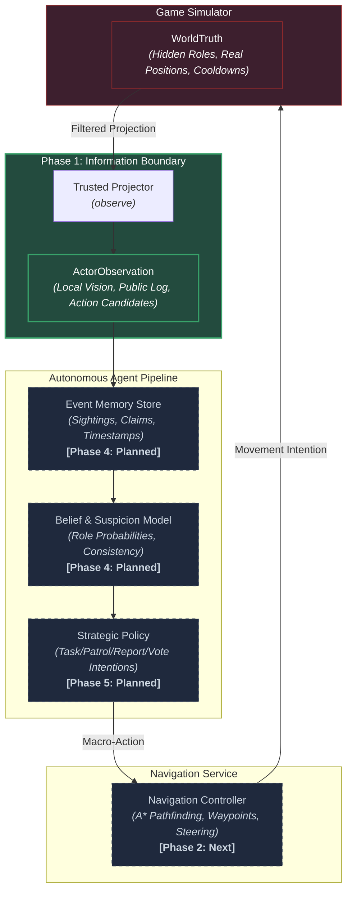

# Social Deduction AI

> Autonomous crewmate reasoning, belief modeling, and strategic reinforcement learning under legitimate partial observability.

[](https://www.python.org/)
[](https://pytorch.org/)
[](https://gymnasium.farama.org/)
[](test_information_contract.py)
[](docs/information_contract.md)


*Figure 1: The Skeld multi-room map environment. Logical world coordinate space (1600.0 × 895.45) with 14 rooms, 40 authentic task destinations, dual-layer collision geometry, and internal A\* route validation.*

---

## What is this?

**Social Deduction AI** is an artificial intelligence research project investigating autonomous agent reasoning in partially observable, multi-agent social-deduction environments (inspired by games like *Among Us*).

Rather than relying on omniscient game state or hand-crafted heuristic rules, the project focuses on training an **autonomous crewmate** that:
- Receives strictly legitimate partial observations (local field-of-view, public announcements, and verbal statements).
- Accumulates timestamped evidence in an episodic memory store.
- Maintains and updates an explicit probabilistic belief/suspicion model over hidden player roles.
- Learns high-level strategic decision-making (task completion, patrol routes, grouping, reporting bodies, and voting) through reinforcement learning.

---

## Research Question

> **Can a compact learned crewmate agent—operating solely under legitimate partial observations, persistent evidence memory, and explicit role uncertainty—learn effective cooperative strategies that significantly improve team win rates over heuristic and memory-ablated baselines against held-out teammate and impostor strategies?**

---

## Architecture

The system enforces a strict hierarchical separation between the simulated game world, legitimate sensory observations, epistemic memory, and low-level navigation:



*Architectural Guarantees*: Hidden simulator truth (`WorldTruth`) can **never** leak into actor observations (`ActorObservation`), memory containers (`Knowledge`), or legal action candidates.

---

## Project Roadmap & Status

| Phase | Focus Area | Core Deliverables | Status |
|:---:|:---|:---|:---:|
| **Phase 1** | **Information Contract** | Immutable value types, observation projector, evidence provenance, zero-leakage test harness. | **COMPLETE / FROZEN** |
| **Phase 2** | **Navigation Service** | Continuous steering controller, diagonal clearance, arrival tolerance, 1,560 validated task routes. | **CURRENT / NEXT** |
| **Phase 3** | **Scripted Game Simulator** | 5-player match engine (4 crew + 1 impostor), tasks, kill cooldowns, reports, and voting meetings. | **PLANNED** |
| **Phase 4** | **Memory & Belief Model** | Spatio-temporal event memory, consistency tracking, impossibility detection, and role posterior estimation. | **PLANNED** |
| **Phase 5** | **Learned Crewmate Policy** | Strategic actor-critic policy (PPO) optimizing crew task completion, grouping, and voting accuracy. | **PLANNED** |
| **Phase 6** | **Multi-Agent Expansion** | Learned impostor strategies, competitive self-play, saboteurs, vent networks, and symbolic communication. | **FUTURE** |

---

## Current Validated Foundation

1. **Phase 1 Information Boundaries**:
   - `WorldTruth`, `ActorObservation`, `Knowledge`, and `RoleLabels` cleanly decoupled into immutable dataclasses.
   - Provenance typing (`DIRECT`, `PUBLIC`, `CLAIM`) with explicit delivery vs. claimed timestamp separation.
   - Identity randomization stream isolated from role assignment.
   - 42 exhaustive property and paired-world invariance tests.
2. **The Skeld Spatial Infrastructure**:
   - High-fidelity $1600.0 \times 895.45$ logical world with 1.7866 aspect-ratio preservation.
   - 50 solid wall rectangles and 32 walkable floor segments.
   - 40 authentic task destinations with verified $\ge 20\text{ px}$ wall clearance (0 unreachable).
   - Single connected walkable component verified via 4px occupancy grid ($89,600$ cells).
   - 34 automated physical validation tests.
3. **Continuous Locomotion Baseline**:
   - Preserved Stage 1 PPO model (`models/stage1/best_model/best_model.zip`) achieving 100% success rate and 93.86% path efficiency across 100 evaluation episodes.
4. **Test Suite Health**:
   - **139 / 139 tests passing** across the entire repository.

---

## Quick Start

### 1. Installation

```powershell
# Clone repository
git clone https://github.com/Hadisovic/social-deduction-ai.git
cd social-deduction-ai

# Create and activate virtual environment
python -m venv .venv
.venv\Scripts\activate

# Install dependencies
pip install -r requirements.txt
pip install -r requirements-dev.txt
```

### 2. Run Test Suite

```powershell
# Run all 139 automated tests
pytest -q
```

### 3. Launch Map & Navigation Inspector

```powershell
# Interactive visual inspector for The Skeld map
python inspect_skeld.py
```
- `W / A / S / D`: Move player
- `Left Click`: Set target navigation goal
- `Tab / N`: Cycle through 40 authentic task destinations
- `G`: Toggle real-time internal A\* path overlay
- `C`: Toggle collision and walkable floor overlays
- `R`: Toggle 16 radial obstacle raycasts
- `H`: Toggle diagnostic HUD (spatial region, nearest task, FPS)

---

## Documentation

Comprehensive project documentation is maintained in the [`docs/`](docs/) directory:

- [**docs/PROJECT_PROGRESS.md**](docs/PROJECT_PROGRESS.md): Canonical detailed project history, navigation curriculum benchmarks (Stages 1, 2, 2.5), architectural pivot analysis, settled decisions, and milestone commits.
- [**docs/information_contract.md**](docs/information_contract.md): Strict rules, data structures, and invariants governing player observation and action spaces.
- [**docs/project_architecture.md**](docs/project_architecture.md): Module hierarchy, data flow, observation filtering, and evaluation design.
- [**docs/skeld_research.md**](docs/skeld_research.md): Map coordinate derivation, aspect ratio mathematics, and physical clearance calibration.
- [**docs/skeld_accuracy.md**](docs/skeld_accuracy.md): Rigorous factual accuracy audit, 9 canonical routes validation table, and physical test report.
- [**docs/asset_sources.md**](docs/asset_sources.md): Attribution, licensing, and strict zero-copyright-asset hygiene policy.
- [**HANDOFF.md**](HANDOFF.md): Engineering state, frozen boundaries, key files, and Phase 2 transition notes.

---

## Tech Stack

- **Core Simulation**: Python 3.12, Pygame-CE 2.5
- **RL Interfaces**: Gymnasium 1.1, Stable-Baselines3 2.7
- **Deep Learning**: PyTorch 2.6
- **Numeric & Testing**: NumPy, Pytest 9.1
