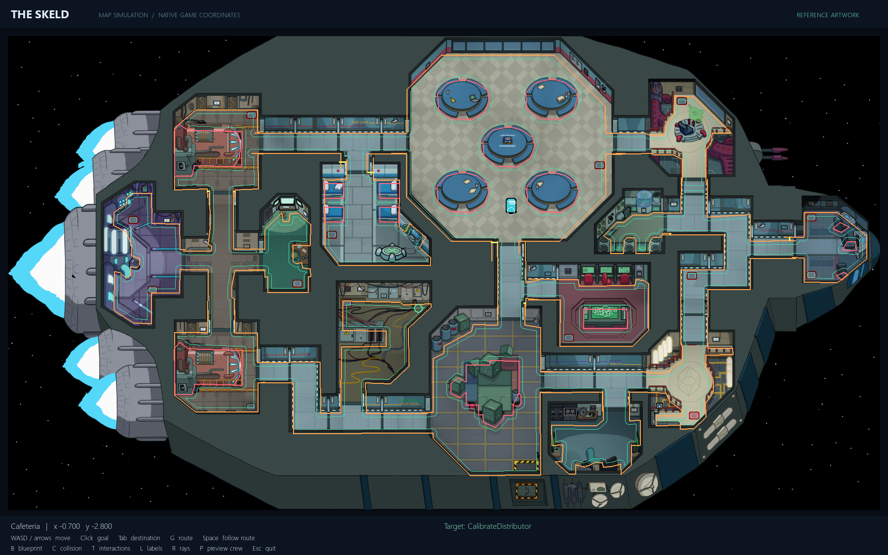
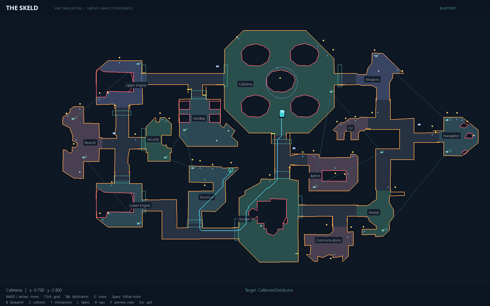

# Source-backed Skeld map simulation

Implemented 2026-10-02 as a separate replacement candidate for the approximate
Stage 2.5 map. This is the original Skeld layout for normal crewmate/impostor play.
Phase 1 information-contract code remains frozen. No social policy, training,
kill/task minigame, meeting, sabotage, or live-game connector was added.

## Run and inspect

```powershell
python -m pip install -r requirements.txt
python among_us_map_simulation.py
```

WASD/arrows move; click sets a walkable goal; Tab cycles destinations; Space
follows a diagnostic A* route. G toggles the route, C collision, T interactions,
L room labels, R rays, B blueprint, P cosmetic preview crewmates, Esc quits.
Preview crewmates do not collide or have roles. The cyan player's feet locate
its physical circle. Vents and task triggers are walkable; solid walls and
furniture block the player. Doors are open by default.





Orange lines are native wall chains, pink lines are prop colliders, yellow short
segments are explicit seam repairs, and green contours show player-center
clearance. Interaction overlays show yellow console positions and blue reachable
standing positions. Blueprint vent links show transport connections, not walking
routes. Cameras mark estimated housings; they do not implement camera vision.

## Files and preservation

| File | Purpose |
|---|---|
| `among_us_map_simulation.py` | New inspector and Gymnasium environment |
| `among_us_map.py` | Geometry, collision, raycasts, destinations and A* |
| `among_us_renderer.py` | Calibrated reference artwork and blueprint renderer |
| `assets/skeld/among_us_map.json` | Combined, versioned map blueprint |
| `assets/skeld/sources/` | Pinned input datasets and upstream license notices |
| `assets/skeld/reference_map.png` | User-supplied `map2.png`, copied unchanged |
| `tools/build_among_us_map.py` | Deterministic offline blueprint builder |
| `skeld_config_legacy.py` | Byte-for-byte snapshot of the old `skeld_config.py` |
| `test_among_us_map.py` | New geometry and sandbox compatibility checks |

The original `skeld_config.py`, `skeld_environment.py`, navigation scripts,
inspectors and model checkpoints are preserved. Existing training commands still
use the legacy map. Use the new entry point/import to choose this map explicitly.

## What the blueprint contains

- 14 rooms and 7 hallway classification regions, in native game coordinates.
- 42 wall chains, 19 prop collider records, and 8 named-in-code seam repairs from
  the source postprocessor. Props include five Cafeteria tables, four MedBay
  beds, two engines and their rails, Storage boxes, the Admin table and Nav chairs.
- 13 door polygons, 36 separate shadow/visibility records, and 52 raw console or
  scanner trigger records. Decorative furniture is also present in the artwork;
  wall-mounted props are often covered by the room wall chain.
- 14 vents with their source IDs and links, forming six connected vent networks.
- 30 upstream task definitions, expanded into **40 ordinary physical task
  stations**, **14 vent-cleaning locations**, and **9 utility consoles**: 63 total.
  Stations include all five download sites, Admin upload, eight accept-power
  sites, three fuel sites, and both garbage/chute stages. Shared physical
  stations are deduplicated; these are destinations, not task execution rules.
- Four image-estimated camera housings; source spawn center/radius and system
  metadata; emergency button, Admin table, surveillance, lights, communications,
  both O2 panels and both Reactor hands.

The freeplay task-add laptop is retained as a raw source console but is excluded
from normal-game destinations. There are no Hide n Seek additions or spell systems.

## Coordinates, size and fidelity limits

Physics uses the source's **native game units**, x right and y up. The imported
wall/prop extent is approximately x `[-22.93843, 19.13222]`, y
`[-17.54297, 5.95224]`, spanning **42.07065 by 23.49521 game units**. This is the
collider extent, not a claim that the ship's exterior or every room is rectangular.
Individual room/prop outlines and all vertices are available in the JSON.

The supplied 5792 by 3168 image is registered against 14 vent landmarks. Image
coordinates and physical coordinates are separate; display scaling never changes
physics. At the 2048 by 1120 reference preview, landmark RMS error is about
5.58 pixels and maximum error 11.51 pixels (about 0.27 game units). Art registration
therefore must not be treated as exact collision evidence.

**This is a sourced approximation, not a verified pixel/physics-identical export
of the current game.** The geometry dump is historical (committed September 2021;
client version unknown), whereas task/vent/system metadata identifies 2026.8.18.
Their agreement does not prove unchanged current colliders. Exact parity requires
exporting colliders, transforms, player collider/offset, speed, door state, usable
distances and visibility from the same target game build and validating against it.

Several source SVG circles lack world transforms. They are preserved as raw
records but never interpreted as physical polygons or coordinates. Missing
multi-stage task locations use nine available native trigger bounds and eleven
explicitly labeled image estimates. Five utility locations and all camera
housings also use image estimates. Estimated use radii are 1.5 units. Inspect
each destination's `provenance` rather than assuming uniform accuracy.

Player radius 0.22, speed 2.5 units/second, timestep 1/30 second, ray range 5.5,
and a 0.06-unit navigation grid are configurable simulation defaults, not measured
client physics. Classification regions are buffered by 0.25 units to construct an
envelope; subtracting collider clearance and choosing the largest connected
interior removes exterior/prop-interior fragments. This floor reconstruction and
the eight seam repairs are explicit approximations. The current grid has 67,924
connected nodes at the default radius. Movement uses swept geometry, not the grid.

## Sandbox compatibility

```python
from among_us_map_simulation import AmongUsMapEnv

env = AmongUsMapEnv(render_mode=None, goal_mode="task")
observation, info = env.reset(seed=7)
observation, reward, terminated, truncated, info = env.step([1.0, 0.0])
env.close()
```

The new environment retains the old Skeld interface: `Box(2)` continuous actions,
22 float32 observations, Gymnasium reset/step results, and positive action y
moving down on screen. Observation entries are normalized player position (2),
goal displacement (2), obstacle rays (16), stuck flag and stagnation (2).
Native `info` positions use y up. `task`, `task_to_task`, and `room_to_room` resets
are available. `render_mode="rgb_array"` provides image observations for callers.

This is API/shape compatibility, not policy equivalence: coordinate normalization,
physics, task distribution, rewards and geometry differ. Old checkpoints are not
validated on this map. The Phase 1 social-information projector is not connected
to this navigation-only environment; do not feed debugger state or unrestricted
geometry into future actor observations. Geometry IDs/task strings describe the
world; no new enums or hard-coded suspicion/kill decisions were introduced.

`env.map.astar(start, goal)` returns native-coordinate waypoints. Every grid edge
and endpoint connector is checked against the same player-clearance geometry used
by movement, including diagonals. The inspector follower is diagnostic, not a
completed Phase 2 navigation service. A static closed-door variant can be built
with `AmongUsMap(closed_doors=["11:5"])` (Electrical's door);
door mechanics and timers are not implemented.

## Rebuild and validation

```powershell
python tools/build_among_us_map.py
python among_us_map_simulation.py --screenshots docs/images
python -m pytest test_among_us_map.py -q
python -m pytest -q
```

The builder uses checked-in JSON only and records source SHA-256 hashes. No
downloaded third-party executable code is run. Tests check room connectivity,
every destination's reachable standing point and executable A* route, all vent
surfaces and link components, solid props, long-move tunneling, blocked shortcuts,
coordinate transforms, task-stage coverage, deterministic resets, action direction,
timeouts, RGB rendering, the Gymnasium checker and preservation of the old map.
These verify internal consistency; they cannot certify live-game parity.

Validation on 2026-10-02: **154 tests passed** (139 existing, 15 new), with three
existing dependency/Gym registration warnings. An additional SB3 `DummyVecEnv`
reset/step smoke check passed, and closing Electrical's door prevented an A* exit.
No policy training was run.

See [source provenance and notices](../assets/skeld/NOTICE.md) before redistributing
the bundled reference material. The old procedural-assets-only description applies
to the legacy environment, not this separately authorized source-backed map.
