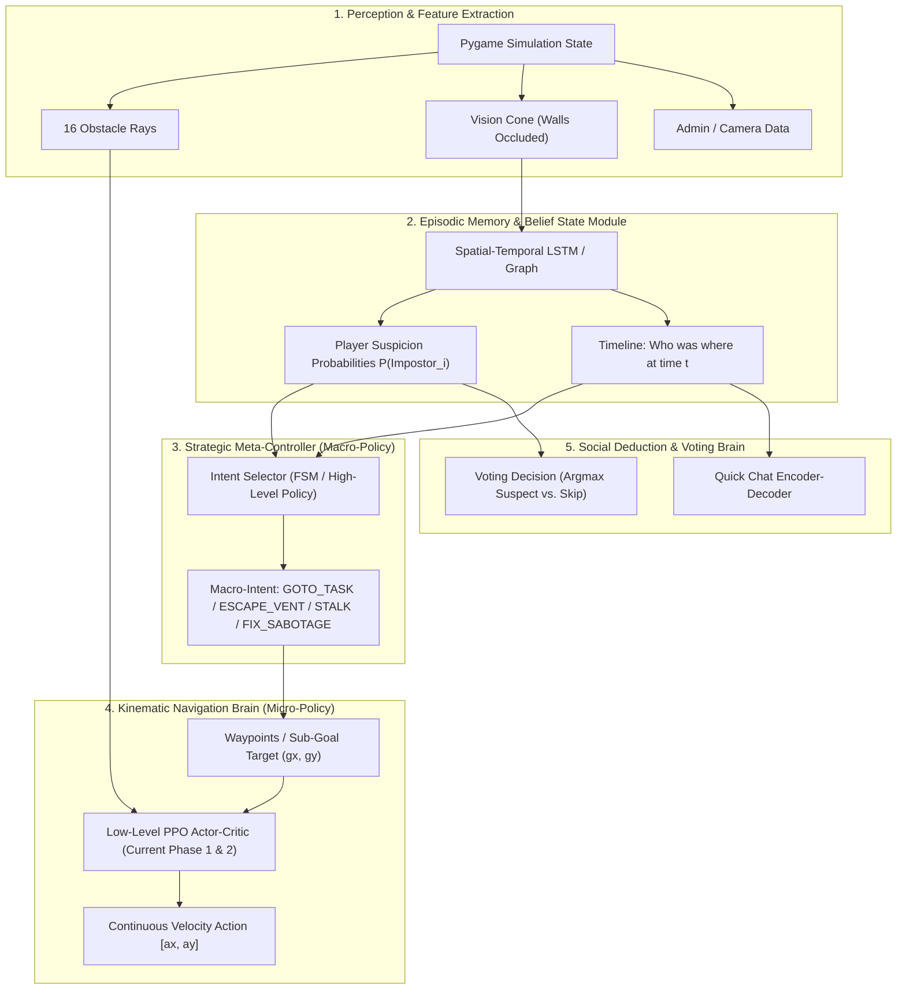

# The Ultimate Among Us Mechanics, Strategy & AI Architecture Compendium

> An exhaustive reference manual documenting every game mechanic, role, map, task, sabotage, voting rule, and Quick Chat formula in *Among Us*, followed by a comprehensive engineering blueprint for training a Neural Network to master the game from scratch.

---

## Table of Contents
1. [Core Premise & Win/Loss Conditions](#1-core-premise--winloss-conditions)
2. [Lobby Settings & Configurable Parameters](#2-lobby-settings--configurable-parameters)
3. [Player Identity, Colors & Cosmetics](#3-player-identity-colors--cosmetics)
4. [Roles & Special Abilities](#4-roles--special-abilities)
5. [Maps, Architectural Topologies & Utilities](#5-maps-architectural-topologies--utilities)
6. [Complete Tasks Compendium (Step-by-Step Mechanics)](#6-complete-tasks-compendium-step-by-step-mechanics)
7. [Impostor Sabotages & Combat Mechanics](#7-impostor-sabotages--combat-mechanics)
8. [Dead Bodies, Emergency Meetings & Voting Rules](#8-dead-bodies-emergency-meetings--voting-rules)
9. [The Quick Chat System & Dialogue Protocols](#9-the-quick-chat-system--dialogue-protocols)
10. [Engineering Blueprint: Teaching Among Us to a Neural Network](#10-engineering-blueprint-teaching-among-us-to-a-neural-network)

---

## 1. Core Premise & Win/Loss Conditions

*Among Us* is an asymmetric social deduction game designed around the **Informed Minority vs. Uninformed Majority** paradigm. Players are divided into two primary factions: **Crewmates** and **Impostors**.

```
                           ┌───────────────────────────────┐
                           │      Among Us Match (4-15)    │
                           └───────────────┬───────────────┘
                                           │
                    ┌──────────────────────┴──────────────────────┐
                    ▼                                             ▼
     ┌─────────────────────────────┐               ┌─────────────────────────────┐
     │     Crewmates (Majority)    │               │     Impostors (1-3 Minor)   │
     │      Uninformed / Honest    │               │      Informed / Deceptive   │
     └──────────────┬──────────────┘               └──────────────┬──────────────┘
                    │                                             │
      ┌─────────────┴─────────────┐                 ┌─────────────┴─────────────┐
      ▼                           ▼                 ▼                           ▼
[Task Victory]            [Ejection Victory]  [Kill Parity Victory]     [Sabotage Victory]
All tasks completed       All Impostors       Impostors equal living    Critical sabotage
by all Crewmates.         voted out.          Crewmates (e.g. 1v1, 2v2) countdown hits zero.
```

### Crewmate Victory Conditions
1. **Task Victory**: The collective green Task Bar reaches 100%. Every living and dead Crewmate completes all assigned Common, Long, and Short tasks.
2. **Ejection Victory**: All active Impostors are successfully identified and voted out through emergency meetings.

### Impostor Victory Conditions
1. **Kill Parity Victory**: The number of living Impostors equals the number of living Crewmates (e.g., 1 Impostor vs. 1 Crewmate, or 2 Impostors vs. 2 Crewmates). At parity, Crewmates can no longer win by vote, and Impostors can kill with impunity.
2. **Critical Sabotage Victory**: A lethal sabotage (Reactor Meltdown, Oxygen Depletion, Seismic Stabilizers, or Crash Course) countdown timer reaches `00:00` without Crewmates repairing both emergency terminals.

---

## 2. Lobby Settings & Configurable Parameters

Every match operates on a rulebook configured in the lobby by the host. These parameters dictate the game physics, sensory limits, and temporal pacing:

| Parameter | Permitted Range | Default | Competitive / Standard Value | Strategic Impact |
|---|:---:|:---:|:---:|---|
| **Max Players** | 4 – 15 | 10 | 10 – 15 | Determines lobby density and information fog. |
| **Impostor Count** | 1 – 3 | 2 | 2 (for 10-15 players) | Sets the parity threshold and kill pacing. |
| **Player Speed** | $0.5\times$ – $3.0\times$ | $1.0\times$ | $1.0\times$ – $1.25\times$ | Affects transit times between rooms and escape windows. |
| **Crewmate Light** | $0.25\times$ – $5.0\times$ | $1.0\times$ | $0.75\times$ – $1.0\times$ | Radius of circular vision cone in lit rooms. |
| **Impostor Light** | $0.25\times$ – $5.0\times$ | $1.5\times$ | $1.25\times$ – $1.5\times$ | Night vision capability (unaffected by Lights sabotage). |
| **Kill Cooldown** | 10.0s – 60.0s | 45.0s | 22.5s – 30.0s | Cooldown timer between consecutive kills for an Impostor. |
| **Kill Distance** | Short, Medium, Long | Medium | Short / Medium | Pixel snap distance required to trigger the Kill button. |
| **Common Tasks** | 0 – 2 | 1 | 1 – 2 | Tasks shared identically by all Crewmates. |
| **Long Tasks** | 0 – 3 | 1 | 1 | Multi-step or time-delayed tasks across rooms. |
| **Short Tasks** | 0 – 23 | 2 | 2 – 3 | Single-station rapid tasks. |
| **Emergency Meetings** | 0 – 9 | 1 | 1 per player | Maximum button calls allowed per individual player. |
| **Emergency Cooldown**| 0s – 60s | 15s | 20s – 25s | Global cooldown at match start & after meetings before button can be pressed. |
| **Discussion Time** | 0s – 120s | 15s | 15s – 30s | Mandatory chat period where voting is locked. |
| **Voting Time** | 0s – 300s | 120s | 60s – 90s | Window where players can cast ballots or skip. |
| **Confirm Ejects** | On / Off | On | Off (Competitive) | Displays whether the ejected player was an Impostor. |
| **Anonymous Votes** | On / Off | Off | On (Competitive) | Colors of voters are rendered as uniform gray silhouettes. |
| **Visual Tasks** | On / Off | On | Off (Competitive) | If On, external animations (scanners, lasers) visually clear players. |
| **Task Bar Updates** | Always, Meetings, Never | Always | Meetings / Never | Determines whether the task bar gives instant alibis. |

---

## 3. Player Identity, Colors & Cosmetics

### The 18 Official Astronaut Colors
Every player is assigned a unique primary body color in the lobby. Duplicate colors are forbidden within a single match.

```
Classic 12 (Original)        Added (15-Player Update)
[01] Red       [07] Black     [13] Maroon    [16] Gray
[02] Blue      [08] White     [14] Rose      [17] Tan
[03] Green     [09] Purple    [15] Banana    [18] Coral
[04] Pink      [10] Brown
[05] Orange    [11] Cyan
[06] Yellow    [12] Lime
```

### Color Specification Table

| ID | Color Name | Hex Code | Primary RGB | Common Nickname / Alias |
|:---:|:---|:---:|:---:|:---|
| 0 | **Red** | `#C51111` | `(197, 17, 17)` | Red, Cherry |
| 1 | **Blue** | `#132ED1` | `(19, 46, 209)` | Dark Blue, Navy |
| 2 | **Green** | `#117F2D` | `(17, 127, 45)` | Dark Green, Forest |
| 3 | **Pink** | `#ED54BA` | `(237, 84, 186)` | Magenta, Hot Pink |
| 4 | **Orange** | `#EF7D0D` | `(239, 125, 13)` | Carrot, Tangerine |
| 5 | **Yellow** | `#F5F557` | `(245, 245, 87)` | Lemon, Gold |
| 6 | **Black** | `#3F474E` | `(63, 71, 78)` | Charcoal, Dark |
| 7 | **White** | `#D6E0F0` | `(214, 224, 240)` | Snow, Light |
| 8 | **Purple** | `#6B2FBC` | `(107, 47, 188)` | Violet, Lavender |
| 9 | **Brown** | `#71491E` | `(113, 73, 30)` | Chocolate, Tan-Dark |
| 10 | **Cyan** | `#38FEDC` | `(56, 254, 220)` | Light Blue, Aqua, Teal |
| 11 | **Lime** | `#50EF39` | `(80, 239, 57)` | Light Green, Neon Green |
| 12 | **Maroon** | `#5F1E2E` | `(95, 30, 46)` | Burgundy, Wine |
| 13 | **Rose** | `#ECC0D3` | `(236, 192, 211)` | Pastel Pink, Blush |
| 14 | **Banana** | `#FFFFBE` | `(255, 255, 190)` | Pale Yellow, Butter |
| 15 | **Gray** | `#758593` | `(117, 133, 147)` | Silver, Ash |
| 16 | **Tan** | `#918877` | `(145, 136, 119)` | Khaki, Sand |
| 17 | **Coral** | `#D76464` | `(215, 100, 100)` | Salmon, Peach |

### Cosmetic Layers
Each astronaut entity contains 5 visual attachment slots that persist through matches:
1. **Base Body Color**: The primary 18-hue skin.
2. **Skin / Outfit**: Suit attire worn on the torso (e.g., Tuxedo, Astronaut, Lab Coat).
3. **Hat**: Headwear (e.g., Top Hat, Plunger, Dum Sticker).
4. **Visor**: Face accessory attached to the glass visor (e.g., Gas Mask, Sunglasses, Eyepatch).
5. **Pet**: Independent follower sprite trailing behind the player by 25-40 px. Sits down at death location when player is killed.

---

## 4. Roles & Special Abilities

Special roles introduce unique mechanics and asymmetric interaction loops:

```
                               ┌───────────────────────────┐
                               │     Roles in Among Us     │
                               └─────────────┬─────────────┘
                                             │
                     ┌───────────────────────┴───────────────────────┐
                     ▼                                               ▼
      ┌─────────────────────────────┐                 ┌─────────────────────────────┐
      │        Crewmate Roles       │                 │        Impostor Roles       │
      └──────────────┬──────────────┘                 └──────────────┬──────────────┘
                     │                                               │
  ├── Crewmate (Vanilla)                         ├── Impostor (Vanilla)
  ├── Engineer (Venting ability)                 ├── Shapeshifter (Morph disguise)
  ├── Scientist (Mobile vitals tablet)           └── Phantom (Invisibility stealth)
  ├── Guardian Angel (Ghost protection shield)
  ├── Tracker (Tracking beacon minimap)
  └── Noise Maker (Death siren / alert arrow)
```

### Crewmate Faction Roles

#### 1. Vanilla Crewmate
* **Primary Function**: Complete tasks, observe discrepancies, report bodies, participate in social deduction.
* **Abilities**: Standard movement, interaction with task terminals, Emergency Button press, Report button.

#### 2. Engineer
* **Primary Function**: Mobility, covert scouting, shortcut transit.
* **Special Ability**: `Vent`. Can enter, hide inside, and navigate through the map's vent network (identical to Impostors).
* **Constraints**:
  * Limited duration inside vent (configured: 15s to 30s). Forcefully ejected when timer reaches 0.
  * Vent cooldown after exiting (configured: 15s to 30s).
  * High social risk: If spotted venting by other crewmates, often mistaken for an Impostor.

#### 3. Scientist
* **Primary Function**: Bio-monitoring and early death detection.
* **Special Ability**: `Vitals`. Can open a handheld vitals tablet from anywhere on the map to monitor the live/dead status of all 15 players.
* **Constraints**:
  * Limited battery duration (typically 3 to 5 seconds of active viewing).
  * Battery is depleted only while tablet is open.
  * Recharged by completing tasks (each task completion restores a percentage or full charge).

#### 4. Guardian Angel (Ghost Role)
* **Primary Function**: Post-mortem protection of living crewmates.
* **Special Ability**: `Protect`. While dead, floats as a ghost and casts a glowing energy shield over a living Crewmate.
* **Mechanics**:
  * If an Impostor attacks a shielded player, the kill fails, consuming the shield and triggering the Impostor's kill cooldown without killing the victim.
  * Cooldown: 50s – 70s. Shield duration: 5s – 15s.

#### 5. Tracker
* **Primary Function**: Reconnaissance and tracking alibis.
* **Special Ability**: `Track`. Attaches a temporary tracking beacon to a target player.
* **Mechanics**:
  * The tracked player’s real-time position appears on the Tracker’s personal minimap as a moving icon for a set duration (e.g., 10s – 20s).
  * Cooldown: 20s – 40s.

#### 6. Noise Maker
* **Primary Function**: Instant kill alert siren.
* **Mechanics**:
  * Passive trigger on death. When killed by an Impostor, an alert siren sounds and a bright visual distress marker with a directional arrow appears on the screens of all living players.

---

### Impostor Faction Roles

#### 1. Vanilla Impostor
* **Primary Function**: Eliminate crewmates until parity, cause chaos via sabotages, maintain alibis.
* **Abilities**:
  * `Kill`: Eliminates a player within range. Triggers kill cooldown.
  * `Sabotage`: Opens holographic map to trigger system failures or close doors.
  * `Vent`: Unlimited duration inside vents; can travel instantly between interconnected vent nodes.

#### 2. Shapeshifter
* **Primary Function**: False-flag framing and identity theft.
* **Special Ability**: `Shapeshift`. Can morph into the exact color, skin, hat, and nameplate of any living player.
* **Mechanics**:
  * Cast Animation: Encloses into a fleshy egg cocoon for 1.5 seconds before emerging disguised.
  * Shift Duration: Typically 10s to 30s.
  * Revert Animation: Eggs back into original identity. Leaves behind temporary physical evidence (egg remnants) on the floor.
  * Strategic Power: Committing kills in plain sight while wearing a crewmate’s identity to frame them.

#### 3. Phantom
* **Primary Function**: Stealth assassinations and clean getaways.
* **Special Ability**: `Vanish`. Becomes semi-transparent / fully invisible to living players for a limited duration (e.g., 10s – 15s).
* **Constraints**:
  * Emits a brief puff of smoke upon triggering. Cannot kill while invisible; must decloak first.

---

## 5. Maps, Architectural Topologies & Utilities

### 1. The Skeld (The Canonical Spacecraft)
* **Context**: 14 distinct rooms connected by metal hallways. Standard competitive map.
* **Rooms (14)**:
  1. **Cafeteria**: Central hub, spawn point, Emergency Button table, trash chute, wiring.
  2. **Weapons**: Top right. Asteroids visual turret, download data.
  3. **O2**: Right corridor. Oxygen filter chute, O2 sabotage keypad.
  4. **Navigation**: Far right cockpit. Chart course, align telescope, steer ship.
  5. **Shields**: Bottom right. Prime shields visual task, divert power.
  6. **Communications**: Bottom center. Radio comms sabotage console, download data.
  7. **Storage**: Center-bottom hub. Fuel station canister, trash compactor lever.
  8. **Admin**: Center-right office. Admin map table, card swipe common task, O2 keypad.
  9. **Electrical**: Center-left death trap. One narrow entrance, 3 isolated corners, breaker panel, lights sabotage console.
  10. **Lower Engine**: Bottom left. Engine alignment console, fueling terminal.
  11. **Upper Engine**: Top left. Engine alignment console, fueling terminal.
  12. **Reactor**: Far left engine core. Start reactor (Simon Says), unlock manifolds, dual meltdown scanners.
  13. **Security**: Mid-left surveillance room. Camera monitor viewing 4 corridor junctions.
  14. **MedBay**: Mid-top medical bay. Submit scan (visual platform), inspect sample carousel.

```
                            THE SKELD - ACCURATE SHIP TOPOLOGY & ROOM MAP

                                  ┌───────────────────────────────┐
                                  │           CAFETERIA           │═════════════════════╗
                   ╔══════════════╡       [Emergency Table]       │                     ║
                   ║              └───────────────┬───────────────┘                     ║
                   ║                              ║                               ┌─────╨────────┐
            ┌──────╨───────┐              ╔═══════╩═══════╗                       │   WEAPONS    │
            │ UPPER ENGINE │              ║    Hallway    ║                       │ [Asteroids]  │
            └──────┬───────┘              ╚═══╦═══════╦═══╝                       └─────┬────────┘
                   ║                          ║       ║       ╔═════════════════════════╝
    ┌──────────┐   ║    ┌──────────────┐      ║   ┌───╨───────╨──┐                      ║
    │          ├───╨────┤    MEDBAY    │      ║   │    ADMIN     │        ┌─────────────╨┐
    │          │   ║    │[Visual Scan] │      ║   │ [Card/Table] │        │      O2      │
    │          │   ║    └──────────────┘      ║   └──────────────┘        │ [Clean Chute]│
    │          │   ║                          ║                           └─────┬────────┘
    │ REACTOR  │   ╠══════════════════════════╣                                 ║
    │[Meltdown │   ║    ┌──────────────┐      ║                                 ║     ┌────────────┐
    │Manifolds]│   ║    │   SECURITY   │      ║                                 ╠═════╡ NAVIGATION │
    │          │   ║    │ [Camera Hub] │      ║                                 ║     │  [Pilots]  │
    │          ├───╥────┴──────────────┘      ║                           ┌─────╨┐    └─────╥──────┘
    └──────────┘   ║                          ║                           │      │          ║
            ┌──────╨───────┐                  ║                           │   ┌──┴──────────╨┐
            │ LOWER ENGINE │                  ║                           │   │   SHIELDS    │
            └──────┬───────┘          ┌───────╨──────────────┐            │   │[Visual Lights│
                   ║                  │       STORAGE        ╞════════════╧═══╡   Deflect]   │
                   ╚══════════════════╡    [Fuel Station]    │                └─────┬────────┘
                             ║        └───────────────┬──────┘                      ║
                      ┌──────╨───────┐                ║                       ┌─────╨────────┐
                      │  ELECTRICAL  │                ╚═══════════════════════╡COMMUNICATIONS│
                      │ [Lights/Comms│                                        │ [Radio Dial] │
                      └──────────────┘                                        └──────────────┘
```

#### Exact Corridor & Doorway Connections (Verified Against In-Game Map):
1. **Cafeteria (Central-Top Octagon)**:
   * **West Corridor**: Leads west $\rightarrow$ branches south directly into **MedBay** (only 1 doorway) $\rightarrow$ continues west into **Upper Engine**.
   * **East Corridor**: Leads east $\rightarrow$ enters **Weapons** $\rightarrow$ curves south toward **O2**, **Navigation**, and **Shields**.
   * **South Corridor**: Major central thoroughfare heading straight down $\rightarrow$ passes **Admin** (on the east) $\rightarrow$ enters the north door of **Storage**.
2. **West Wing Cross (Reactor, Engines, Security)**:
   * **Upper Engine** (Top-Left) connects south through a vertical hallway cross down to **Lower Engine** (Bottom-Left).
   * **Reactor** (Far-Left pod) connects via two horizontal bridges: one into the upper junction (near Upper Engine), one into the lower junction (near Lower Engine).
   * **Security** (Surveillance Room) is nestled between Upper and Lower Engine, entered directly from the east wall of this vertical hallway.
3. **South-West Corridor (Electrical)**:
   * A horizontal hallway connects **Lower Engine** east into **Storage**.
   * **Electrical** branches north off this lower hallway (positioned below MedBay, but only accessible from this bottom corridor).
4. **South-Center (Storage, Admin, Communications)**:
   * **Storage** is the massive southern crossroads connecting North to Cafeteria, West to Electrical/Lower Engine, and East to Shields/Communications.
   * **Admin** sits east of the Cafeteria-Storage corridor (door faces west into the main hall).
   * **Communications** sits at the bottom-right of Storage, entered from the corridor leading to Shields.
5. **East Wing (Weapons, O2, Navigation, Shields)**:
   * **Weapons** (Top-Right) connects south past **O2** (on the west of the east hallway).
   * **Navigation** (Far-Right tip) is entered via two angled corridors: one from O2/Weapons, one from Shields.
   * **Shields** (Bottom-Right) connects North to Navigation and West back into Storage and Communications.

#### Vent Networks on The Skeld:
* **System 1 (Left Wing / Reactor Loop)**: Reactor (top) $\longleftrightarrow$ Upper Engine $\longleftrightarrow$ Reactor (bottom) $\longleftrightarrow$ Lower Engine.
* **System 2 (Center-Left / Surveillance Loop)**: Electrical (top-left) $\longleftrightarrow$ MedBay $\longleftrightarrow$ Security.
* **System 3 (Admin / Cafeteria Loop)**: Admin $\longleftrightarrow$ Cafeteria (top right) $\longleftrightarrow$ Hallway outside Navigation.
* **System 4 (Right Wing / Navigation Loop)**: Navigation (top) $\longleftrightarrow$ Weapons $\longleftrightarrow$ Navigation (bottom) $\longleftrightarrow$ Shields.

#### Key Observation Utilities on The Skeld:
* **Admin Table (Admin Room)**:
  * Holographic minimap showing yellow astronaut icons indicating real-time count of players in every room.
  * *Blind spots*: Hallways and corridors do not register on Admin.
  * *Impostor detection trick*: If an icon blinks into a room and instantly vanishes, or jumps between non-adjacent rooms (e.g., MedBay to Security), someone vented. If two icons merge in Electrical and one vanishes, a kill just occurred.
* **Security Cameras (Security Room)**:
  * Monitor switching between 4 live camera feeds:
    1. West Hallway (outside Upper/Lower Engine & Reactor).
    2. MedBay Hallway (outside MedBay & Cafeteria).
    3. Admin Hallway (outside Cafeteria & Storage).
    4. East Hallway (outside Navigation & Shields).
  * *Camera Indicator Light*: When someone is actively looking at cameras, red LED lights flash on all 4 physical wall cameras across the ship. Impostors use this to know if cameras are watching.

---

### 2. MIRA HQ (Floating Sky Platform)
* **Architecture**: Vertical layout with long walkways and glass bridges.
* **Unique Features**:
  * **Global Vent Network**: All 11 vents on the map are fully interconnected. An Impostor can enter anywhere and exit anywhere.
  * **Decontamination Airlock**: Mandatory 5-second cleaning cycle locking players in a sealed chamber between the lobby and laboratory.
  * **Doorlog Terminal (Communications)**: Records timestamped sensor crossings across 3 choke points: North Sensor, South Sensor, East Sensor. Does not show who is with whom, only who crossed which line and when.

---

### 3. Polus (Frozen Alien Research Outpost)
* **Architecture**: Sprawling outdoor planetary base with free-standing buildings and lava pits.
* **Unique Features**:
  * **Vitals Terminal (Office)**: Shows the current status of every player (OK, DEAD, or D/C). Updates instantaneously the millisecond someone is killed.
  * **6-Camera CCTV System**: Security room features a panoramic camera switcher cycling through 6 wide outdoor angles.
  * **Specimen Room Isolation**: Two long decontamination corridors isolate the Specimen building from the rest of the base.

---

### 4. The Airship (Giant Steampunk Zeppelin)
* **Architecture**: Massive multi-level map with vertical ladder climbs and delayed spawn selections.
* **Unique Features**:
  * **Moving Floating Platform (Gap Room)**: Manual ferry platform that carries only one player across the central chasm at a time.
  * **Ladders**: Vertical transitions between upper and lower deck sections. Players climbing ladders cannot report or kill until reaching the top/bottom.

---

### 5. The Fungle (Deserted Tropical Island)
* **Architecture**: Dense jungle wilderness with outdoor campsites, ziplines, and beach shores.
* **Unique Features**:
  * **Zipline**: One-way rapid transit line across the central ravine.
  * **Spore Mushrooms**: Interactive plants that, when triggered, release a cloud of purple spores blinding all nearby players for several seconds.
  * **Lookout Post**: High-elevation binocular station providing wide-angle field of view.

---

## 6. Complete Tasks Compendium (Step-by-Step Mechanics)

Tasks are classified into **Common**, **Long**, and **Short**.

```
                           ┌───────────────────────────────┐
                           │      Task Classification      │
                           └───────────────┬───────────────┘
                                           │
         ┌─────────────────────────────────┼─────────────────────────────────┐
         ▼                                 ▼                                 ▼
   [Common Tasks]                    [Long Tasks]                      [Short Tasks]
Shared identically by             Multi-step journeys across        Single-step rapid tasks
all players in match.             different rooms or delays.        at one station (1-5s).
(e.g., Wires, Swipe Card)         (e.g., Download, Water Plants)    (e.g., Manifolds, Asteroids)
```

### Visual Tasks (100% Innocence Proof)
If "Visual Tasks" are toggled `ON` in lobby settings, performing these 4 specific tasks renders a visible external animation that all players can see in real-time. Since Impostors cannot perform tasks, seeing an animation provides mathematical proof of innocence:

1. **Submit Scan (MedBay)**: A green holographic ring sweeps up and down the player's body for 10 seconds. Shows weight, blood type, and ID number on screen. Only one player can scan at a time.
2. **Clear Asteroids (Weapons)**: Twin green laser cannons visibly fire energy blasts from the exterior nose of the spacecraft each time an asteroid is clicked.
3. **Empty Garbage / Chute (Storage / O2)**: When the lever in Storage is pulled down, metal hatch doors open on the outside underside of the ship, expelling leaves, canisters, and trash into space.
4. **Prime Shields (Shields)**: When the last red shield tile is cleared, bright white LED navigation lights ignite along the ship’s exterior hull and remain illuminated for the rest of the game.

---

### Full Step-by-Step Task Catalog

#### 1. Fix Wiring (Common / Short)
* **Locations**: Occurs in 3 sequential stages across rooms (e.g., Electrical $\rightarrow$ Storage $\rightarrow$ Cafeteria).
* **Mechanic**: UI displays two columns of 4 colored wire ends: Red, Blue, Yellow, Magenta. Wires in the right column are randomized in vertical order. The player must click and drag each wire from left to the matching colored port on the right.
* **Completion**: All 4 wires connected across all 3 assigned rooms.

#### 2. Swipe Card (Common / Short)
* **Location**: Admin desk.
* **Mechanic**: Player pulls an ID card out of a wallet, places it into a card reader slot, and drags it horizontally from left to right.
* **Physics/Timing Constraints**:
  * *Too Slow*: Error: "Too slow. Try again."
  * *Too Fast*: Error: "Too fast. Try again."
  * *Bad Read*: Error: "Bad read. Try again."
  * *Sweet Spot*: Drag duration must land between 0.35s and 0.65s.

#### 3. Download & Upload Data (Long)
* **Mechanic**: Two-stage task.
  * Stage 1: Download from a remote room terminal (Weapons, Cafeteria, Navigation, Communications, or Electrical). Takes 8.7 seconds of watching a running folder progress bar.
  * Stage 2: Travel to Admin and click "Upload Data". Takes an additional 8.7 seconds.
* **Vulnerability**: Completely blinds the player’s screen with UI for nearly 9 seconds, making it a prime kill window for Impostors.

#### 4. Calibrate Distributor (Short)
* **Location**: Electrical.
* **Mechanic**: Three rotating dials spinning at different speeds with black, blue, and cyan notch marks. As the colored contact on a spinning wheel aligns with the static right-hand bar, the player must press a button (1, 2, 3) to lock it.
* **Failure State**: Pressing at the wrong time resets the entire task back to dial #1. Known as one of the most mechanically frustrating tasks.

#### 5. Start Reactor / Simon Says (Long)
* **Location**: Reactor.
* **Mechanic**: A $3\times3$ grid of black squares on the left and a numeric keypad on the right. The game flashes a sequential pattern of blue lights. The player must repeat the pattern on the keypad.
* **Progression**: 5 consecutive rounds (Round 1 = 1 flash, Round 2 = 2 flashes, ... Round 5 = 5 flashes).
* **Reset**: If a mistake is made, the player restarts from Round 1.

#### 6. Unlock Manifolds (Short)
* **Location**: Reactor.
* **Mechanic**: A metal plate displaying 10 numbered buttons (1 through 10) in randomized positions. The player must press them in ascending sequential order: `1 -> 2 -> 3 -> 4 -> 5 -> 6 -> 7 -> 8 -> 9 -> 10`.

#### 7. Fuel Engines (Long)
* **Mechanic**: 4-step process.
  1. Go to Storage: Hold down fuel pump button until gas canister is 100% full.
  2. Walk to Upper Engine: Hold down fuel input button until tank is filled.
  3. Return to Storage: Refill gas canister.
  4. Walk to Lower Engine: Hold down fuel input button to fill lower engine.

#### 8. Clean O2 Filter (Short)
* **Location**: O2.
* **Mechanic**: A glass ventilation pipe filled with 6 floating green leaves. Player must drag each leaf into the vacuum suction port on the left.

#### 9. Inspect Sample (Long)
* **Location**: MedBay.
* **Mechanic**: Two-phase delay task.
  * Step 1: Press green button to dispense chemical fluid into 5 test tubes. A 60-second countdown timer starts. (Player can walk away and do other tasks).
  * Step 2: Return after 60 seconds. One tube turns red (the anomaly). Press the button corresponding to the red tube.

#### 10. Align Engine Output (Short)
* **Locations**: Upper Engine & Lower Engine.
* **Mechanic**: A crosshair targeting interface showing a center horizontal dashed line. The engine nozzle angle is tilted. Drag the slider on the right until the center crosshair aligns with the horizontal guide line.

---

## 7. Impostor Sabotages & Combat Mechanics

Impostors carry a personal Sabotage Map interface allowing them to trigger global emergencies or lock room doors.

```
                             ┌───────────────────────────────┐
                             │       Sabotage Systems        │
                             └───────────────┬───────────────┘
                                             │
             ┌───────────────────────────────┴───────────────────────────────┐
             ▼                                                               ▼
   [Critical / Lethal Sabotages]                                   [Non-Lethal Sabotages]
Countdown timer to instant victory.                             Disrupts perception or systems.
• Reactor Meltdown (Skeld / MIRA)                               • Lights Out (reduces crew vision)
• Oxygen Depletion (O2)                                         • Comms Jammed (hides tasks, cams)
• Seismic Stabilizers (Polus)                                   • Door Lockdown (seals exits 10s)
• Crash Course (Airship)
```

### Critical / Lethal Sabotages

1. **Reactor Meltdown / Seismic Stabilizers**:
   * **Countdown**: 30 to 45 seconds (depending on map).
   * **Fix Requirement**: Two living players must simultaneously hold their hands on two separate biometric scanner pads in Reactor. A single player cannot fix it alone.
   * **Strategic Use**: Draws all crewmates to the far left edge of the map, allowing Impostors to pick off isolated stragglers on the right.

2. **Oxygen Depletion (O2)**:
   * **Countdown**: 30 seconds.
   * **Fix Requirement**: Two distinct 5-digit PIN codes must be typed into numeric keypads in two separate rooms (Admin and O2).
   * **Strategic Use**: Forces the crew to split up. Failure by even one room results in immediate loss.

---

### Non-Lethal Sabotages

1. **Electrical / Lights Out**:
   * **Effect**: Slashes Crewmate vision from normal ($1.0\times$) down to a tiny circular radius around their sprite ($0.15\times$). Crewmates can only see players directly adjacent to them.
   * **Impostor Advantage**: Impostor vision is completely unaffected! Impostors can see the entire hallway and kill in pitch darkness without anyone seeing who did it.
   * **Fix**: Breaker panel in Electrical. Flip 5 toggle switches until all green indicator lights are active.

2. **Communications Jamming**:
   * **Effect**:
     * Erases the Task List from Crewmate HUDs.
     * Freezes the green Task Bar.
     * Disables Security Cameras, Admin Table, and Vitals monitors.
     * Prevents Scientists and Trackers from using role abilities.
     * Prevents Guardian Angels from seeing living players clearly.
   * **Fix**: Turn a radio dial in Communications until the red interference wave matches the green carrier frequency wave.

3. **Door Sabotages (Lockdowns)**:
   * **Effect**: Metal blast doors slam shut for 10 seconds, trapping anyone inside the room and preventing outsiders from entering.
   * **Cooldown**: Has an independent cooldown from room system sabotages.

---

### Combat & Elimination Mechanics

* **Kill Button Range**:
  * *Short*: ~1.0 player diameter (~35 px).
  * *Medium*: ~2.0 player diameters (~70 px).
  * *Long*: ~3.5 player diameters (~120 px).
* **Execution**: When within range and cooldown is `00:00`, the Kill button illuminates. Clicking it snaps the Impostor directly to the victim’s coordinates, executes a 1.2-second animation, drops a severed lower torso body sprite at the exact spot, and resets the kill cooldown.
* **Anti-Kill Shields**: If a Guardian Angel cast `Protect` on the target within the window, the kill is blocked: a blue hexagonal shield repels the attack, the victim survives, and the Impostor’s cooldown resets.

---

## 8. Dead Bodies, Emergency Meetings & Voting Rules

```
                      ┌─────────────────────────────────────────┐
                      │            Meeting Triggered            │
                      │  (Body Reported OR Emergency Button)    │
                      └────────────────────┬────────────────────┘
                                           │
                                           ▼
                      ┌─────────────────────────────────────────┐
                      │            Discussion Phase             │
                      │  (0-120s timer; text/quick chat active; │
                      │   VOTING IS STRICTLY LOCKED)            │
                      └────────────────────┬────────────────────┘
                                           │
                                           ▼
                      ┌─────────────────────────────────────────┐
                      │              Voting Phase               │
                      │   Cast ballot for a player color,       │
                      │   choose to 'Skip Vote', or abstain.    │
                      └────────────────────┬────────────────────┘
                                           │
                     ┌─────────────────────┴─────────────────────┐
                     ▼                                           ▼
              [Plurality Won]                             [Tie / Skip Won]
      A single player received more               Two players tied, or Skip
      votes than any other player OR skip.        received equal/most votes.
                     │                                           │
                     ▼                                           ▼
            [Player Ejected]                                [No Ejection]
     Ejection screen plays; role revealed            Match resumes with zero
     if 'Confirm Ejects' is ON.                      ejections.
```

### Meeting Invocations
1. **Reporting a Body**:
   * Any player (Crewmate or Impostor) whose line-of-sight and proximity intersects a dead body sprite can press the red **Report** button.
   * *Self-Reporting*: An Impostor can kill a victim and instantly report their own kill to establish an alibi (claiming: *"I just walked into Electrical and found them!"*).
2. **Emergency Button**:
   * Located on the central table in Cafeteria (or Office in Polus).
   * Restricted by lobby limits (e.g., 1 per player per game) and global emergency cooldowns.
   * **Disabled during active sabotages**: You cannot press the button while Lights, O2, Reactor, or Comms are actively sabotaged.

### The Vote Resolution Algorithm
* Every living player possesses 1 vote. Dead players cannot vote.
* Total Ballots = $\sum \text{Votes for Player}_i + \text{Votes for Skip}$.
* **Plurality Rule**:
  * Let $V_{\max}$ be the maximum vote count received by any option.
  * If exactly one player color receives $V_{\max}$ and $V_{\max} > \text{Votes for Skip}$, that player is **Ejected**.
  * If `Skip` receives $\ge V_{\max}$, **Nobody is Ejected (Skipped)**.
  * If two or more player candidates tie for $V_{\max}$ (e.g., Red: 3 votes, Blue: 3 votes, Skip: 2 votes), **Tie Occurred: Nobody is Ejected**.

---

## 9. The Quick Chat System & Dialogue Protocols

The Quick Chat system provides a structured, discrete taxonomy of communication tokens designed for rapid console/mobile play and safety against abuse.

### The 7 Semantic Categories & Grammar Templates

```
                               ┌───────────────────────────┐
                               │    Quick Chat Taxonomy    │
                               └─────────────┬─────────────┘
                                             │
      ┌───────────┬───────────┬──────────────┼──────────────┬───────────┬───────────┐
      ▼           ▼           ▼              ▼              ▼           ▼           ▼
[Questions]    [Orders]   [Statements] [Accusations]    [Answers]   [Locations]  [Crew]
"Who?"         "Vote"     "I was in"   "[Player] sus"   "Yes / No"  "MedBay"     "Red"
"Where?"       "Skip"     "Safe"       "Saw vent"       "I was with""Admin"      "Engineer"
```

1. **Questions**:
   * `"Who?"`
   * `"Where was the body?"`
   * `"Who was with [Player]?"`
   * `"Why did you report?"`
   * `"What tasks do you have left?"`

2. **Accusations**:
   * `"[Player] is suspicious."`
   * `"[Player] killed [Player] in [Location]."`
   * `"[Player] vented in [Location]."`
   * `"[Player] was faking [Task]."`
   * `"[Player] did not do visual task."`

3. **Statements / Alibis**:
   * `"I was doing [Task] in [Location]."`
   * `"I was with [Player] in [Location]."`
   * `"[Player] is safe. I saw them do MedBay scan."`
   * `"I saw [Player] and [Player] together."`
   * `"The body was in [Location]."`

4. **Orders & Recommendations**:
   * `"Vote [Player]."`
   * `"Skip vote."`
   * `"Follow me."`
   * `"Fix [Sabotage] now!"`
   * `"Stick together."`

5. **Answers**:
   * `"Yes."` / `"No."` / `"Maybe."`
   * `"I don't know."`
   * `"I was alone."`

6. **Locations**:
   * Standard nouns for all rooms on the current map (`Cafeteria`, `Admin`, `Electrical`, etc.).

7. **Crew / Cosmetics**:
   * All 18 color tokens (`Red`, `Blue`, `Green`, etc.) and role tokens (`Engineer`, `Scientist`, etc.).

---

## 10. Engineering Blueprint: Teaching Among Us to a Neural Network

Teaching a machine to play *Among Us* from scratch is fundamentally different from games like Chess, Go, or Atari. It requires combining:
* **Continuous spatial navigation & obstacle geometry** (Physics).
* **Discrete decision logic & multi-step scheduling** (Game Engine).
* **Partially observable environments under Fog of War** (POMDP).
* **Episodic memory & timeline reconstruction** (Who went where?).
* **Social deduction, deception, and belief state inference** (Theory of Mind).

A single monolithic neural network will fail because the action and state spaces are too heterogeneous. Instead, we use a **Hierarchical Multi-Agent Reinforcement Learning (HMARL)** architecture:



---

### Step 1: The Low-Level Kinematics Brain (What We Are Building Now)
* **Architecture**: Actor-Critic Multilayer Perceptron (MLP) trained via PPO.
* **Observation Space**:
  * Normalized coordinates $(x/W, y/H)$.
  * Relative displacement to sub-goal: $((g_x - p_x)/W, (g_y - p_y)/H)$.
  * 16 radial distance sensors detecting walls and obstacles.
  * Stuck & stagnation flags.
* **Action Space**: Continuous 2D velocity $[a_x, a_y] \in [-1, 1]^2$.
* **Reward Shaping**:
  * Step penalty (`-0.01`).
  * New-best Euclidean progress (`+0.05 * dist`).
  * Wall-impact & stagnation penalties (`-25.0`).
  * Sub-goal reached jackpot (`+100.0`).

---

### Step 2: The Tactical Meta-Controller (Discrete Macro Actions)
Once the low-level policy can smoothly steer to any coordinate $(x, y)$ on the map without hitting walls, the high-level policy never worries about steering. It only chooses **where to go** and **what button to press**:

```python
# Macro-Action Space for Crewmate:
class CrewmateIntent(Enum):
    NAVIGATE_TO_TASK = 0      # Sub-goal: coordinates of nearest incomplete task
    FIX_CRITICAL_SABOTAGE = 1 # Sub-goal: coordinates of O2 keypad / Reactor scanner
    FLEE_SUSPECT = 2          # Sub-goal: move toward high-density room with multiple players
    PRESS_EMERGENCY_BUTTON = 3# Sub-goal: Cafeteria table
    REPORT_BODY = 4           # Micro-action: press Report button
```

```python
# Macro-Action Space for Impostor:
class ImpostorIntent(Enum):
    PATROL_SOLITARY = 0       # Search for isolated crewmate
    EXECUTE_KILL = 1          # Snap to target and kill
    ENTER_VENT = 2            # Escape into nearest vent
    TRIGGER_SABOTAGE_LIGHTS = 3
    TRIGGER_SABOTAGE_O2 = 4
    FAKE_TASK = 5             # Stand stationary at task station for 4-8 seconds
```

---

### Step 3: Episodic Memory & Timeline Reconstruction
Humans play *Among Us* by maintaining a mental ledger of chronological events:
* *"I saw Cyan go into Electrical with Yellow 20 seconds ago."*
* *"A body was reported in Electrical."*
* *"Cyan was the only person who left."*

To replicate this in a Neural Network, we maintain a **Spatial-Temporal Event Buffer** (or Graph Neural Network):
$$\text{Event}(t) = \langle \text{Time } t, \text{ Player ID } i, \text{ Room } R, \text{ Action } A \rangle$$
From this buffer, we calculate an empirical **Suspicion Vector**:
$$\mathbf{S} = [s_0, s_1, s_2, \dots, s_{14}] \quad \text{where } s_i \in [0.0, 1.0]$$

#### Programmatic Heuristics (Rule-Based Guardrails) to Bootstrap the NN:
Before pure RL discovers deduction through self-play, we can provide strong Bayesian priors:
1. **Direct Venting Sight**: If Player $i$ is observed in a room with no entrance and exits via a vent without an open door $\longrightarrow S_i = 1.0$.
2. **Proximity to Dead Body**: If Player $i$ was within 100 px of a body location at estimated time of death and did not report $\longrightarrow S_i \mathrel{+}= 0.4$.
3. **Visual Task Clearance**: If Player $i$ successfully ran the MedBay scanner or Weapons lasers in plain sight $\longrightarrow S_i = 0.0$ (Permanently Cleared).
4. **Alibi Overlap**: If Player $i$ and Player $j$ were together in Navigation during a kill in Reactor $\longrightarrow S_i$ and $S_j$ receive innocence discounts.

---

### Step 4: The Social Deduction & Voting Brain
During Emergency Meetings, the physics simulation pauses, and the agent activates its **Voting Brain**:

```
Input: Suspicion Vector S + Living Status Vector L + Vote History
  │
  ▼
Decision Logic:
  1. If any living player has S_i >= 0.85:
         Vote for Color(i).
         QuickChat: "I saw [Color(i)] kill [Victim] in [Room]."
  2. Else If remaining living players <= 4 AND 1 Impostor remains:
         (Danger of kill parity! Must attempt an ejection):
         Vote for argmax(S).
  3. Else (High uncertainty / early game):
         Vote to SKIP.
         QuickChat: "Not enough info. Skip vote."
```

---

### Step 5: Multi-Agent Self-Play (The Ultimate Training Phase)
Once all subsystems are connected:
1. Initialize a full lobby of **10 Autonomous Agents** (8 Crewmates, 2 Impostors) in the Pygame sandbox.
2. Run training episodes through **Self-Play Reinforcement Learning**:
   * Crewmates receive $+1.0$ for completing tasks, $+10.0$ for successfully voting out an Impostor, and $-10.0$ for dying or ejecting innocent teammates.
   * Impostors receive $+5.0$ for every successful kill, $+15.0$ for reaching kill parity, and $-10.0$ for being caught or ejected.
3. **Emergent Behaviors to Expect**:
   * *Stage 1*: Impostors kill blindly and get immediately caught by nearby witnesses.
   * *Stage 2*: Impostors learn to sabotage Lights and wait for victims in dark corners.
   * *Stage 3*: Crewmates learn the "Buddy System" (traveling in pairs of two so nobody can be killed in isolation).
   * *Stage 4*: Impostors learn to sabotage O2 to forcefully split up the buddies, or trigger double-kills in simultaneous strikes.

---

### Summary Checklist for Implementation Progress

- [x] **Phase 1 (Current)**: 2D Locomotion, continuous velocity $[a_x, a_y]$, goal tracking, Gymnasium decoupled wrapper.
- [ ] **Phase 2**: Obstacle raycasts (16 radial rays), wall sliding, deadlock detection & recovery.
- [ ] **Phase 3**: Topological Map geometry (The Skeld rooms, corridors, and doorways).
- [ ] **Phase 4**: Interactive Task stations (Wiring, Card Swipe, Download) & Task Bar progression.
- [ ] **Phase 5**: Fog-of-War vision cones, player proximity sensing, and line-of-sight occlusion.
- [ ] **Phase 6**: Dead body creation on kill, proximity reporting, and episodic timeline memory.
- [ ] **Phase 7**: Emergency meeting state machine, Quick Chat token encoding, and plurality voting.
- [ ] **Phase 8**: Impostor combat engine (Kill cooldowns, Vent networks, Sabotage triggers).
- [ ] **Phase 9**: Multi-agent self-play league training (10 simultaneous neural agents).
- [ ] **Phase 10**: External game interface and screen-based policy transfer.
