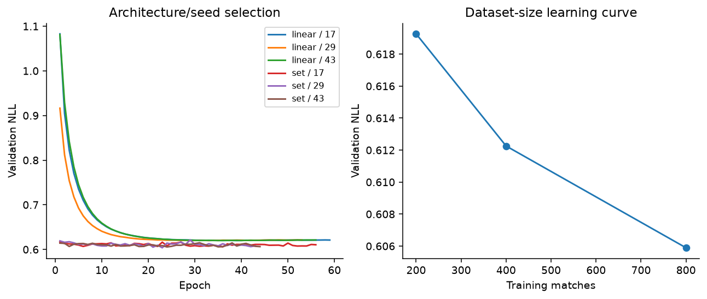
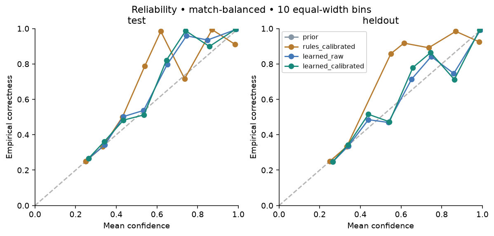
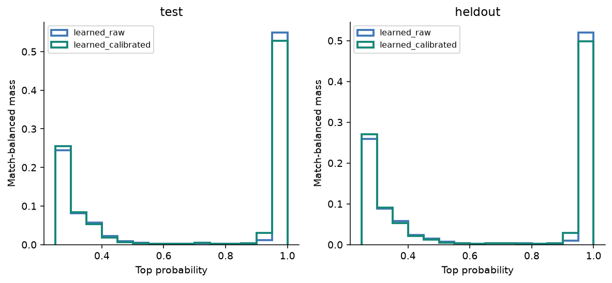
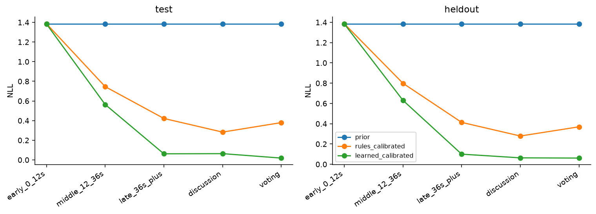
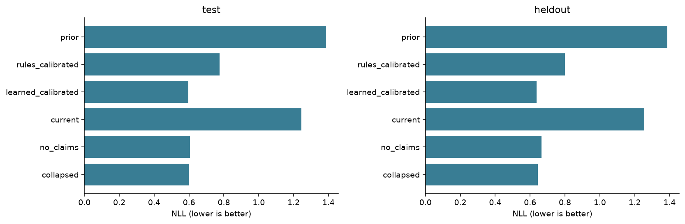
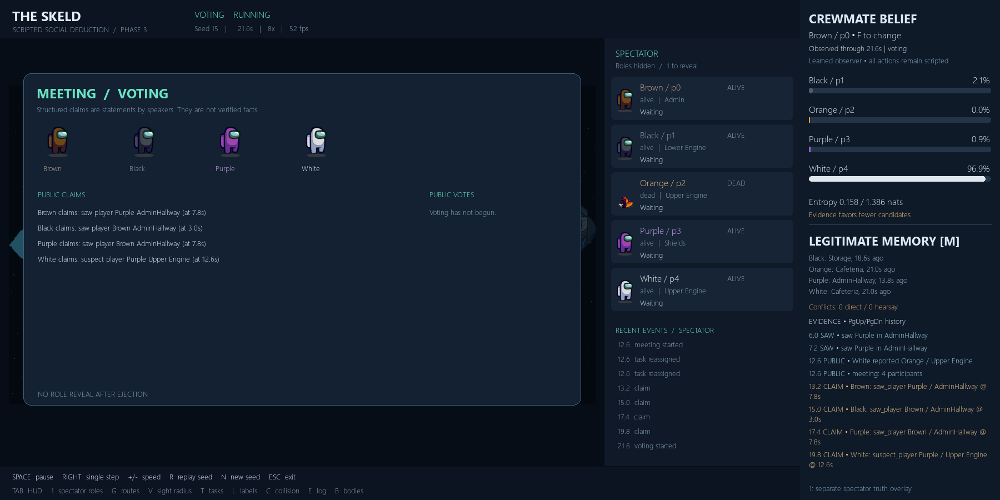

# Phase 4 measured results

**The learned observer beats the prior and calibrated evidence rules on both final
sets.** This is a result for five-player scripted matches, not evidence of human
social competence or better strategic play. All actions remain scripted.

The experiment was registered in [phase4_design.md](../../phase4_design.md) before
data generation and model selection. Implementation/contract:
[belief_model.md](../../belief_model.md). Machine-readable results: [metrics.json](metrics.json),
[selection/config/history](../../../artifacts/phase4/selection.json), [dataset.json](dataset.json).

## Data and split accounting

| Partition | Seeds | Matches | Focal crew histories | Samples |
|---|---|---:|---:|---:|
| Training | 10000–10799 | 800 | 3,200 | 36,465 |
| Validation | 20000–20199 | 200 | 800 | 9,391 |
| Final ID test | 30000–30199 | 200 | 800 | 9,119 |
| Patient-family test | 40000–40199 | 200 | 800 | 9,122 |
| Total | disjoint match ranges | **1,400** | **5,600** | **64,097** |

Training has 368 hunter / 432 self-report impostors, validation 109 / 91,
ID test 86 / 114. All 200 strategy-test impostors use the withheld patient family.
Crew and meeting styles are mixed independently of roles. Small communication
variants prevent accusation format alone being an impostor label; they appear in
all partitions. No game rule, navigation setting or original Phase 3 script changed.

Samples occur at match start, new meaningful actor events and six-second checkpoints.
Only living focal, nonterminal packets are admitted. No winner-dependent match
filtering, privileged replay inputs or frame-level random split is used. Every
match gets equal weight; its samples share that weight. Event/reason distributions,
family counts, outcomes and source hashes are in `dataset.json`.

Generation took **1,094.63 seconds (18.24 minutes)** with eight workers; compressed
shards and metadata currently occupy **9,570,835 bytes** after the documented
current-context correction. All 1,400 completed
with zero timeouts, invalid samples, illegal actions or navigation failures.
[The data audit](dataset_audit.json) checks all shards and independently regenerates
five matches across all partitions, requiring identical arrays and trajectory hashes.

Two audit corrections are explicit. A sample before a terminal killing action can
share that action's timestamp, so the correct acceptance check uses causal ordering
and forbids finished observations, rather than requiring a strictly earlier number.
The timeout guard originally compared against lowercase while the engine uses
`TIMEOUT`; it now normalizes case. Every existing outcome was checked before
updating the cache's acceptance-source fingerprint. **No feature array changed.**
[The amendment](source_acceptance_amendment.json) retains the original generation
config and both hashes. Fresh generation uses the corrected guard.

## Models and selection

Shared linear score: **23 parameters**, mean validation NLL **.61999** across
seeds 17/29/43. Shared set score: **2,849 parameters**, mean validation NLL **.60507**.
The set model was selected; seed **29**, best epoch **23**, is the release. The other
two seeds remain available for variability checks. Feature shape is **4 × 22**.
Encoder 22→32→32, candidate embedding concatenated with mean set embedding, score
head 64→16→1, ReLU activations and categorical softmax. All transformations are
shared across identities. Explicit memory supplies history; there is no recurrence.

Adam cross entropy, lr .003, weight decay .001, batch 512, max 160 epochs,
patience 20; CPU, one torch thread, deterministic operations. Training-only
normalization, schema and positive temperature are saved. Main candidate and
ablation fitting/calibration records total 170.91 seconds, excluding learning-curve
fits, data loading and plot overhead. Exact versions are in `selection.json`.

The committed [release checkpoint](../../../artifacts/phase4/belief.pt) is
**15,722 bytes**. SHA-256:
`e931b1fa8a421d9a329a29280d676bf52f793cc8f07c02b8da61f2b3e5e537d1`.
Independent selected-model retraining reproduced every tensor and the temperature
exactly; see [reproducibility.json](reproducibility.json). Mean inference including
memory feature extraction was **.246 ms** over 1,000 calls on a representative
34-event memory, CPU/one thread; this is a local measurement, not a hardware guarantee.

Validation NLL for seed 17 improves from .6193 (200 training matches), to .6123
(400), to .6059 (800). Gains are modest but consistent; the curve does not establish
that additional data would be useless.



## Final scores

Accuracy gives fractional credit to exactly tied maxima; ordinary argmax accuracy
is also stored in JSON. NLL and multiclass Brier are lower-is-better. Brier sums
four squared errors; the uniform prior is .75. ECE uses ten equal-width top-confidence
bins. The uniform prior's zero ECE reflects its honest uncertainty, not useful ranking.

| Model | ID accuracy | ID NLL | ID Brier | ID ECE | Patient accuracy | Patient NLL | Patient Brier | Patient ECE |
|---|---:|---:|---:|---:|---:|---:|---:|---:|
| Prior | 25.00% | 1.3863 | .7500 | .0000 | 25.00% | 1.3863 | .7500 | .0000 |
| Rules, raw | 65.05% | 1.0194 | .5705 | .2494 | 63.15% | 1.0409 | .5807 | .2396 |
| Rules, calibrated | 65.05% | .7755 | .3878 | .0576 | 63.15% | .8005 | .4019 | .0501 |
| Learned, raw | 70.54% | .5936 | .3186 | .0080 | 67.41% | .6360 | .3439 | .0095 |
| Learned, calibrated | 70.54% | .5955 | .3189 | .0129 | 67.41% | .6375 | .3442 | .0134 |

Calibrated learned-minus-calibrated-rule NLL differences, 1,000 whole-match bootstrap
resamples: **ID -.1801, 95% interval [-.2386,-.1245]**; **patient -.1630,
[-.2272,-.1090]**. These intervals quantify match sampling uncertainty within these
distributions, not uncertainty over possible human or novel bot strategies.

Across the three preselected set-model training seeds, calibrated ID NLL is
.5928/.5955/.5953 and patient NLL is .6359/.6375/.6353. Seed 29 remains the released
validation choice even though another seed does slightly better on final data.

## Calibration and uncertainty

Validation temperatures: learned **1.1016**, rules **.08895**. Learned calibration
**slightly worsens** both final sets' NLL/Brier/ECE. It is retained because selection
was validation-only; final tests were not used to revert temperature or choose a
different checkpoint. Raw learned probabilities are already well calibrated on
these aggregates. Reliability bins with few matches can be noisy; low ECE alone
is not proof of robustness.




Early (0–12s) learned accuracy/NLL is **27.1% / 1.384** ID and **25.8% / 1.385**
patient: near the prior, as expected before useful evidence. Roaming accuracy is
54.9% / 52.6%; scripted discussion accuracy is 99.0% / 98.3%. The near-solved
meetings are a limitation of this controlled script distribution. Body evidence,
witnesses and predictable behavior make many late examples easy. Do not equate
the overall score with robust deception understanding.



## Retrained ablations

All ablations retrain the selected set architecture with seed 17, identical data
partitions/labels and optimizer budget, and separately fitted validation temperature.
Compare against full **seed 17** to avoid confusing ablation effects with seed choice.

| Evidence | ID accuracy | ID NLL | ID Brier | ID ECE | Patient accuracy | Patient NLL | Patient Brier | Patient ECE |
|---|---:|---:|---:|---:|---:|---:|---:|---:|
| Release full, seed 29 | 70.54% | .5955 | .3189 | .0129 | 67.41% | .6375 | .3442 | .0134 |
| Current only | 29.82% | 1.2455 | .7049 | .0018 | 29.01% | 1.2546 | .7081 | .0079 |
| No claims | 70.11% | .6057 | .3221 | .0193 | 67.39% | .6657 | .3536 | .0105 |
| Collapsed provenance | 70.19% | .5994 | .3202 | .0155 | 67.80% | .6446 | .3476 | .0128 |

The seed-17 full NLL reference is **.5928 ID / .6359 patient**. The current-only
view retains the live meeting roster while removing historical claims, votes and
sightings; it is near the uniform-prior NLL, showing that persistent evidence is
critical. Explicit claims help probability quality, especially patient NLL, but
much of the useful information survives without them. Collapsing the source distinction
slightly hurts NLL/Brier; its held-out accuracy is slightly higher. This is why
accuracy alone should not choose the representation. Provenance ablation merges
selected direct/hearsay channels rather than erasing every clue to event semantics.
Votes remain in the no-claims view because they are legitimate downstream behavior.



## Evidence and leakage checks

Controlled feature probes with all other evidence zero:

| Change for one candidate | Its probability | Distribution entropy, nats |
|---|---:|---:|
| No evidence | .2500 (all four equal) | 1.3863 |
| Direct elimination witness | .8958 | .4488 |
| Another player's elimination claim | .7536 | .8290 |
| Directly contradicted location claim | .4509 | 1.2916 |
| Conflict between claims | .3671 | 1.3527 |
| Direct near-body evidence | .7853 | .7559 |

These are controlled sensitivity probes, not real-match accuracy or a claim of
causal understanding. A directly witnessed killer is treated differently from
hearsay, and a weak claim conflict leaves substantial uncertainty. Candidate
permutation error was **0** for these probes. Nonuniform whole-memory ID/color/
roster permutation tests also pass.

Paired histories preserve serialized memory, features and predictions under hidden
role permutations, unseen positions/death, private tasks/cooldowns, internal metadata,
world ordering and hidden body killer/death-time changes. Temporal tests reject
future sightings/bodies/claims/votes/ejections/meetings. End-of-match results never
enter evidence. Provenance spoofing and truth objects are rejected. Serialization
roundtrip and incompatible checkpoint/schema rejection are tested. Attaching the
observer leaves the original scripted match trajectory hash unchanged.

Identity/color/spawn audit tables live in `metrics.json`. Training impostor ID
counts p0..p4 are 170/166/150/160/154. Final-set identity imbalance is finite-sample
variation: ID-test p3 has a .304 empirical role rate when a candidate and .294 mean
predicted probability; in the patient set those rates become .215 and .229. No
identity is an input column. Renaming/recoloring the entire nonuniform history leaves
the correctly mapped probabilities unchanged. This is stronger evidence against
an ID shortcut than demanding exactly equal predictions on unequal histories.

A negative control randomizes labels per training match/focal history while leaving
validation targets correct. Its validation NLL is **1.4131**, entropy **1.3853**, mean
confidence **.2608**: essentially uninformative probability output. Its 15.25%
top-ranking accuracy is below chance, so it is not described as a successful model.

## Acceptance and live demo

Full suite: **327 passed**, one pre-existing Gym spec warning ([output](pytest.txt)).
The frozen Phase 1/2/3 modules have no diff from the starting revision. Dataset
audit, exact retraining, final evaluation and retrained ablations all passed.

`python run_phase4.py` was launched without flags. Actual complete matches 7, 15
and 25 were rendered with the release model. Native desktop inspection confirmed
the fitted window exposes the whole panel. The control handlers for pause/step,
reset/new seed, focal actor, memory history and independent truth overlay are
exercised through the real demo event loop in an integration test. Native helper
key injection on this host did not visibly activate controls; handler verification
therefore uses injected Pygame events, not a claim of successful physical key testing.




Commands:

```powershell
python run_phase4.py
python train_phase4.py
python train_phase4.py --quick
python evaluate_phase4.py
.venv\Scripts\python.exe phase4_diagnostics.py
.venv\Scripts\python.exe -m pytest -q
```

The normal demo loads committed weights. Evaluation uses local generated shards;
training regenerates them on a fresh clone. Optional original artwork stays in
the existing ignored local pack. Beliefs do not select tasks, reports, accusations
or votes. Five players, one impostor, structured claims, no sabotage/vents/language
and narrow scripted opponents remain the principal limitations.

Phase 4 supplies a tested, fast, serialized `belief_model.predict(actor_memory)`
interface for Phase 5. It does **not** demonstrate improved team win rate and does
not implement a strategic policy.
