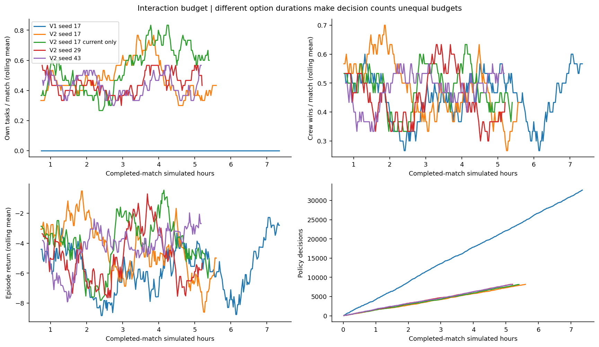
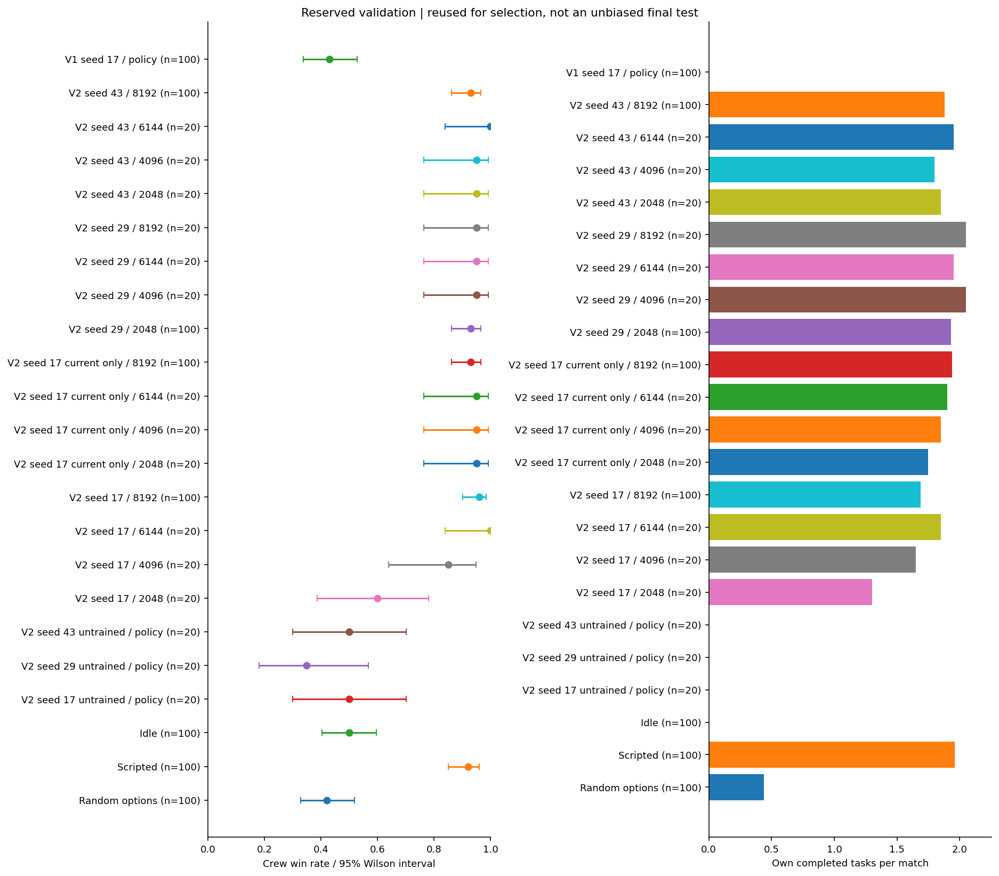
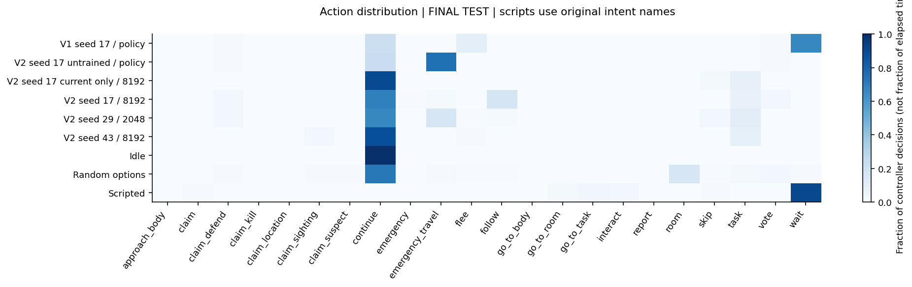
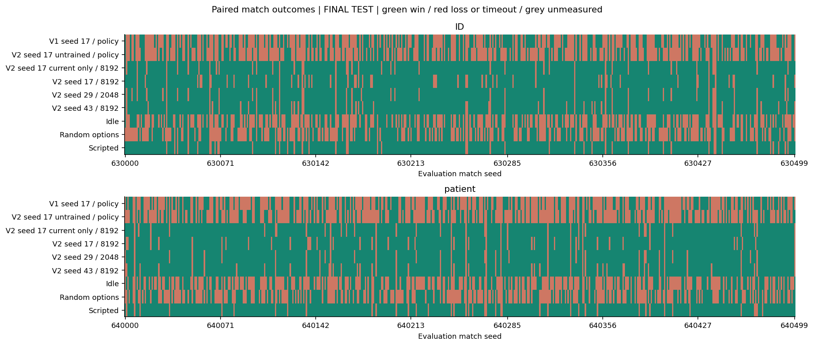
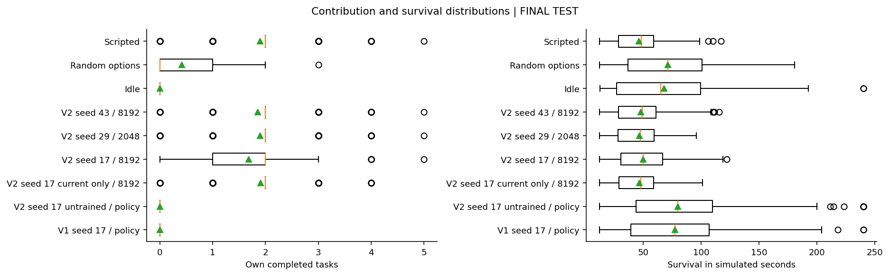
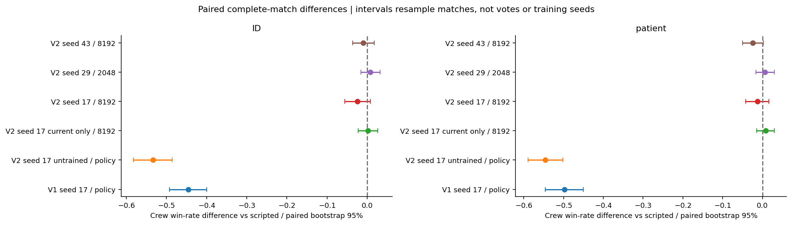
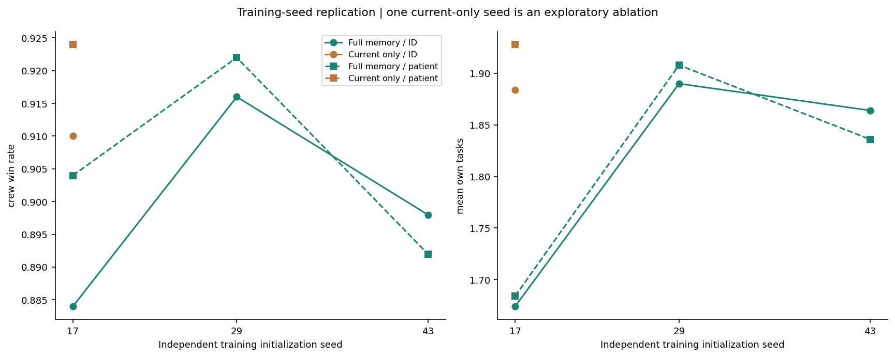

# Phase 5 expanded learning study

**Status:** final evaluation available.
Final test partitions have been opened after selection.

| Run | Training seed | Decisions | Complete matches | Own tasks | Training minutes | Finished |
|---|---:|---:|---:|---:|---:|---|
| V1 seed 17 | 17 | 32,768 | 299 | 0 | 36.6 | True |
| V2 seed 17 | 17 | 8,192 | 221 | 103 | 22.7 | True |
| V2 seed 17 current only | 17 | 8,192 | 216 | 114 | 23.4 | True |
| V2 seed 29 | 29 | 8,192 | 201 | 93 | 23.4 | True |
| V2 seed 43 | 43 | 8,192 | 204 | 92 | 23.1 | True |

Training outcomes are exploratory. Three scripted teammates may carry an idle focal player.
Compare task contribution, voting coverage, idle and scripted controls, not team wins alone.
V1 and V2 use different action durations. Interaction-budget plots show this difference.
PPO loss is not accuracy. Voting accuracy is conditional on cast non-skip votes.
The frozen belief model is reused; all strategic networks began from random weights.
Initial controls reproduce the same RNG and environment-before-policy construction order without PPO updates.
The separately trained current-only ablation has one seed. Its result cannot establish replicated memory benefit.

## Locked final results

Selected on validation: **V2 seed 17 / 8192**.
Every method uses the same 500 ID and 500 held-out patient match seeds.
All final comparisons report this frozen selection; they do not choose a new checkpoint.

| Family | Method | Crew wins | 95% match interval | Own tasks | Voting accuracy | Cast votes | Skips | Illegal / navigation failures |
|---|---|---:|---|---:|---:|---:|---:|---:|
| ID | V1 seed 17 / policy | 46.2% | 41.9%–50.6% | 0.00 | 97.9% | 612 | 0 | 0 / 0 |
| patient | V1 seed 17 / policy | 41.8% | 37.6%–46.2% | 0.00 | 98.6% | 635 | 0 | 0 / 0 |
| ID | V2 seed 17 untrained / policy | 37.4% | 33.3%–41.7% | 0.00 | 0.0% | 591 | 66 | 0 / 0 |
| patient | V2 seed 17 untrained / policy | 37.0% | 32.9%–41.3% | 0.00 | 0.0% | 581 | 67 | 0 / 0 |
| ID | V2 seed 17 current only / 8192 | 91.0% | 88.2%–93.2% | 1.88 | N/A | 0 | 383 | 0 / 0 |
| patient | V2 seed 17 current only / 8192 | 92.4% | 89.7%–94.4% | 1.93 | N/A | 0 | 389 | 0 / 0 |
| ID | V2 seed 17 / 8192 | 88.4% | 85.3%–90.9% | 1.67 | 94.2% | 486 | 0 | 0 / 0 |
| patient | V2 seed 17 / 8192 | 90.4% | 87.5%–92.7% | 1.68 | 95.7% | 484 | 0 | 0 / 0 |
| ID | V2 seed 29 / 2048 | 91.6% | 88.8%–93.7% | 1.89 | N/A | 0 | 384 | 0 / 0 |
| patient | V2 seed 29 / 2048 | 92.2% | 89.5%–94.2% | 1.91 | N/A | 0 | 385 | 0 / 0 |
| ID | V2 seed 43 / 8192 | 89.8% | 86.8%–92.2% | 1.86 | 0.0% | 1 | 391 | 0 / 0 |
| patient | V2 seed 43 / 8192 | 89.2% | 86.2%–91.6% | 1.84 | N/A | 0 | 397 | 0 / 0 |
| ID | Idle | 47.2% | 42.9%–51.6% | 0.00 | N/A | 0 | 538 | 0 / 0 |
| patient | Idle | 44.0% | 39.7%–48.4% | 0.00 | N/A | 0 | 554 | 0 / 0 |
| ID | Random options | 51.0% | 46.6%–55.4% | 0.39 | 29.7% | 455 | 119 | 0 / 0 |
| patient | Random options | 46.6% | 42.3%–51.0% | 0.45 | 27.8% | 474 | 126 | 0 / 0 |
| ID | Scripted | 90.8% | 87.9%–93.0% | 1.88 | 81.2% | 48 | 341 | 0 / 0 |
| patient | Scripted | 91.6% | 88.8%–93.7% | 1.91 | 70.0% | 50 | 342 | 0 / 0 |

## Learning assessment

**ID:** selected policy wins 88.4% and completes 1.67 own tasks per match.
Against scripted: -2.4% crew win-rate difference; paired 95% interval [-5.6%, +0.8%].
Against random: +37.4% crew win-rate difference; paired 95% interval [+32.4%, +42.6%].
Against idle: +41.2% crew win-rate difference; paired 95% interval [+36.4%, +45.8%].
**patient:** selected policy wins 90.4% and completes 1.68 own tasks per match.
Against scripted: -1.2% crew win-rate difference; paired 95% interval [-4.2%, +1.6%].
Against random: +43.8% crew win-rate difference; paired 95% interval [+38.8%, +48.6%].
Against idle: +46.4% crew win-rate difference; paired 95% interval [+41.4%, +51.2%].

The selected policy contributes useful learned behavior relative to idle and random controls. Superiority to scripted play depends on the paired intervals above; a globally best policy is not established.
Final observations can motivate a new research question, but they cannot be reused to pick a better checkpoint in this experiment.
Three full-memory seeds measure initialization sensitivity. One current-only run is an exploratory comparison, not a definitive ablation.
This fixed five-player simulator, fixed scripted opponents and research map do not establish real-game or human-opponent performance.
See final-results.json for vote uncertainty from resampling whole matches, exact counts and paired comparisons.

## Figures

## Phase 6 gate

Only after one learned crewmate works, explore adapting opponents and self-play.
The teammate handoff contains the proposed sequence. This study does not implement multi-agent learning.
