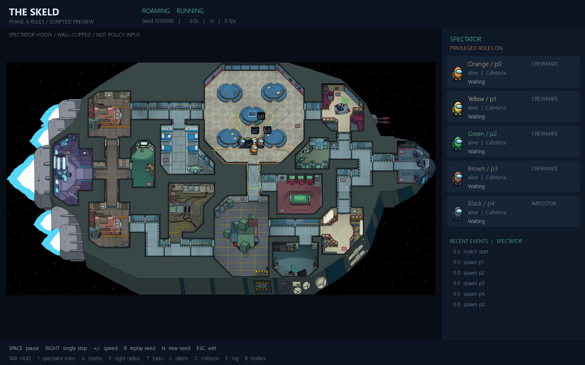

# Phase 6.0 foundation verification

This is a **development verification report**, not a new strategic win-rate
study. Phase 6 is in progress; only the baseline/vision foundation is implemented
and verified. Learned impostors and multi-agent adaptation remain planned.

Baseline repository: `6b78b08e41d0791e49ff486b996d7490666db970`.
Reference rules: crew 4.5, impostor 6.75; unchanged kill/report range and radius;
native walls/opaque obstacles block both. See [plan](../../../phase6_experiment_plan.md)
and [rules](../../../phase6_vision_and_rules.md).

## Evidence

`audit.json` records frozen release/source SHA-256 values, fresh seed partitions,
and setup coverage over 1,000 domain-separated identity/role/color draws.
This is not 1,000 gameplay evaluations. Impostor counts cover every public ID,
color and spawn slot; the audit does not prove an absence of every correlation.

The new tests cover controlled distances, exact native wall/prop occlusion,
body visibility versus reporting range, event-time witness eligibility,
out-of-range/through-wall witness rejection, historical sightings, dead/ejected
actors, actor-local caching, deterministic observations/replays, unchanged
legacy replay serialization, frozen-model loads, hidden-role/private-task/
cooldown/position/death counterfactuals for both roles, crew policy distributions,
controlled ablations and mechanical reward/discount equivalence. The route
boundary test compares the consumed packet with an explicit fresh route projection.
Exact final counts and timings are in `results.json` / `pytest.xml`. The three
`development-*.jsonl` files and corresponding metrics preserve raw diagnostic
records/source hashes. `browser_check.py` preserves the executed browser assertions
(requires Python Playwright and the built site served at port 4186).

The baseline seed-7 hashes were collected **before editing** and match afterward:

| Trace | SHA-256 |
|---|---|
| Actor | `42b5d65e484869fe42e7ac19fce9b9e18d50eb09c64d5db53ba762f52ed180b1` |
| Truth | `dc6fe1cc6002983acf19a187d86625b8bc5bebfff15a0225e3148b28d36ff6e0` |

Historical Phase 4/5 files, map geometry, and benchmark outputs are unchanged.
The regression suite is run with explicit SDL dummy video/audio drivers. The
clean worktree needed copies of existing **ignored** legacy local models and optional local sprite
assets to run checkpoint/art-dependent tests; these copies are not committed.
The final suite passed **416 tests**, zero skips (44 new tests), in 170.00 seconds.
One existing Gymnasium render-spec warning remains. An initial viewer
test waited indefinitely when its one-shot exit event preceded audio/display
initialization; explicit headless drivers resolved that test setup.

## Bounded smoke and reproducibility

Three successful infrastructure trainings use 256 decisions each: reference
full-memory, history-without-belief, and a combined current-only/route/12-second/
512-rollout **plumbing check**. The combined case changes multiple factors to
exercise code, not to estimate their causal effects. Completed runs changed
policy weights and preserved the frozen belief network/releases.

The first route case was stopped before a PPO update because public route
descriptors were recomputed during unused internal option steps. The new runtime
queries them only at decision boundaries, preserving the consumed descriptors.
The corrected case finished successfully. Original smoke outputs/checkpoints
are retained locally under ignored `artifacts/phase6/smoke/`; older successful
runs retain their original hashes and are not accepted by the changed-runtime
loader. No historical or selected research checkpoint was retrained/overwritten.

Two development evaluations used five methods × two families × one paired seed
(10 matches/run): idle, random, scripted, frozen Phase 5 transfer and the earlier
reference smoke checkpoint. Their `matches.jsonl` files are byte-identical,
with zero illegal actions/navigation failures. These are debugging seeds, not
new validation or final tests. The final runtime also reevaluates the four
non-smoke controls and is checked against corresponding earlier rows.
Tiny intervals/outcomes cannot support a new performance or generalization claim.
No reserved Phase 6 validation/final partition was opened.

## Viewer and website

Existing Phase 4/5 and new Phase 6 viewers launch headlessly with the frozen release.
The preview uses a learned crewmate and a **scripted impostor**. The genuine
rules screenshot below is a separate scripted fixture with privileged spectator
roles enabled; it does not imply learned-opponent performance.

Source/build site validators resolve 94 local assets with exact case under
`/social-deduction-ai/`. Desktop (1440px) and mobile (390px) browser checks cover
real travel to Mission 12, expandable checkpoints, the image, preserved Phase 5
metrics/12 figures, red Hadi / black Masa, reduced motion, no page overflow,
zero console errors and zero missing assets. The website stays a PR draft until
review/merge; production is not deployed from this branch.

## Remaining gate

Review the foundation PR and approve a compute budget before larger crewmate
studies. The proposed nine-model memory/belief study, validation work, acceptance
criteria and later 6.2–6.4 gates are in the plan. Neither a learned impostor nor
self-play is implemented, and Phase 6 is not complete.
