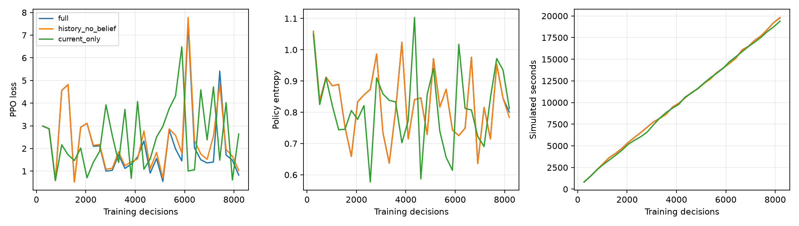
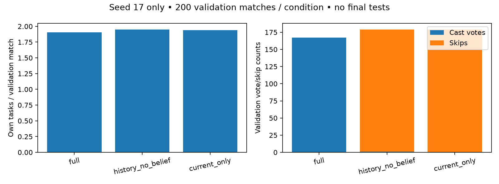

# Phase 6.1: seed-17 pilot, validation only

The approved three-model stage completed. Phase 6.1 is **in progress, not accepted**. No remaining seed-29/43 models, learned impostor, final tests, merge or production deployment was started. PR #3 remains a separate unmerged foundation review.

Frozen training/validation code revision: `cd48b65a8de9de0cab33894ddb2558057487847d`. Source and dependency hashes are in [manifest.json](manifest.json); historical release models are unchanged. [Protocol](../../../phase6_1_staged_protocol.md) records the advance selection rule and fail-safe limits.

## Training and experience

| Input condition | Decisions | Actual training minutes | Simulated hours | Completed training matches | Selected decision checkpoint |
|---|---:|---:|---:|---:|---:|
| full | 8,192 | 28.78 | 5.490 | 221 | 6,144 |
| history_no_belief | 8,192 | 26.12 | 5.507 | 222 | 4,096 |
| current_only | 8,192 | 36.67 | 5.386 | 215 | 2,048 |

Serial training took **91.58 minutes**. Total stage wall time was **2.746 hours**; screening 15.73 minutes and extended validation 55.97 minutes. All models used initialization seed 17, the same initial tensor digest and ordered training partition, 24-second options, Euclidean descriptors, lr 0.0003, rollout 256 and constant entropy coefficient 0.02. Input condition was the only registered difference. Actions were sampled in training and greedy in validation. Simulated exposure includes partial final episodes; completed training-match metrics exclude those partial episodes. These are CPU wall times on this machine.

## Behavioral validation

Each method below used the same **200 familiar-family validation seeds** under crew/impostor vision 4.5/6.75 and the same wall blocking. The historical Phase 5 transfer is reevaluated under these rules. Four checkpoints per learned condition were screened on the first 20 seeds; selection was locked before extended validation. Those 20 seeds are included in the 200, so these are not 220 independent matches.

| Method | Crew wins | Wilson 95% | Own tasks / match | Correct / cast votes | Skips | Correct / innocent team ejections |
|---|---:|---|---:|---:|---:|---:|
| full | 90.0% | 85.1–93.4% | 1.905 | 159 / 167 | 0 | 13 / 5 |
| history_no_belief | 87.5% | 82.2–91.4% | 1.950 | 1 / 1 | 178 | 3 / 2 |
| current_only | 90.0% | 85.1–93.4% | 1.940 | 0 / 0 | 179 | 6 / 1 |
| scripted | 91.0% | 86.2–94.2% | 1.890 | 11 / 14 | 146 | 12 / 0 |
| phase5_release_transfer | 87.0% | 81.6–91.0% | 1.745 | 195 / 211 | 0 | 12 / 4 |
| idle | 55.5% | 48.6–62.2% | 0.000 | 0 / 0 | 185 | 9 / 1 |
| random | 46.5% | 39.7–53.4% | 0.440 | 57 / 201 | 50 | 12 / 16 |

Ejections are team outcomes; cast/correct/skip votes and reports refer to the focal crewmate. Voting accuracy is conditional on casting: high accuracy with rare votes does not establish useful participation. Timeouts, survival, individual reports and action counts are retained in results and raw rows.

| Learned condition | Matches with a cast vote | Skip share of vote/skip decisions | Valid own reports |
|---|---:|---:|---:|
| full | 64.0% | 0.0% | 0 |
| history_no_belief | 0.5% | 99.4% | 0 |
| current_only | 0.0% | 100.0% | 0 |

## Paired comparisons and limits

The full condition combines useful task contribution with frequent, mostly correct
voting. It still casts every recorded vote/skip decision, including eight incorrect
votes; uncertainty-sensitive abstention is not demonstrated. The ablations complete
tasks but almost never vote. All three made zero own reports. This is a useful
diagnostic contrast, not a replicated finding that memory improves crew wins.
Replicating the frozen comparison is the proposed next step before changing
architecture or PPO settings. Phase 6.1's voting and multi-seed gates remain open.

Exploratory paired differences in crew wins are +2.5 percentage points for full
versus history without belief (95% match bootstrap −2.0 to +7.0), and 0.0 points
versus current-only (−4.5 to +4.5). These do not resolve a win advantage from memory
or belief. Against the old release under the same new rules, full contributes
0.160 more own tasks per match (exploratory interval +0.010 to +0.305); its +3.0-point
win difference remains uncertain (−2.0 to +8.5). See
[matched-ablation-review.json](matched-ablation-review.json), using 5,000 paired
whole-match bootstrap draws and RNG seed 606. These are developmental comparisons.

| Condition vs control | Crew-win difference | Paired whole-match bootstrap 95% |
|---|---:|---|
| full vs scripted | -1.0 pp | -5.0 to +3.0 pp |
| full vs idle | +34.5 pp | +27.5 to +41.5 pp |
| full vs random | +43.5 pp | +35.5 to +51.0 pp |
| history_no_belief vs scripted | -3.5 pp | -8.5 to +1.5 pp |
| history_no_belief vs idle | +32.0 pp | +25.0 to +39.0 pp |
| history_no_belief vs random | +41.0 pp | +33.5 to +49.0 pp |
| current_only vs scripted | -1.0 pp | -5.5 to +3.5 pp |
| current_only vs idle | +34.5 pp | +27.5 to +42.0 pp |
| current_only vs random | +43.5 pp | +36.0 to +51.0 pp |

These intervals describe paired validation-match uncertainty, **not variation across training initializations**. This pilot has one initialization per condition, no independent final test and no patient-family evaluation. The small checkpoint screen and its reuse make this developmental evidence. It cannot establish replicated memory/belief benefit, held-out robustness or superiority to historical Phase 5 results with different rules. No untrained control was part of this stage, so useful policy behavior alone does not quantify improvement over initialization.

## Reproducibility, safety and preserved evidence

Runner verification: **431 tests passed**, zero skips/failures; one existing Gymnasium render-spec warning. Two 32-decision preflight training runs reproduced initial/final tensor and full transition digests. Saved-policy development matches repeated exactly and an actual two-worker Windows probe passed. All 60 selected screening rows reproduced exactly in extended validation, including actor transition hashes and behavior. Identical initialization, all checkpoint/file/source hashes, validation seeds and immutable selection were audited. **Zero recorded illegal actions or navigation failures** occurred in completed training, screening or extended validation. No registered nonfinite, frozen-model, source, corruption or wall-limit fail-safe fired.

All 15 research checkpoint files (four per-condition decision checkpoints plus final weights) are copied under [experimental artifacts](../../../../artifacts/phase6/seed17-stage/) with hashes in [checkpoint-copies.json](checkpoint-copies.json). Prior checkpoints remain intact. These are experimental models and do not replace the Phase 5 release. Raw local run directories remain preserved.

Final familiar seeds 1230000–1230499 and final patient seeds 1240000–1240499 were **not executed**. Their ranges occur only in the registered partition manifest. Validation executions total 1,640 (240 screening + 1,400 extended); two preflight worker probes are separate diagnostics.

## Remaining-six estimate and stop gate

At the observed throughput, the six seed-29/43 replications would take approximately **4.28 additional hours**: 3.05 training and 1.22 validation (1,680 executions, two workers, controls reused). Provisional planning range: **3.42–6.42 hours**, not a statistical interval. It extrapolates this machine and protocol; seed-dependent match lengths and workload may change it. Any diagnostics or protocol changes need a revised estimate. Final testing is excluded.

**Stopped at the requested approval gate.** Review task contribution, voting coverage and paired controls before approving the six replications. Phase 6.2–6.4 remain future milestones.

## Figures and machine-readable records

[Results](results.json) · [Locked selection](selection.json) · [Integrity audit](integrity-audit.json) · [Preflight](preflight.json) · [Test XML](runner-pytest.xml) · [Runner verification](runner-verification.json)

All 15 copied models [load and match their original digests](checkpoint-load-verification.json).
The [desktop/mobile browser check](browser-verification.json) passed the Pages base
path, map/mission log, 6.1 in-progress status, preserved Phase 5 figures and red/black
collaborators, with no console errors, failed assets or horizontal overflow.
Static source/build and sprite palette validators passed; no production deploy ran.
