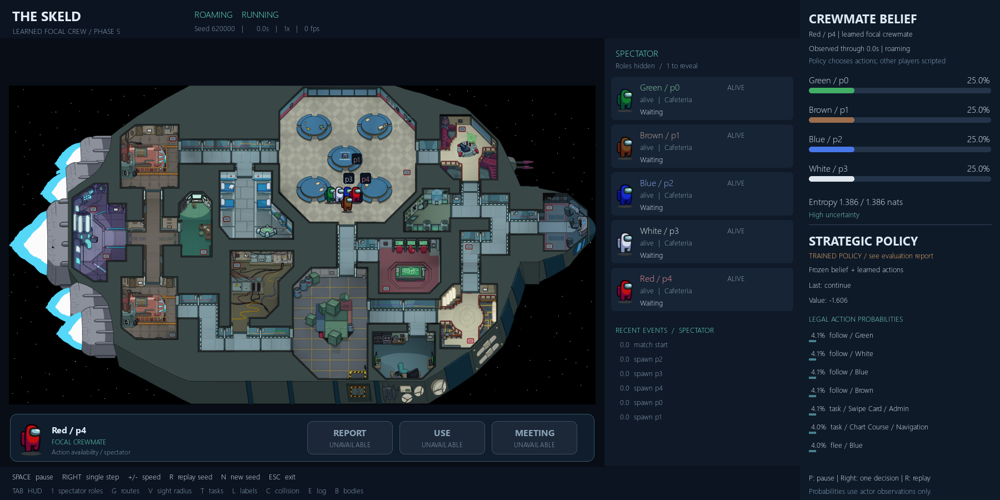
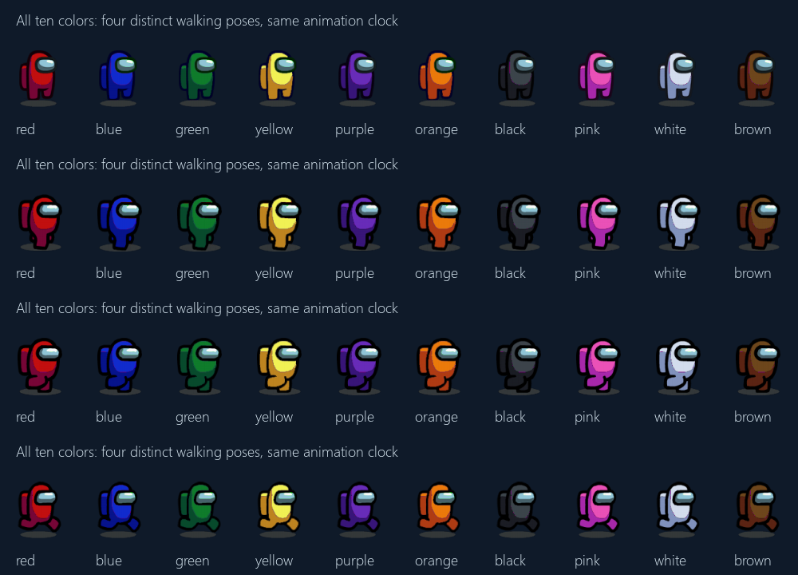
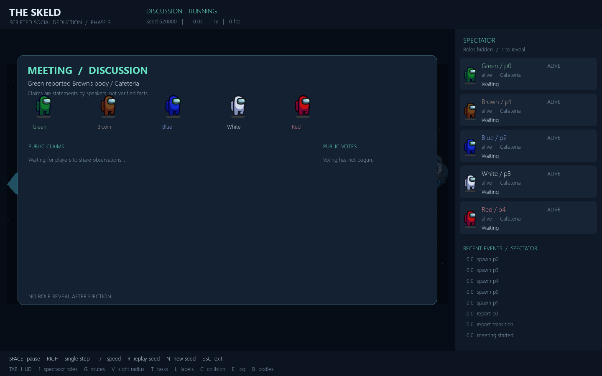
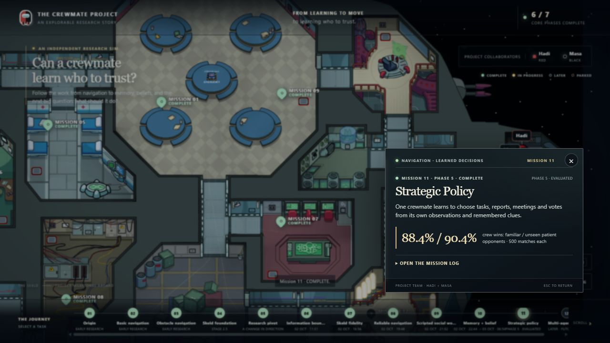
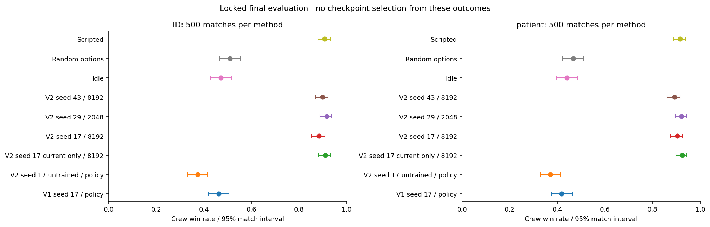
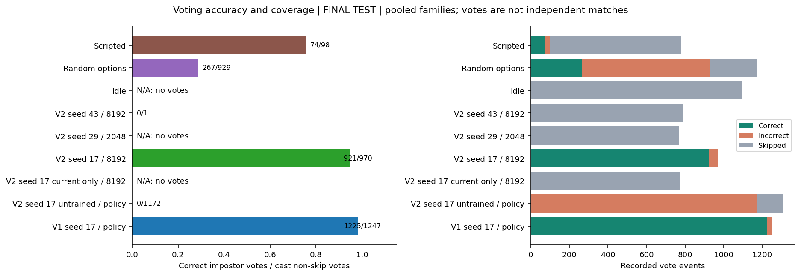
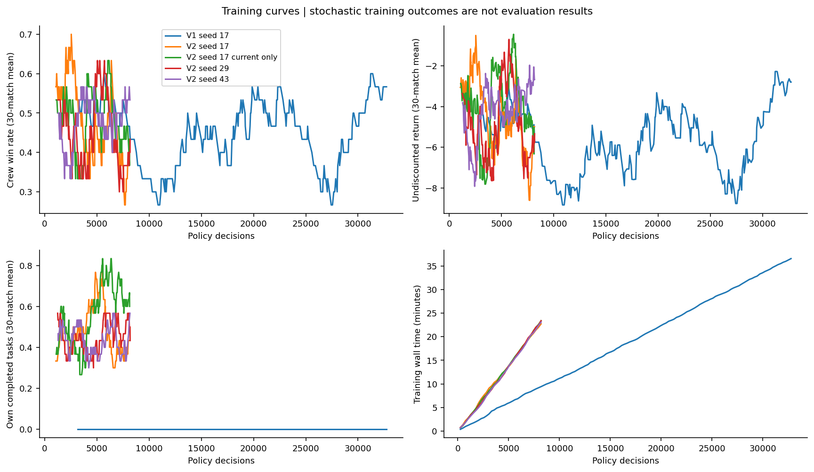
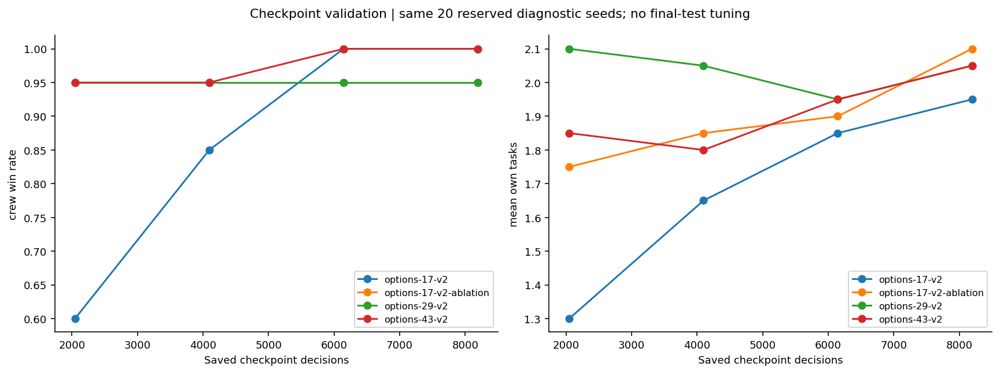
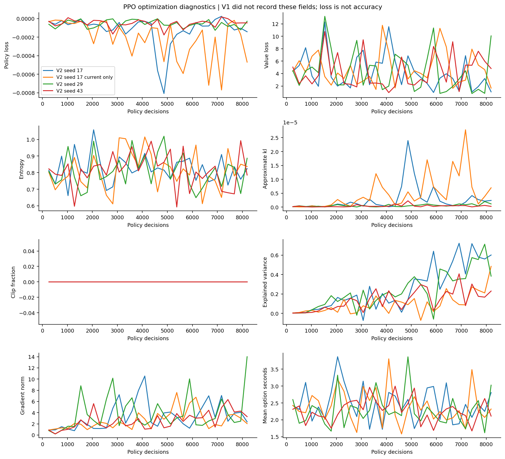

# Phase 5 — teammate guide

Updated 4 October 2026 · **Complete simulator study** · [Live project](https://hadisovic.github.io/social-deduction-ai/)

**The result is good for a first learned crewmate, but it is not game mastery.**
The selected neural policy completes tasks and clearly improves team wins over
idle and random players. It has not demonstrated better play than the scripted
baseline. Human opponents, real-game transfer and self-play remain untested.

## 1. Run it and understand the panel

From the repository root:

```powershell
python run_phase5.py
```

This loads the evaluated seed-17 / 8,192-decision release. One crewmate uses the
learned policy. The other four players use scripts.

**Phase 5 currently has no key to switch the belief panel.** It stays on the
learned crewmate. This is an unimplemented viewer feature, not a device problem.
`F` cycles the observed player only in `python run_phase4.py`; `M` expands its
memory. A future Phase 5 spectator switch should change only the displayed
observer, never transfer control of the learned policy to another player.

| Phase 5 key | Action |
|---|---|
| Space / P; Right arrow | Pause/resume; advance one decision while paused |
| + / −; R / N | Change speed; replay / next match seed |
| Tab; 1 | Toggle HUD; reveal spectator roles |
| G / C / V | Routes / collision overlay / visibility overlay |
| T / L / E / B | Tasks / labels / events / bodies |
| Esc | Close viewer |



*Top right: suspicion estimates. Bottom right: legal action probabilities and
value estimate. Bottom left: the focal avatar and action availability. Revealing
spectator roles does not reveal them to the neural policy.*

## 2. What changed, and why

| Update | Purpose |
|---|---|
| New PPO strategic network | Learn action choices from rewards, starting with random weights |
| Frozen Phase 4 belief network | Reuse learned suspicion without changing its weights |
| Room-location features | Make different destinations distinguishable to the policy |
| V2 action holds | Let a chosen task or journey finish before choosing again |
| Versioned execution and source hashes | Match deployment behavior to the trained checkpoint |
| Three full-memory runs, an ablation and controls | Measure learning, contribution and seed sensitivity |
| Locked selection, paired final tests and 12 graphs | Separate choosing a model from judging it |
| Evaluated release as viewer default | Replace the earlier smoke-model default; preserve old artifacts |
| Conservative circle clearance | Clear corridor corners without widening the map or shrinking players |
| Red mask decoding and repaired walk cycles | Show correct suit colors and moving legs |
| Half-body corpses, avatar HUD, caller/reporter labels | Make bodies, action availability and meeting origin readable |
| Resizable viewer and motion interpolation | Fit the display and smooth movement between physics steps |
| Website Phase 5 mission and red/black collaborator fixes | Publish learning evidence in the existing mission flow |

<details>
<summary>Pictures of presentation fixes</summary>



*Pose comparison checks leg movement and color consistency.*



*Renderer test fixture: the banner identifies the reporter and body location.
This staged screenshot is not a recorded evaluation match.*



*The public mission explains strategy and results. Earlier presentation repairs
are documented here, outside the Phase 5 web story.*

</details>

## 3. How learning works

**Own observations → memory → frozen suspicion model → strategic network →
chosen action → A* / game mechanics → reward → PPO update.**

The network can choose tasks, rooms, following, fleeing, approaching/reporting
bodies, emergency meetings, votes, skipping and bounded factual/social claims.
There are 17 action kinds and at most 96 legal candidates. Names/enums describe
the game interface; they do not prescribe suspicion or voting strategy.
There is no rule such as “vote above 70% suspicion” or “always report.”

V1 reconsidered actions every 0.6 simulated seconds and completed no own tasks.
V2 holds a chosen travel/task action for up to 24 seconds; follow/flee for up to
3 seconds. Completion or an actor-visible event can interrupt it. Reporting and
voting still require a network choice. Physics advances every 0.2 seconds.
PPO uses elapsed time for rewards and discounting.

The actor receives legitimate observations and attributed claims. It does not
receive hidden roles, unseen current positions or opponents' private task state.
Training rewards and evaluator labels may use match outcomes; actor inputs may not.
This is a fixed five-player research simulator, not a certified exact game clone.

## 4. Are the results good?

**Yes: useful task behavior is learned. No: superiority over the scripted player
and a reliable advantage from memory are not established.** No more training is
needed to report this Phase 5 result. Further improvement belongs in a new study.

Each method played the same **500 familiar-family (ID)** and **500 held-out
patient-opponent** scenarios. These are crew win rates, not “NN accuracy.”

| Method | ID wins | Patient wins | Own tasks/match, ID / patient |
|---|---:|---:|---:|
| **Selected V2, seed 17 / 8192** | **88.4%** | **90.4%** | **1.67 / 1.68** |
| V2, seed 29 / 2048 | 91.6% | 92.2% | 1.89 / 1.91 |
| V2, seed 43 / 8192 | 89.8% | 89.2% | 1.86 / 1.84 |
| Current-only ablation, seed 17 / 8192 | 91.0% | 92.4% | 1.88 / 1.93 |
| Scripted focal player | 90.8% | 91.6% | 1.88 / 1.91 |
| Random legal options | 51.0% | 46.6% | 0.39 / 0.45 |
| Idle focal player | 47.2% | 44.0% | 0 / 0 |
| Same seed-17 network before training | 37.4% | 37.0% | 0 / 0 |
| Preserved V1, seed 17 | 46.2% | 41.8% | 0 / 0 |

Seed 17 was selected on validation, where it won 96/100 matches. It stays selected
even though seed 29 scored higher on final tests. Changing selection now would
use the test set for tuning. The ablation is one run; it cannot prove memory helps
or hurts. The release casts votes; the other V2 runs mostly skip.



**Read it:** each point is a win rate; whiskers show uncertainty across matches.
The large improvement over idle/random supports useful learned contribution.
Against scripted play, the selected policy's paired difference is **−2.4 points
[−5.6, +0.8]** on ID and **−1.2 [−4.2, +1.6]** on patient. Both intervals include
zero: neither superiority nor equivalence is established.



**Read it:** accuracy counts only cast non-skip votes; the bars also show voting
coverage. The release scored **94.2% on 486 votes** and **95.7% on 484 votes**.
Zero cast votes means “not measured,” not perfect accuracy. V1's high vote accuracy
did not compensate for zero tasks. Good voting alone is not good overall play.

There were **zero recorded illegal actions or navigation failures** in final
evaluation. The existing suite passed **372 tests**. The separate clearance
benchmark passed **9,828 route executions** across two physics step sizes.

## 5. What the other graphs tell us

All twelve figures are preserved. Training seeds initialize networks; match seeds
define scenarios. They are different sources of variation.

| Graph | How to read it / conclusion |
|---|---|
| [Learning curves](benchmarks/phase5/expanded/figures/learning_curves.png) | Rolling training wins, return and own tasks. V1 stays at zero tasks. Stochastic training is noisier and weaker than greedy evaluation; these are not test scores. |
| [Interaction budget](benchmarks/phase5/expanded/figures/interaction_budget.png) | Uses simulated game time. Equal numbers of decisions do not mean equal experience when action durations differ. |
| [PPO diagnostics](benchmarks/phase5/expanded/figures/ppo_diagnostics.png) | Losses, entropy, KL, clipping, gradients and value prediction. Updates were conservative; noisy critic loss does not prove convergence. Loss is not accuracy. |
| [Validation comparison](benchmarks/phase5/expanded/figures/validation_comparison.png) | Compares checkpoint wins and tasks; labels show sample counts. Larger validation samples replace smaller samples for the same model. |
| [Checkpoint curve](benchmarks/phase5/expanded/figures/validation_curve.png) | Same 20 diagnostic seeds at each checkpoint. Seed 17 reached 100% at 6144 and 8192; this small-set plateau supported moving to final tests. |
| [Paired differences](benchmarks/phase5/expanded/figures/paired_differences.png) | Differences from scripted play on shared scenarios. An interval crossing zero does not establish an advantage. |
| [Training-seed comparison](benchmarks/phase5/expanded/figures/training_seed_comparison.png) | Compares three independently initialized full-memory policies and one ablation. Voting behavior varies; memory benefit is unresolved. |
| [Action distribution](benchmarks/phase5/expanded/figures/action_distribution.png) | Share of controller decisions per action. It measures choices, not elapsed time. Scripts use their original intent names. |
| [Match outcomes](benchmarks/phase5/expanded/figures/seed_outcomes.png) | Each column is a shared scenario: green win, red loss/timeout. Read patterns across methods, not isolated lucky matches. |
| [Tasks and survival](benchmarks/phase5/expanded/figures/behavior.png) | Separates individual contribution from team outcomes. Surviving longer or being carried by teammates is not sufficient. |

<details>
<summary>View the learning, checkpoint and PPO plots</summary>







</details>

## 6. Runs, process and time

| Training run | Decisions | Completed episodes | Own tasks total | Minutes |
|---|---:|---:|---:|---:|
| V1 seed 17 | 32,768 | 299 | 0 | 36.58 |
| V2 seed 17 | 8,192 | 221 | 103 | 22.74 |
| V2 seed 29 | 8,192 | 201 | 93 | 23.40 |
| V2 seed 43 | 8,192 | 204 | 92 | 23.11 |
| V2 current-only seed 17 | 8,192 | 216 | 114 | 23.40 |

**Process:** train → screen checkpoints on 20 validation scenarios → compare
finalists on 100 validation scenarios → lock selection/hashes → run 9,000 final
matches → report all methods. Early 512-step smoke runs checked plumbing only.

| Evaluation stage | Match executions | Approx. elapsed minutes | Sum of job minutes |
|---|---:|---:|---:|
| Diagnostic screening and baseline checks | 400 | 31.36 | 32.23 |
| Untrained initialization diagnostics | 60 | 2.55 | 7.15 |
| Full validation: eight methods × 100 | 800 | 24.03 | 59.86 |
| Final testing: nine methods × 1000 | 9,000 | **185.03** | 721.84 |

Training-run times sum to **129.23 minutes**; some runs overlapped. The substantive
study spanned about **4 h 40 min**, from 3 October 22:36:56 to 4 October 03:16:56
(Amman, UTC+03). This includes review/scheduling gaps and excludes earlier
development. Final testing ran about 00:11:52–03:16:54 on 4 October.
Job durations were measured. Stage spans were inferred from saved file timestamps
and are approximate. Summed job time is neither elapsed wall time nor CPU time.

**Machine:** Intel i9-14900HX, 24 cores / 32 logical processors, 15.71 GiB visible
RAM, Windows 11. Python 3.12.3, PyTorch 2.9.1+cpu, NumPy 1.26.4.
One process and one Torch thread per training run; three validation workers;
four final-test workers. No GPU or two-device distributed run was used.

<details>
<summary>Technical settings, information boundary and reproducibility</summary>

| Setting | Value |
|---|---|
| Network | 47,938-parameter shared-candidate actor-critic; strategic weights trained from scratch |
| Inputs | Context 40; other-player evidence 4 × 26; up to 96 × 23 action descriptors; target references and legal mask |
| PPO | Rollout 256; 4 epochs; minibatch 64; Adam learning rate 0.0003 |
| Stability | Clip 0.2; value coefficient 0.5; gradient clip 0.5 |
| Time discount | Gamma 0.99; GAE lambda 0.95; actual action duration |
| Entropy coefficient | V1: 0.02 → 0.001; V2: 0.02 → 0.005 |
| Rewards | Crew win +10; impostor win −10; timeout −5; own elimination once −5; unique own task +1; −0.005 per 0.6 s; no direct report/vote reward |
| Training seeds | Network initializations 17/29/43; match partition 600000–619999, sequential prefix per run |
| Validation seeds | 620000–620099; diagnostics reuse the first 20 |
| Final seeds | ID 630000–630499; patient 640000–640499; 90 chunks × 100 matches |
| Evaluation action selection | Greedy for learned policies; stochastic during training |
| Selection | Full-memory models only; legal/navigation checks, then wins, own tasks, vote accuracy |

V2 checkpoints were saved every 2048 decisions. Selected checkpoints were
17/8192, 29/2048, 43/8192 and current-only 17/8192. The same-seed untrained control
reconstructed initialization without PPO. The ablation removes historical memory
and supplies uniform suspicion/zero logits; it retains current observations and
the public meeting roster.

Features use direct distances, not A* path lengths. Two hallway labels share the
Unknown category. Claims are speaker-attributed statements, not verified truth.
The actor never receives hidden roles, unseen positions, opponent cooldowns,
private opponent task progress, live global task totals or hidden living counts.
The belief model stays frozen. Action legality is mechanical, not a strategic rule.

Win intervals are 95% Wilson intervals. Vote uncertainty and paired differences
use 5,000 whole-match bootstrap samples. Votes within one match are not independent.
These intervals do not measure uncertainty across a population of training seeds.

Raw experiments are retained locally under `artifacts/phase5/runs/` and ignored
by Git. The compact [release](../artifacts/phase5/release/metadata.json),
[final records](benchmarks/phase5/expanded/final-results.json),
[validation review](benchmarks/phase5/expanded/validation-review.json),
[selection lock](benchmarks/phase5/expanded/locked-selection.json),
[full report](benchmarks/phase5/expanded/README.md) and
[timing metadata](benchmarks/phase5/expanded/execution-metadata.json) are in Git.
The trainer does not resume optimizer state. Preserve completed runs and use
new output directories; do not restart final evaluation to tune selection.

Implementation: [inputs](../phase5_features.py), [environment](../phase5_env.py),
[policy](../phase5_policy.py), [options](../phase5_options.py),
[trainer](../phase5_options_training.py), [evaluation](../phase5_evaluation.py),
[viewer](../run_phase5.py). The [original specification](phase5_strategic_policy_specification.md)
and earlier checkpoints remain preserved.

</details>

## 7. Suggested Phase 6 — improve, then adapt opponents

**Only after one learned crewmate works, explore adapting opponents and self-play.**
Phase 5 supports a useful single-crewmate baseline against these fixed scripts.
It does not establish mature social reasoning. The following are proposed
experiments, not implemented features or guaranteed improvements.

| Observed gap | First experiment | Evidence needed |
|---|---|---|
| Lower task contribution than scripted | Inspect validation failure traces; compare action-hold caps of 12 vs 24 s and path-distance descriptors | Better wins/tasks without more illegal actions or failures, at matched simulated-time budgets |
| Other seeds rarely vote; release never skips | Evaluate ambiguous meeting cases; compare greedy vs sampled decisions; test entropy schedules one at a time | Better correct/innocent ejections and appropriate abstention, not accuracy from avoiding all votes |
| Memory advantage is unresolved | Train current-only seeds 29/43 under the same budget and selection procedure; if feasible use at least five seeds per condition | Replicated full-memory versus current-only differences with uncertainty |
| Small PPO updates and noisy value learning | First verify gradient/advantage scales; then test learning rates 0.0001/0.0003 and rollout 256/512 separately | Stable optimization plus better validation behavior; lower loss alone is insufficient |
| Fixed opponents limit generalization | Reserve unseen opponent behaviors and varied task/spawn settings before tuning | Useful contribution across opponents, not only aggregate crew wins |

Those numerical settings are **starting hypotheses from this project's
diagnostics**, not proven optimal values. Keep rewards unchanged initially to
isolate causes. Do not add rules forcing reports, votes or suspicion thresholds.

1. Freeze the Phase 5 release and declare new training/validation/test partitions.
   The old final test is now a historical benchmark, not a fresh selection set.
2. Run the targeted single-crewmate checks above. Change one factor at a time.
   Extend training only while validation improves; repeat promising settings
   across seeds and compare equal simulated experience.
3. Once the baseline remains useful and mechanically safe, train one learned
   impostor against frozen crew. Preserve each role's legitimate observation boundary.
4. Alternate updates with the other side frozen. Keep older opponents to detect
   forgetting, then explore a mixed historical-policy self-play pool.
5. Publish crew-versus-impostor cross-play matrices, seed variation, tasks, survival,
   voting and held-out results. Study learned claims and additional learned players
   only after this two-sided setup is stable.

PPO method: [Schulman et al.](https://arxiv.org/abs/1707.06347).
Why multiple runs and uncertainty matter: [Agarwal et al.](https://arxiv.org/abs/2108.13264).
The tuning plan above is our project-specific proposal, not a result from those papers.
