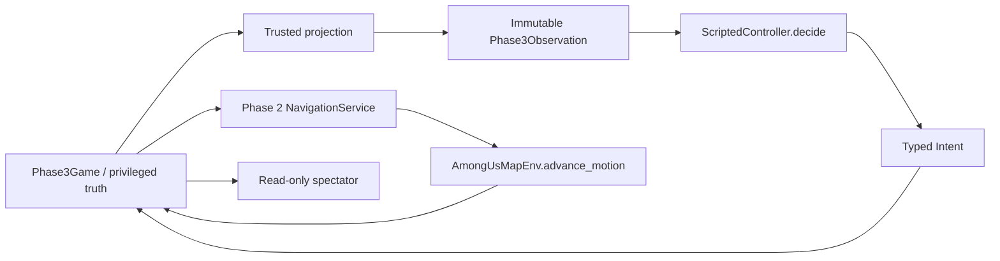

# Phase 3: five-player scripted social-deduction simulator

Phase 3 builds the deterministic world for a later learned crewmate. It does not
train a model or implement Phase 4 beliefs. Five scripted actors play complete
matches using local observations, timed tasks, eliminations, reports, structured
discussion and public voting. See the [acceptance evidence](benchmarks/phase3/README.md).

## Run it

From the repository root, after the existing dependency installation:

```powershell
python run_phase3.py
```

This opens a 1440-by-900 Pygame spectator window immediately, loads the improved
Skeld map and starts seed 7 at normal speed. There is no menu, training step or
required flag. The launcher uses the existing project `.venv` when available;
otherwise the selected Python must have `requirements.txt` installed. It never
installs packages automatically. The existing legacy launchers are preserved.

The local character/task artwork pack requested by the owner is already installed
on the development machine. An offline checkout uses original procedural
characters and text task cards. Optional local installation:

```powershell
python phase3_assets.py --install
```

The pack's 119 PNG files stay outside Git. Read the exact [asset audit and source
manifest](phase3_asset_provenance.md) before distributing artwork.

| Control | Effect |
|---|---|
| Space | Pause/resume |
| Right arrow | Advance one fixed tick while paused |
| `+` / `-` | Speed from 0.25x to 32x |
| R / N | Replay this seed / start the next seed |
| Tab / 1 | Toggle spectator sidebar / privileged roles |
| G / V / T | Routes / sight-radius circles / task locations |
| L / C / E / B | ID labels / collision / event list / bodies |
| Escape or Q | Exit |

The whole-map view and sidebar are **spectator truth**, even with roles hidden.
They are not an actor view. Visibility circles illustrate range only; actual
occlusion uses geometry. Task previews illustrate timed interactions, not playable
commercial task minigames. Labels and overlays never enter policy input.

```powershell
python run_phase3.py --seed 15 --speed 4
python run_phase3.py --seed 25 --speed 4
python run_phase3.py --seed 7 --speed 4 --capture .pytest_cache/phase3_visual --exit-on-finish
python run_phase3_batch.py --matches 1000 --workers 8
python run_phase3_batch.py --seed 15 --logs .pytest_cache/phase3_replays --output .pytest_cache/phase3_seed15
```

The window normally remains open at the final result. Optional capture/exit flags
are verification aids. Headless batches never create a renderer or display. They
repeat every match by default and compare actor-input/action and truth traces.
`--replay-checks none` is exploratory and cannot pass the acceptance gate.

## Architecture and alternatives

The selected design is a small fixed-tick rules engine, an explicit trusted
projection, value-only controllers and the unchanged Phase 2 movement service.
This gives the visual and batch modes one implementation of rules and physics.
Physical entities own navigation, position and timers; controllers own only their
script style, private RNG and a small record of legitimate recent observations.

Alternatives considered were extending the single-player Gym loop into the whole
game, or using an event-driven multiplayer framework. The first would mix private
rules into the preserved navigation interface; the second adds scheduling and
state ownership complexity before it is needed. A new movement implementation
would discard the Phase 2 validation. None is necessary here.



| Module | Responsibility |
|---|---|
| `phase3_engine.py` | Entities, rules, timers, transition order, wins, invariants, event publication |
| `social_deduction/phase3_api.py` | Additive immutable actor values, finite claims, intents, pure candidates, exact-type validation |
| `social_deduction/phase3_observation.py` | Native-map visibility and explicit truth-to-actor projection |
| `phase3_bots.py` | Small scripts; imports no engine, truth, renderer or navigation module |
| `phase3_runner.py` | Collect all observations before decisions; fixed decision schedule; deterministic trace hashes |
| `phase3_renderer.py` / `run_phase3.py` | Read-only spectator and desktop controls |
| `run_phase3_batch.py` | Independent seeded matches, replays, metrics, CSV/JSON acceptance reports |
| `phase3_assets.py` / `assets/phase3_assets.json` | Pinned optional local artwork loading and explicit installation |

The frozen Phase 1 files are unchanged. The additional Phase 3 contract supports
native map coordinates and an impostor's own cooldown; it does not broaden the
old crew-only fixture API. A future controller replaces `decide(observation) ->
Intent`. The trusted runner continues owning engine access and actor collection.
No renderer, map/planner helper, callable, mutable dictionary, truth object,
training label or simulator metadata is supplied to a controller.

## Default rules and transition order

`GameConfig` defaults: five players, four crew/one impostor, 0.2-second physics
ticks, decisions every 0.6 seconds, speed 2.5 native units/second, sight 4.5,
kill range 1.1, report range 1.3, initial/repeated kill cooldown 12 seconds,
two private tasks per crew, four seconds per task/fake task, nine seconds of
discussion, six seconds of voting, and a 240-second match deadline.

Initialization creates five legal Cafeteria spawns. Roles, public ID assignment,
colors, per-player hypothetical tasks/task IDs and controller behavior use separate
SHA-256-derived seed domains. No match seed or role RNG state enters observations.
Own task generation does not skip other players based on their hidden roles.
Role assignment does not determine color, ID, spawn slot or iteration order.

Persistent phases are `ROAMING`, `DISCUSSION`, `VOTING`, `FINISHED`. Initialization,
report transition, meeting resolution and return to exploration are atomic,
logged transitions. All actions are validated against tick-start observations.
Reports/emergency calls precede eliminations, which precede remaining exploration
intentions. Public player ID breaks simultaneous-action ties. Then movement and
timers advance; task completion and terminal checks run. Decisions are collected
before any player's action executes. `WAIT`/no submission is always harmless.

No exploration action can execute in a meeting; dead/ejected actors have no
actions or local sight. A terminal `step` is a no-op. Meetings cancel all navigation
and interactions. Positions remain fixed, and task/kill cooldown timers pause.
On resumption controllers issue new intentions; stale routes do not restart.
The meeting table is a drawing, not a physical teleport.

### Navigation and tasks

High-level intents select a public console, room, observed body or explicit
location. The existing `NavigationService` plans and emits bounded displacements;
`AmongUsMapEnv.advance_motion` executes normal swept collision physics. There are
no gameplay coordinate assignments or teleport recovery. A body approach uses
its observed location. Known static destinations do not disclose another actor's
private task assignment. Unreachable/invalid navigation is explicit and logged.

Crew draw ordinary consoles, excluding vent cleaning and utility/sabotage points.
Tasks require entering the validated console interaction region and spending
nonzero simulated time there. Interrupted progress is retained; continuing
requires another interaction action. Own assignment/progress stays private.
Observers see only an ambiguous interaction animation, which an impostor can
imitate with a timed fake task. Fake tasks never advance the crew quota.

The initial eight-task quota is conserved. Eliminated crew retain their work
until a meeting publicly reveals their absence; only then is unfinished work
privately reassigned to active crew with the fewest remaining tasks, breaking
ties by ID. Ejection is already public, so reassignment follows resolution.
Completed work remains credited. Reassignment retains IDs and partial progress
and discloses no prior owner. Deferral avoids an unseen kill changing a survivor's
task list. If an absent player's body stays undiscovered, active crew eventually
patrol; the explicit deadline prevents an unbounded match.

### Sight, kills, bodies and reports

Sight is 360 degrees and point-to-point. Range is inclusive; intersection with
native wall, prop or floor-boundary geometry blocks sight. The player's collision
radius is not used to inflate a vision ray. Only active roaming actors receive
current visible players and bodies; unseen coordinates and life status are absent.

A kill requires an active impostor, ready own cooldown, a currently visible living
target within range, and roaming phase. The victim stops immediately and a body
remains at the exact physical death location. A direct kill event is delivered
only to actors who could see both killer and victim at the instant of the kill.
Other actors are not notified. The body view contains victim, position and region;
it has no killer or death time. Bodies persist until a meeting clears all bodies.

A report requires legitimate current sight and report range. It publicly reveals
reporter, victim and region, followed by the meeting's active participant roster.
The roster publicly reveals absences at that point. An emergency call requires
the Cafeteria meeting console and an unused personal allowance (one per match).
No recursive report, task, kill or movement is allowed during a meeting.

### Claims, votes and wins

Discussion gives each participant a fixed speaking window and one claim. A typed
claim has kind, authenticated speaker, subject ID, region, delivery tick and
asserted tick. Eight kinds cover sightings, location/task alibis, body discovery,
proximity, suspicion, defense and witnessing an elimination. Regions and subjects
must belong to the public vocabulary; asserted time must not be future. The
engine authenticates syntax/speaker/delivery, **not the truth of the allegation**.
`CLAIM` evidence remains distinct from `DIRECT` and `PUBLIC` evidence.

Votes are published as cast. Each participant can vote once for an active meeting
participant (including self) or skip. The full six-second window remains visible;
missing votes become skips at the deadline. A unique player plurality must beat
every other count, including skip. Player ties, skip ties and all-skip eject no
one. Thus 2 Blue/2 Red/1 Skip and 2 Blue/2 Skip/1 Red both eject nobody. Ejection
publishes identity only, never role. History is retained after elimination/ejection.

Central terminal checks follow kills, ejections and task completion:

1. No living impostor: crew win `IMPOSTOR_EJECTED`.
2. Living impostors at least as numerous as living crew: impostor win `PARITY`.
3. All initial tasks completed: crew win `TASKS_COMPLETED`.
4. Otherwise the deadline yields `TIMEOUT`, winner `None` (a draw and validation
   failure, never silently counted as a team victory).

The actor-facing result contains winner only, without a role roster. Privileged
replay metadata includes the reason and final simulated time.

## Script families and evidence

Crew choose nearest tasks, seeded shuffled tasks, or a distance preference toward
currently seen company. They interrupt travel to approach/report visible bodies,
work on remaining tasks and patrol public rooms when finished. Impostors use
hunter, patient and self-report variants; chase points come from current legitimate
sight. Cooldown behavior includes fake tasks and public-destination patrols.

Meeting scripts share recent direct observations, make deliberately false public
alibis/accusations as impostor, and use small threshold rules for votes. Direct
witnesses, observed proximity and claims receive different fixed weights; repeat
delivery of the same public prefix does not multiply support. Uncertainty or a
tied score produces skip. These are interpretable validation fixtures, not learned
suspicion or a balanced opponent population.

The actor packet carries a static public roster (no live status), own state,
current sightings, authorized historical direct kill events, and public events.
The policy records only a few recent sightings/body observations. The privileged
JSONL additionally records spawn roles, actions, navigation, task progress events,
kills, observer-specific discoveries, public claims/votes and transitions. Each
entry identifies `truth`, `direct` or `public` channel. Do not pass this mixed
spectator log to a learner as observations.

The runner hashes every complete actor input and chosen action, plus the truth
event log and result. Shared immutable map metadata is hashed once and included
by digest; this is an audit optimization, not an input feature. Warm planner
caches and rendering FPS cannot change the trace. Reproduction requires the same
code, configuration, seed and compatible numerical runtime; cross-platform
bitwise determinism is not claimed.

## Validation and limits

The [benchmark report](benchmarks/phase3/README.md) records seeds, replay checks,
all failure categories, outcomes, timings and representative timelines. The
batch captures source hashes before starting and verifies they have not changed
at completion. A flushed per-case temporary journal preserves completed work.
Acceptance requires at least 1,000 primary matches, all independently replayed,
with zero crashes, invalid states, timeouts, illegal script actions, navigation
failures or replay differences. Unit/paired-world tests are a separate gate.

The new tests cover state transitions, real physical task execution, interruption,
fixed quota, hidden-death deferral, kill/report priority, witnesses, claims,
vote ties/skip/invalid/double votes, ejection, all terminal outcomes, replay,
controls and rendering. Full-packet paired-world tests mutate hidden roles,
positions, deaths, tasks, cooldowns, order and future events. They also cover
visible-body metadata, native occlusion, own-role controls, provenance confusion,
exact-type/frozen value validation, independent RNG assignments and spectator
toggles. The original 197 tests remain required and unchanged.

Known limitations: fixed static map, estimated historical map/game parameters,
structured exact localization, no player-player collision, coarse 0.2-second
ticks, timed stand-ins for tasks, and small heuristic scripts. There is no live
Among Us client integration, networking, sabotage, vent travel, dynamic doors,
ghost gameplay, CNN perception, LLM dialogue, learned memory, learned suspicion,
strategic RL or self-play. Some local-art colors have only one frame per direction.
Performance measurements include Python validation/hashing and concurrent work;
they are machine-specific. Passing this gate establishes a controlled research
environment, not commercial-game parity or a learned crewmate's ability.

Phase 4 should consume this verified actor interface to build event memory and
belief evaluation while keeping training labels separate. It has not begun here.
